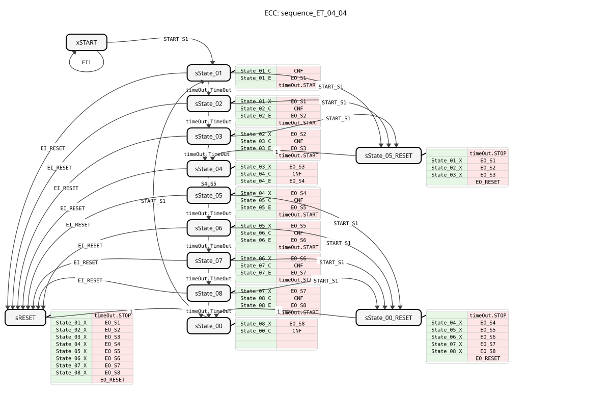
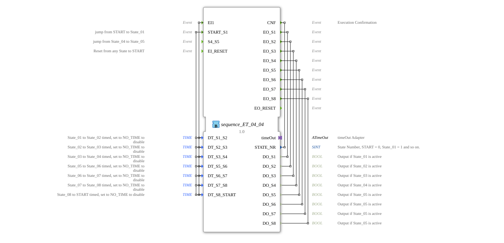

# sequence_ET_04_04

* * * * * * * * * *
## Introduction
The `sequence_ET_04_04` function block is an 8-output sequencer used to control processes in automation technology. It implements a fixed sequence of states, with transitions between states triggered either by an external event or by an adjustable time interval. This block is particularly suitable for applications requiring cyclic or step-by-step activation of outputs.

## Interface Structure
### **Event Inputs**
* **`EI1`**: General input event. In the start state (`xSTART`), this triggers a self-transition (no state change).
* **`START_S1`**: Starts the sequence or jumps from states 1-3 back to state 4, or from states 5-8 back to the final state (`sState_00`). Triggers the transition from the start state (`xSTART`) or from the final state (`sState_00`) to the first active state (`sState_01`).
* **`S4_S5`**: Triggers the transition from state 4 (`sState_04`) to state 5 (`sState_05`). This is the only manual transition in the sequence.
* **`EI_RESET`**: Resets the sequence from any active state to the reset state (`sRESET`) and then to the final state (`sState_00`).

### **Event Outputs**
* **`CNF`**: Execution Confirmation. Triggered on every state change, it returns the new state number (`STATE_NR`).
* **`EO_S1` to `EO_S8`**: State events. These are triggered upon entering the corresponding state (State_01 to State_08) and provide the associated Boolean data output (`DO_Sx`).
* **`EO_RESET`**: Triggered upon passing through the reset state (`sRESET`).

### **Data Inputs**
* **`DT_S1_S2`** (TIME): Time for the automatic transition from State_01 to State_02. Initial value: `NO_TIME` (disabled).
* **`DT_S2_S3`** (TIME): Time for the automatic transition from State_02 to State_03. Initial value: `NO_TIME` (disabled).
* **`DT_S3_S4`** (TIME): Time for the automatic transition from State_03 to State_04. Initial value: `NO_TIME` (disabled).
* **`DT_S5_S6`** (TIME): Time for the automatic transition from State_05 to State_06. Initial value: `NO_TIME` (disabled).
* **`DT_S6_S7`** (TIME): Time for the automatic transition from State_06 to State_07. Initial value: `NO_TIME` (disabled).
* **`DT_S7_S8`** (TIME): Time for the automatic transition from State_07 to State_08. Initial value: `NO_TIME` (disabled). * **`DT_S8_START`** (TIME): Time for the automatic transition from State_08 back to the final state (`sState_00`). Initial value: `NO_TIME` (disabled).

### **Data Outputs**
* **`STATE_NR`** (SINT): Current state number. `0` = START/State_00, `1` = State_01, ..., `8` = State_08.
* **`DO_S1` to `DO_S8`** (BOOL): Logical outputs indicating whether the corresponding state is active. The values are set to `TRUE` upon entering the state and to `FALSE` upon exiting.

### **Adapter**
* **`timeOut`** (Plug, Type: `iec61499::events::ATimeOut`): Used to implement timed state transitions. The function block starts (`START`) and stops (`STOP`) the timer and sets the delay time (`DT`).

## Functionality
The function block operates as a Basic Function Block (BFB) with an extended finite state machine (ECM). The sequence typically iterates through states 1 to 8 in a fixed order. The transition from state 4 to state 5 occurs exclusively via the external event `S4_S5`. All other transitions (1→2, 2→3, 3→4, 5→6, 6→7, 7→8, 8→End) can be time-controlled, provided the corresponding time (`DT_...`) is not set to `NO_TIME`.

Each active state (1-8) sets its associated Boolean output (`DO_Sx`) to `TRUE` and, if necessary, starts the timer for the next transition. Upon exiting the state, the output is reset to `FALSE`. With each state change, the confirmation event `CNF` is triggered with the new event `STATE_NR`.

The event `START_S1` serves not only for the initial start but also for "jumping back" within the sequence: From states 1-3, it jumps back to state 4, and from states 5-8, back to the final state (`sState_00`). A `EI_RESET` terminates the sequence from any point, deactivates all outputs, and brings the function block to the consistent final state `sState_00`.

## Technical Features
* **Hybrid Triggering**: Combination of event-driven and time-driven state transitions.
* **Flexible Time Control**: Each timed transition can be individually configured by setting the `DT_...` inputs or deactivated by setting the value `NO_TIME`.
* **Safe Reset**: The reset operation (`EI_RESET`) safely stops all running timers and resets all internal outputs.
* **State Return**: The `START_S1` event enables specific returns to the sequence, supporting complex control patterns.

## State Overview
The ECC includes the following states:

* **`xSTART`**: Initial, inactive state.
* **`sState_01` to `sState_08`**: Active operating states of the sequence.
* **`sState_00`**: Inactive end state after completion of the sequence.
* **`sRESET`**: Reset state that can be accessed from any active state.
* **`sState_05_RESET`** / **`sState_00_RESET`**: Intermediate states for the special return actions via `START_S1`.

## Application Scenarios
* **Batch Process Control**: Step-by-step activation of valves, pumps, or heaters in a chemical process.
* **Linked Machine Sequences**: Control of individual steps in an assembly or packaging line.
* **Test Stands**: Automated, cyclical test sequences with configurable waiting times between test steps.
* **Safety Sequences**: Ordered start-up and shutdown of a system.

## ⚖️ Comparison with Similar Function Blocks
Compared to simple timers (e.g., `TON`) or counters (e.g., `CTU`), this function block offers predefined, complex state logic with multiple outputs. Compared to generic step sequence function blocks (SFCs), it is less flexible but more specific, easier to configure, and offers integrated reset and jump functions. It represents a specialized solution for 8-step processes.

## Conclusion
The `sequence_ET_04_04`This is a robust and practical sequencer for standard automation tasks with up to eight steps. The combination of time and event control, along with integrated safety and reset functions, makes it a reliable component for repetitive control processes. Its strength lies in its clear structure and simple parameterization of state transitions.
