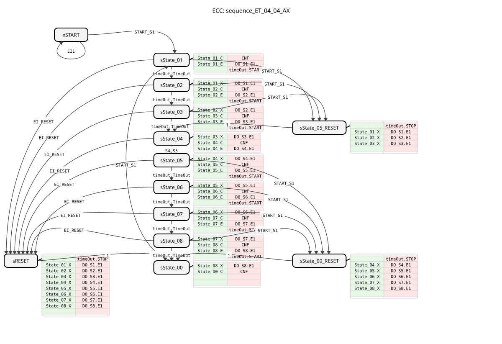
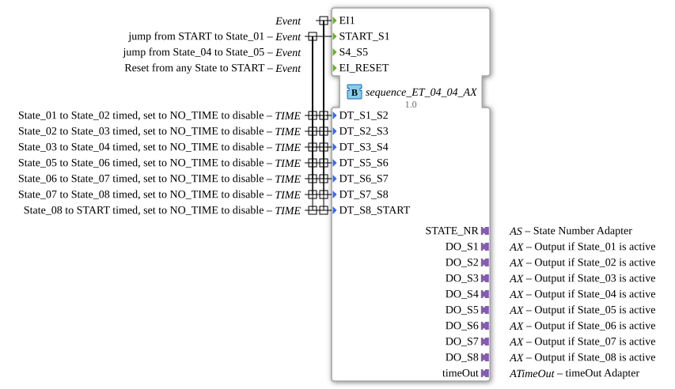

# sequence_ET_04_04_AX

* * * * * * * * * *

## Introduction

The function block `sequence_ET_04_04_AX` is the adapter-based version of `sequence_ET_04_04`. It implements an 8-stage sequence control, where the outputs are controlled via `AX` adapters (event + data) instead of simple BOOL variables. Transitions can be event-driven or time-controlled.

## Interface Structure

### **Event Inputs**

- **`EI1`**: General input event.
- **`START_S1`**: Starts the sequence or jumps back within the phases.
- **`S4_S5`**: Manual transition from state 4 to 5.
- **`EI_RESET`**: Global reset of the sequence.

### **Event Outputs**

- **`CNF`**: Execution confirmation with current `STATE_NR`.
- *(Note: The state-specific events EO_Sx are omitted here, as they are included in the adapters)*

### **Data Inputs**

- **`DT_S1_S2`** to **`DT_S8_START`** (TIME): Time delays for automatic transitions.

### **Data Outputs**

- **`STATE_NR`** (SINT): Current state number (0-8).

### **Adapters**

- **`DO_S1` to `DO_S8`** (Plug, Type: `adapter::types::unidirectional::AX`): Adapter outputs for states 1 to 8. Each entry into or exit from a state triggers the event `E1` on the corresponding adapter and sets `D1` to `TRUE` or `FALSE`, respectively.
- **`timeOut`** (Plug, Type: `iec61499::events::ATimeOut`): Interface to the external timer.

## Functionality

The logic is exactly the same as `sequence_ET_04_04`. The crucial difference lies in the physical encapsulation of the outputs. While the standard version uses separate event and data lines, the `_AX` version combines these into adapter connections. This reduces complexity in the graphical editor for extensive circuits.

## Technical Features

✔ **Adapter Outputs**: Uses the `AX` adapter for all 8 states.

✔ **Combined Triggers**: Events and time sequences control the chain.

✔ **State Feedback**: Continuous output of the `STATE_NR`.

## State Overview

See `sequence_ET_04_04`.

## ⚖️ Comparison with Similar Function Blocks

- **sequence_ET_04_04**: The version with classic BOOL outputs and EO events.

## Conclusion

sequence_ET_04_04_AX` is the ideal choice for complex 8-step controls in systems that consistently rely on adapter-based communication.
