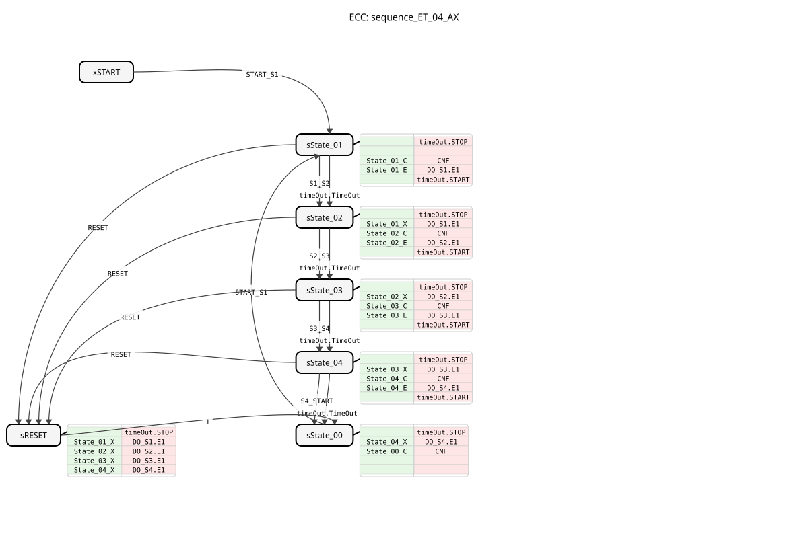
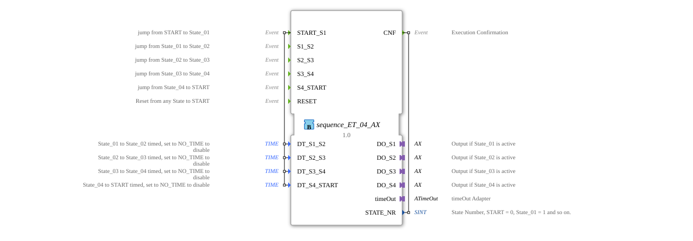

# sequence_ET_04_AX

* * * * * * * * * *
## Introduction
The function block `sequence_ET_04_AX` is a variant of `sequence_ET_04`, which additionally uses adapters (`AX`) for the outputs. It controls a sequence with 4 output states, where transitions can be event-driven or time-controlled.

## Interface Structure

### **Event Inputs**
* **START_S1**: Starts the sequence at State_01.
* **S1_S2**: Manual transition State_01 -> State_02.
* **S2_S3**: Manual transition State_02 -> State_03.
* **S3_S4**: Manual transition State_03 -> State_04.
* **S4_START**: Manual transition State_04 -> START.
* **RESET**: Resets the sequence.

### **Event Outputs**
* **CNF**: Confirmation of execution with current state number.

### **Data Inputs**
* **DT_S1_S2**: Time for transition State_01 -> State_02.
* **DT_S2_S3**: Time for transition State_02 -> State_03.
* **DT_S3_S4**: Time for transition State_03 -> State_04.
* **DT_S4_START**: Time for transition State_04 -> START.

### **Data Outputs**
* **STATE_NR** (SINT): Current state number.

### **Adapters**
* **DO_S1** (adapter::types::unidirectional::AX): Output adapter for State_01.
* **DO_S2** (adapter::types::unidirectional::AX): Output adapter for State_02.
* **DO_S3** (adapter::types::unidirectional::AX): Output adapter for State_03.
* **DO_S4** (adapter::types::unidirectional::AX): Output adapter for State_04.
* **timeOut** (iec61499::events::ATimeOut): Timer adapter.

## Functionality
The functionality is essentially the same as `sequence_ET_04`, however, the outputs `DO_S1` to `DO_S4` are not set as simple BOOL variables, but via adapters. This allows for more flexible integration in more complex systems.

## Technical Features
* Uses `adapter::types::unidirectional::AX` for the outputs.

## Status Overview
See `sequence_ET_04`.

## Application Scenarios
Similar to `sequence_ET_04`, but preferred when adapter connections are to be used.

## ⚖️ Comparison with Similar Function Blocks
* **sequence_ET_04**: The standard version with simple BOOL outputs.

## Conclusion
`sequence_ET_04_AX` offers the functionality of `sequence_ET_04` with a more modern adapter interface.