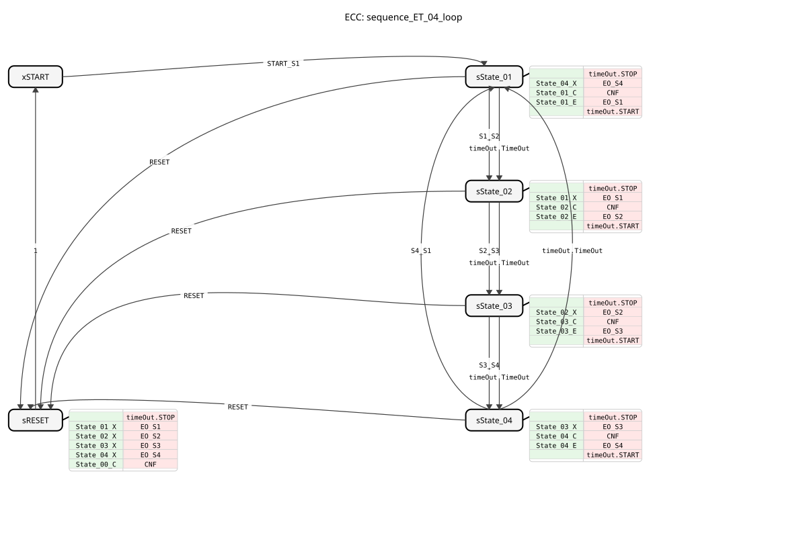

# sequence_ET_04_loop

* * * * * * * * * *

## Introduction

The function block `sequence_ET_04_loop` implements a cyclic sequence with four states. The transition between states can occur either through an external event or after a configurable time has elapsed. The block is designed to implement recurring processes in control applications where actions must be executed sequentially in a loop.

## Interface Structure

### **Event Inputs**

- `START_S1`: Starts the sequence and transitions from state `START` to state `State_01`. Transmits the four time parameters `DT_S1_S2`, `DT_S2_S3`, `DT_S3_S4`, and `DT_S4_S1`.
- `S1_S2`: Triggers the transition from `State_01` to `State_02`.
- `S2_S3`: Triggers the transition from `State_02` to `State_03`.
- `S3_S4`: Triggers the transition from `State_03` to `State_04`.
- `S4_S1`: Triggers the transition from `State_04` back to `State_01` (loop).
- `RESET`: Resets the sequence from any state back to the `START` state.

### **Event Outputs**

- `CNF`: Acknowledge event that is triggered on every state change (including reset). Transmits the current state number `STATE_NR`.
- `EO_S1`: Triggered upon entering `State_01`. Transmits the output value `DO_S1`.
- `EO_S2`: Triggered upon entering `State_02`. Transmits the output value `DO_S2`.
- `EO_S3`: Triggered upon entering `State_03`. Transmits the output value `DO_S3`.
- `EO_S4`: Triggered upon entering `State_04`. Transmits the output value `DO_S4`.
- - ...

### **Data Inputs**

- `DT_S1_S2` (TIME): Time for the automatic transition from `State_01` to `State_02`. A value of `NO_TIME` disables the time transition.
- `DT_S2_S3` (TIME): Time for the automatic transition from `State_02` to `State_03`. A value of `NO_TIME` disables the time transition.
- `DT_S3_S4` (TIME): Time for the automatic transition from `State_03` to `State_04`. The value `NO_TIME` disables the time transition.
- `DT_S4_S1` (TIME): Time for the automatic transition from `State_04` back to `State_01`. The value `NO_TIME` disables the time transition.

### **Data Outputs**

- `STATE_NR` (SINT): Current state number (`0`=START, `1`=State_01, `2`=State_02, `3`=State_03, `4`=State_04).
- `DO_S1` (BOOL): Is `TRUE` when `State_01` is active. ... * `DO_S2` (BOOL): Is `TRUE` when `State_02` is active.
- `DO_S3` (BOOL): Is `TRUE` when `State_03` is active.
- `DO_S4` (BOOL): Is `TRUE` when `State_04` is active.

### **Adapter**

- `timeOut` (Plug, Type: `iec61499::events::ATimeOut`): Used internally for implementing timed state transitions.

## Functionality

The function block (FB) operates as a BASIC FB with a finite state machine (ECC). The sequence iterates through the states `State_01` -> `State_02` -> `State_03` -> `State_04` and then jumps back to `State_01`. Each state has three main actions:

1. **Exit Action (X)**: Sets the corresponding Boolean output (`DO_Sx`) to `FALSE`.
2. **Confirmation Action (C)**: Sets the state number (`STATE_NR`) and configures the `timeOut` adapter with the time scheduled for the next transition (`DT_...`). Triggers the `CNF` event.
3. **Entry Action (E)**: Sets the associated Boolean output (`DO_Sx`) to `TRUE` and triggers the corresponding output event (`EO_Sx`).

A state transition can occur in two ways:

1. **By Event**: Through the corresponding input event (e.g., `S1_S2`).
2. **By Time**: After the time set in the current state in the `timeOut` adapter has elapsed, unless this is `NO_TIME`.

The `RESET` input always leads to the special `sRESET` state, which switches off all active outputs, sets the state number to 0, and then returns to the `START` state.

## Technical Features

- **Hybrid Triggering**: Each state transition can be individually configured to be either event-driven or time-driven. This allows for maximum flexibility within a sequence.
- **Initial Values**: The time parameters are initialized to `NO_TIME` by default, meaning that all time-driven transitions are initially disabled and await an external event.
- **Adapter Usage**: Time control is consistently handled via the standardized `ATimeOut` adapter, increasing reusability and clarity.
- **Status Feedback**: The current position in the sequence is always visible externally via the `STATE_NR` output.

## State Overview

The ECC consists of six states:

1. **xSTART**: Initial, inactive state. Waits for `START_S1`.
2. **sState_01**: Active state
3. Sets `DO_S1`. Can switch to `sState_02` via a `S1_S2` event or timeout.
4. **sState_02**: Active State
5. Sets `DO_S2`. Can transition to `sState_03` via the `S2_S3` event or timeout.
6. **sState_03**: Active State
7. Sets `DO_S3`. Can transition to `sState_04` via the `S3_S4` event or timeout.
8. **sState_04**: Active State
9. Sets `DO_S4`. Can transition back to `sState_01` via the `S4_S1` event or timeout (loop).
10. **sRESET**: Reset state. Switches off all outputs, sets `STATE_NR` to 0, and automatically switches back to `xSTART`.

## Application Scenarios

- **Cyclical Process Control**: Control of machines that perform a repeating work cycle with multiple steps (e.g., filling, heating, mixing, emptying).
- **Traffic Light Circuits**: Modeling a simple, multi-phase traffic light system where each phase can last a fixed time or be terminated prematurely.
- **Batch Processes**: Processing batch processes where individual steps are terminated either by sensors (events) or after a minimum time.

## ⚖️ Comparison with Similar Function Blocks

Unlike simple timer blocks or flip-flops, this function block orchestrates a complete, state-based sequence. Compared to a `E_CYCLE`The `sequence_ET_04_loop` block offers explicit state logic with clear transition conditions and the ability to trigger each step individually. It is more specialized and structured than a custom-programmed sequence of `E_SR` and `E_DELAY` blocks.

## 🛠️ Related Exercises

- [Exercise_037](../../../../../../Uebungen/test_B/Uebungen_doc/Uebung_037.md)

## Conclusion

The `sequence_ET_04_loop` block is a robust and flexible building block for implementing cyclic 4-step sequences. Its strength lies in its hybrid triggering, which allows you to choose between event-driven and time-based triggering for each step. The clear state machine, the feedback of the current state, and the integrated reset make it a reliable component for recurring control tasks in automation technology.
