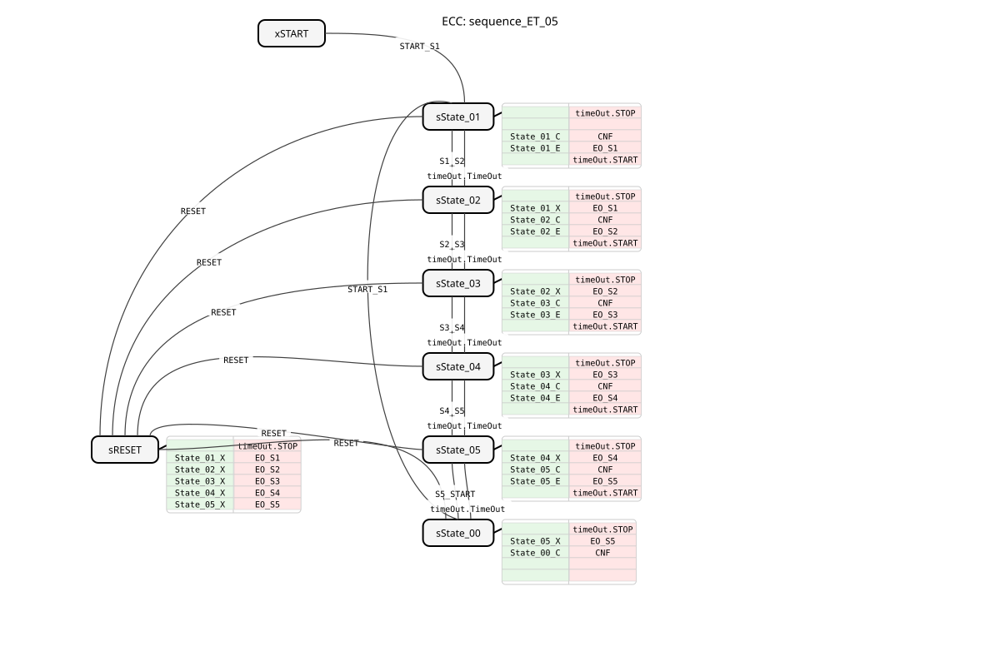

# sequence_ET_05


* * * * * * * * * *
## Introduction
The function block `sequence_ET_05` implements sequential control with five defined states (State_01 to State_05) and a start state (START). The transition between states can occur either through an external event or after an adjustable time. The block is designed for applications that require a step-by-step sequence of actions with flexible transition conditions.


## Interface Structure

### **Event Inputs**
* **`START_S1`**: Switches from the START state or State_00 to the State_01 state. Transmits the time parameters for all state transitions.
* **`S1_S2`**: Manual transition from State_01 to State_02.
* **`S2_S3`**: Manual transition from State_02 to State_03.
* **`S3_S4`**: Manual transition from State_03 to State_04.
* **`S4_S5`**: Manual transition from State_04 to State_05.
* **`S5_START`**: Manual transition from State_05 back to State_00 (representing START).
* **`RESET`**: Instantly returns to State_00 (START) from any state and disables all outputs.

### **Event Outputs**
* **`CNF`**: Execution confirmation. Triggered on every state change and returns the new state number (`STATE_NR`).
* **`EO_S1`**: Triggered upon entering State_01 and returns the active output `DO_S1`.
* **`EO_S2`**: Triggered upon entering State_02 and returns the active output `DO_S2`.
* **`EO_S3`**: Triggered upon entering State_03 and returns the active output `DO_S3`.
* **`EO_S4`**: Triggered upon entering State_04 and provides the active output `DO_S4`.
* **`EO_S5`**: Triggered upon entering State_05 and provides the active output `DO_S5`.

### **Data Inputs**
* **`DT_S1_S2`** (TIME): Dwell time in State_01 before automatic transition to State_02. Initial value: `NO_TIME` (disabled).
* **`DT_S2_S3`** (TIME): Dwell time in State_02 before automatic transition to State_03. Initial value: `NO_TIME` (disabled).
* **`DT_S3_S4`** (TIME): Time spent in State_03 before automatic transition to State_04. Initial value: `NO_TIME` (disabled).
* **`DT_S4_S5`** (TIME): Time spent in State_04 before automatic transition to State_05. Initial value: `NO_TIME` (disabled).
* **`DT_S5_START`** (TIME): Time spent in State_05 before automatic transition back to State_00 (START). Initial value: `NO_TIME` (disabled).

### **Data Outputs**
* **`STATE_NR`** (SINT): Current state number (START = 0, State_01 = 1, ..., State_05 = 5).
* **`DO_S1`** (BOOL): Is `TRUE` when State_01 is active.
* **`DO_S2`** (BOOL): Is `TRUE` when State_02 is active.
* **`DO_S3`** (BOOL): Is `TRUE` when State_03 is active.
* * **`DO_S4`** (BOOL): Is `TRUE` when State_04 is active.
* **`DO_S5`** (BOOL): Is `TRUE` when State_05 is active.

### **Adapter**
* **`timeOut`** (Plug, Type: `iec61499::events::ATimeOut`): Used internally for timed state transitions. The function block starts and stops the timer and sets its runtime (`DT`).

## Functionality
The function block operates as a Basic function block with an Execution Control Chart (ECC). The initial state is `xSTART`. Upon a `START_S1` event, the function block (FB) transitions to state `sState_01`. In each active state (sState_01 to sState_05), the following actions are performed:

1. The `timeOut` adapter is stopped.

2. The output of the previous state is deactivated (exit algorithm `X`).

3. The state number `STATE_NR` is updated, and the dwell time for the *next* transition is passed to the timer (confirmation algorithm `C`). The `CNF` event is then triggered.

2. The output of the previous state is deactivated (exit algorithm `X`). 4. The output of the current state is activated (entry algorithm `E`). The corresponding `EO_Sx` event is triggered.

5. The `timeOut` adapter with the previously set time is started.

A state change can now occur in two ways:

1. **Event-driven:** Through the corresponding manual event (e.g., `S1_S2`).

2. **Time-driven:** Through the adapter's `timeOut.TimeOut` event, provided the time (`DT_Sx_Sy`) is not set to `NO_TIME`.

The `RESET` event always leads to the special state `sRESET`, in which all outputs are deactivated, and from there immediately to the state `sState_00` (representing the logical START state with `STATE_NR = 0`).

## Technical Features
* **Flexible Transitions:** Each state transition can be configured independently as event-driven or time-driven. Time-driven control is deactivated by setting the corresponding `DT_` input to the constant `NO_TIME`.
* **Immediate Reset:** The `RESET` input always has priority and immediately interrupts the current sequence.

## Technical Features
* **Flexible Transitions:** * **Clearly Defined Interface:** The status number and active outputs are always available as data outputs and are confirmed by an event at each step.
* **Adapter-Based Time Control:** The use of a standardized TimeOut adapter makes the internal time management robust and reusable.

## State Overview
The ECC includes the following states:

* **xSTART:** Initial idle state.
* **sState_01 ... sState_05:** The five sequential operating states.
* **sState_00:** Represents the logical START state after completion of the sequence or after a reset. No output is active in this state.
* **sRESET:** Intermediate state for deactivating all outputs during a reset operation.

## Application Scenarios
* **Batch Process Control:** Step-by-step processing of recipes in mixing or filling systems, where each step is manually acknowledged or automatically advances after a defined time.
* **Linked Machine Sequences:** Control of a machine whose cycle consists of several sequentially performed actions (e.g., loading, processing, inspection, ejection).
* **Test Sequences:** Automated test benches that perform a series of tests sequentially, where each test has a fixed duration or can be manually confirmed.

## ⚖️ Comparison with Similar Components
Compared to simple timer chains or counters, `sequence_ET_05` offers a fully encapsulated state machine with clear input/output events and the flexible combination of time and event control. Compared to a genericThe `E_SR` or `E_CTUD` function block, when used in an ad-hoc configuration, provides a predefined, tested, and easily configurable solution for a common control task.

## 🛠️ Related Exercises
* [Exercise_039](../../../../../../Uebungen/test_B/Uebungen_doc/Uebung_039.md)]
* [Exercise_039a](../../../../../../Uebungen/test_B/Uebungen_doc/Uebung_039a.md)]

````````````````## Conclusion

The `sequence_ET_05` is a well-structured and flexible function block for implementing 5-step sequences. The clear separation of control flow (events) and parameters (times), as well as the option to configure each transition either manually or automatically, makes it suitable for a wide variety of control tasks in automation technology. The use of standardized adapters and comprehensive interface documentation facilitate integration into larger applications.

---

### 🌐 Related topic subpages on ms-muc-docs.de
* [🌐 E_CTU Event Counter block on ms-muc-docs.de ](https://www.ms-muc-docs.de/iec-61499/event-function-blocks/e_ctu/)
