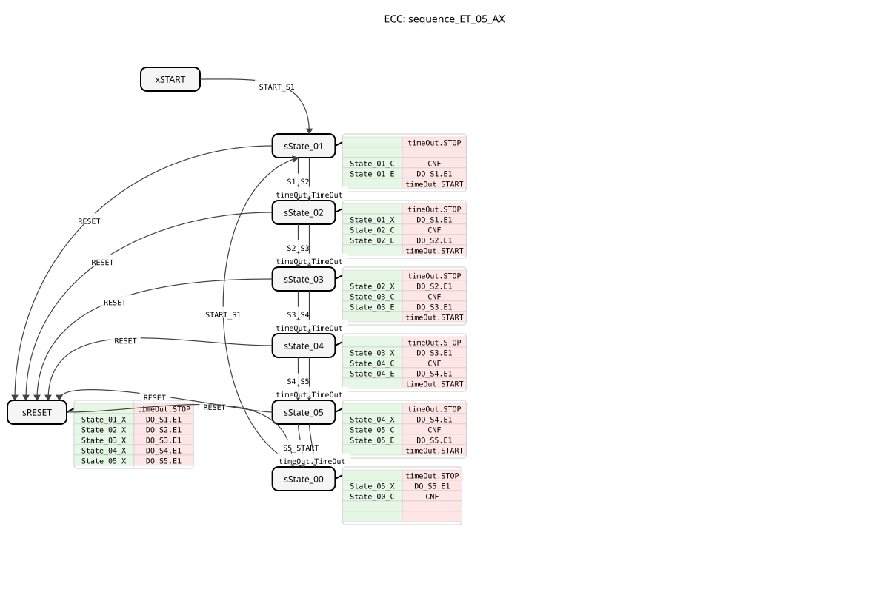
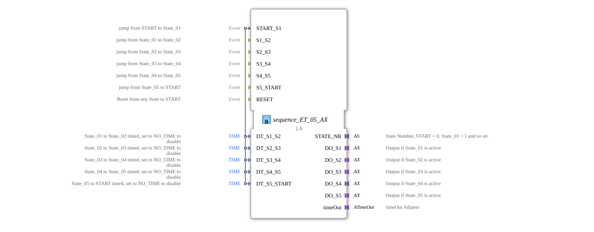

# sequence_ET_05_AX

* * * * * * * * * *
## Introduction
`sequence_ET_05_AX` is a variant of `sequence_ET_05` that additionally uses adapters (`AX`) for the outputs. It controls a sequence with 5 output states.

## Interface Structure

### **Event Inputs**
* **START_S1**: Starts the sequence at State_01.
* **S1_S2**: Manual transition State_01 -> State_02.
* **S2_S3**: Manual transition State_02 -> State_03.
* **S3_S4**: Manual transition State_03 -> State_04.
* **S4_S5**: Manual transition State_04 -> State_05.
* **S5_START**: Manual transition State_05 -> START.
* **RESET**: Resets the sequence.

### **Event Outputs**
* **CNF**: Confirmation of execution.

### **Data Inputs**
* **DT_S1_S2**: Time for transition State_01 -> State_02.
* **DT_S2_S3**: Time for transition State_02 -> State_03.
* **DT_S3_S4**: Time for transition State_03 -> State_04.
* **DT_S4_S5**: Time for transition State_04 -> State_05.
* **DT_S5_START**: Time for transition State_05 -> START.

### **Data Outputs**
* **STATE_NR** (SINT): Current state number.

### **Adapters**
* **DO_S1** (adapter::types::unidirectional::AX): Output adapter for State_01.
* **DO_S2** (adapter::types::unidirectional::AX): Output adapter for State_02.
* **DO_S3** (adapter::types::unidirectional::AX): Output adapter for State_03.
* **DO_S4** (adapter::types::unidirectional::AX): Output adapter for State_04.
* **DO_S5** (adapter::types::unidirectional::AX): Output adapter for State_05.
* **timeOut** (iec61499::events::ATimeOut): Timer adapter.

## Functionality
Corresponds to `sequence_ET_05`, but uses adapters for the outputs.

## Technical Features
* Uses `adapter::types::unidirectional::AX`.

## Status Overview
See `sequence_ET_05`.

## Application Scenarios
For 5-step sequences with adapter connection.

## ⚖️ Comparison with Similar Function Blocks
* **sequence_ET_05**: Standard version without adapter.

## Conclusion
Adapter version of the 5-step sequencer.