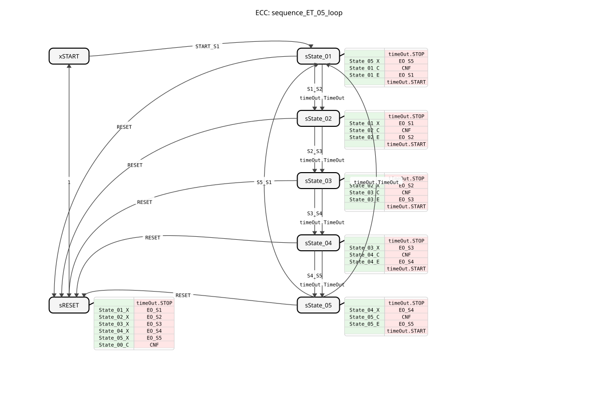
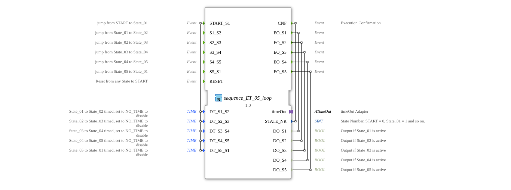

# sequence_ET_05_loop

* * * * * * * * * *
## Introduction
The function block `sequence_ET_05_loop` implements a cyclic sequence with five states. The transition between the individual states can occur either through an external event or after a configurable time has elapsed. This block is designed for applications where a process must be executed step by step, triggering various actions in a fixed sequence, such as in packaging machines, assembly processes, or washing programs.

`` 

## Interface Structure

### **Event Inputs**
* **`START_S1`**: Starts the sequence and executes the transition from the start state (`START`) to the first state (`State_01`). Transmits the time values for all time-controlled transitions.
* **`S1_S2`**: Triggers the transition from `State_01` to `State_02`.
* **`S2_S3`**: Triggers the transition from `State_02` to `State_03`.
* **`S3_S4`**: Triggers the transition from `State_03` to `State_04`.
* **`S4_S5`**: Triggers the transition from `State_04` to `State_05`.
* **`S5_S1`**: Triggers the transition from `State_05` back to `State_01` (cycle).
* **`RESET`**: Resets the sequence from any state back to the start state (`START`).

### **Event Outputs**
* **`CNF`**: Acknowledge event triggered on every state change. Transmits the current state number (`STATE_NR`).
* **`EO_S1`**: Triggered upon entering `State_01`. Transmits the output value `DO_S1`.
* **`EO_S2`**: Triggered upon entering `State_02`. Transmits the output value `DO_S2`.
* **`EO_S3`**: Triggered upon entering `State_03`. Transmits the output value `DO_S3`.
* **`EO_S4`**: Triggered upon entering `State_04`. Transmits the output value `DO_S4`.
* **`EO_S5`**: Triggered upon entering `State_05`. Transmits the output value `DO_S5`.

### **Data Inputs**
* **`DT_S1_S2`** (Type: `TIME`, Initial value: `NO_TIME`): Time for the automatic transition from `State_01` to `State_02`. The timed transition is disabled at `NO_TIME`.
* **`DT_S2_S3`** (Type: `TIME`, Initial value: `NO_TIME`): Time for the automatic transition from `State_02` to `State_03`.
* **`DT_S3_S4`** (Type: `TIME`, Initial value: `NO_TIME`): Time for the automatic transition from `State_03` to `State_04`.
* **`DT_S4_S5`** (Type: `TIME`, Initial value: `NO_TIME`): Time for the automatic transition from `State_04` to `State_05`.
* **`DT_S5_S1`** (Type: `TIME`, Initial value: `NO_TIME`): Time for the automatic transition from `State_05` to `State_01`.

### **Data Outputs**
* **`STATE_NR`** (Type: `SINT`): Outputs the number of the current state (START = 0, State_01 = 1, ..., State_05 = 5).
* **`DO_S1`** (Type: `BOOL`): Is `TRUE` when `State_01` is active.
* **`DO_S2`** (Type: `BOOL`): Is `TRUE` when `State_02` is active.
* **`DO_S3`** (Type: `BOOL`): Is `TRUE` when `State_03` is active.
* **`DO_S4`** (Type: `BOOL`): Is `TRUE` when `State_04` is active.
* **`DO_S5`** (Type: `BOOL`): Is `TRUE` when `State_05` is active.

### **Adapter**
* **`timeOut`** (Type: `ATimeOut`): A plug-in adapter for implementing timed state transitions. The function block (FB) uses the interfaces `START`, `STOP`, and `DT` (time value), as well as the event `TimeOut`.

## Functionality
The FB is implemented as a Basic FB with an Execution Control Chart (ECC). The sequence begins in state `xSTART`. The event `START_S1` activates the first state, `sState_01`. The following actions are executed upon each state entry:

1. The timer adapter is stopped (`timeOut.STOP`).

2. The output of the previous state is reset (e.g., `State_05_X` for `DO_S5`).

3. The state number `STATE_NR` is updated, and the timer for the next transition is configured (e.g., `State_01_C`).

4. The output of the new state is set (e.g., `State_01_E` for `DO_S1`).

5. The timer adapter is started with the time configured for this transition (`timeOut.START`).

A state change can now occur in two ways:

* **Event-driven:** Through the corresponding input event (e.g., `S1_S2`).
* **Time-Controlled:** Triggered by the adapter's `TimeOut` event, provided the time (`DT_...`) is not set to `NO_TIME`.

The sequence cycles through states 1 to 5 and then jumps from `State_05` back to `State_01`, creating an endless cycle. The `RESET` event triggers the reset state `sRESET`, regardless of the current state, from where the sequence automatically returns to the `xSTART` state.

## Technical Features
* **Hybrid Triggering:** Each state transition can be individually configured to be either event-driven or time-controlled. This allows for maximum flexibility within a fixed sequence.
* **Safe State Outputs:** The Boolean outputs (`DO_Sx`) are explicitly reset via an exit algorithm (`State_XX_X`) when a state is exited. This prevents the unintentional persistence of the `TRUE` signal.
* **Explicit Timer Control:** The timer is restarted and stopped with each state change, ensuring precise and deterministic timing.
* **Constants:** The function block uses defined constants (`sequence::State_XX`, `NO_TIME`) from imported libraries, which improves the maintainability and readability of the code.
*
## State Overview

The ECC consists of seven states:

1. **`xSTART`**: Inactive initial state.

2. **`sState_01`** to **`sState_05`**: The five active sequence states.

3. **`sRESET`**: Intermediate state that resets all outputs on reset and confirms the `xSTART`-State sends.

## Application Scenarios
* **Control of Cyclic Processes:** Automated machining centers (e.g., multi-tool lathes) where each step takes a specific amount of time or is completed by a sensor event.
* **Batch Processes:** Batch processing in the food or pharmaceutical industries, where mixing, heating, and filling occur sequentially.
* **Safety Sequences:** Monitored start or stop procedures where each step is manually enabled (`EVENT`) or continues automatically after a waiting period (`TIME`).
* **Test Stands:** Automated testing sequences where various measurements or functional tests are performed sequentially.

## ⚖️ Comparison with Similar Function Blocks
Compared to simple timer function blocks or self-holding relay cascades, `sequence_ET_05_loop` offers a predefined, cyclic structure with integrated time and event control. Compared to programming with individual blocks (e.g., `E_SR`, `E_DELAY`), it reduces wiring effort and improves clarity. Other sequencer function blocks may have a variable number of steps or different transition logic (time only OR event only). This function block is distinguished by its combined `EVENT`/`TIME` triggering per step.

## Conclusion
The `sequence_ET_05_loop` is a robust and clearly structured function block for implementing cyclic 5-step sequences. The combination of event-driven and time-controlled transitions makes it extremely flexible for a wide variety of automation tasks. Explicit control of the outputs and the timer ensures deterministic and reliable behavior. It is ideally suited for efficiently and clearly mapping recurring process flows with a fixed number of steps in an IEC 61499-based controller.
