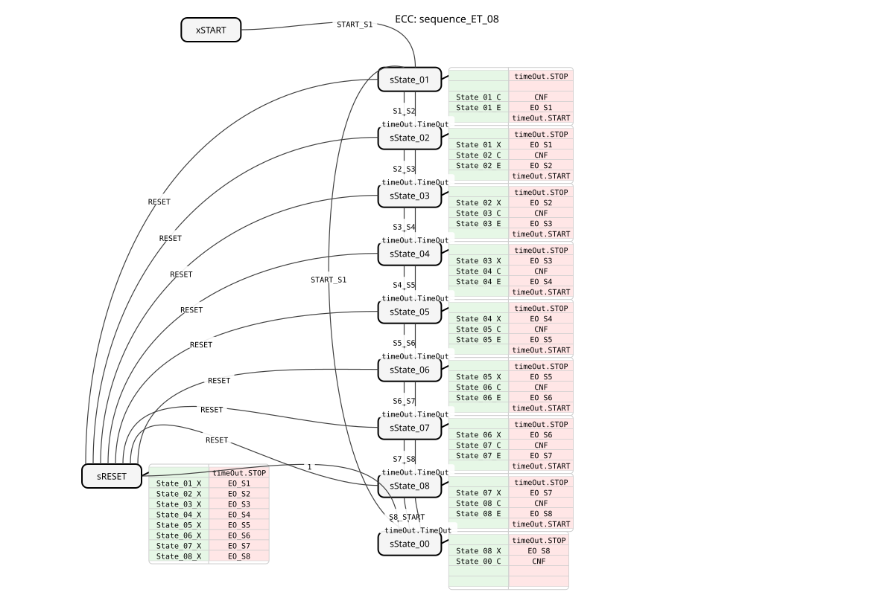
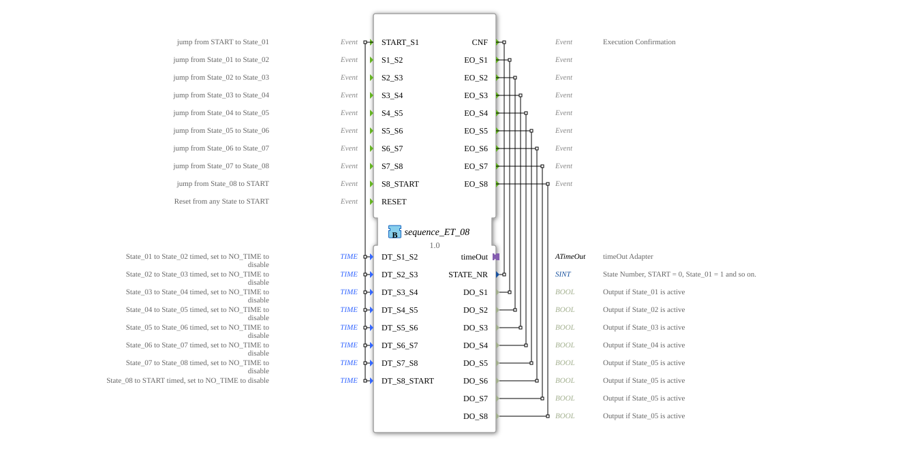

# sequence_ET_08

* * * * * * * * * *
## Introduction
The function block `sequence_ET_08` is a sequencer with eight outputs. It allows the execution of a fixed sequence of steps, where the transition from one step to the next can be triggered either by an external event or by an adjustable time interval. This block is particularly suitable for control tasks requiring a cyclic or time-controlled sequence of actions.

## Interface Structure
### **Event Inputs**
* `START_S1`: Jumps from state `START` to state `State_01`. Transfers all timestamps (`DT_S1_S2` to `DT_S8_START`).
* `S1_S2`: Jumps from `State_01` to `State_02`.
* `S2_S3`: Jumps from `State_02` to `State_03`.
* `S3_S4`: Jumps from `State_03` to `State_04`.
* `S4_S5`: Jumps from `State_04` to `State_05`.
* `S5_S6`: Jumps from `State_05` to `State_06`.
* `S6_S7`: Jumps from `State_06` to `State_07`.
* `S7_S8`: Jumps from `State_07` to `State_08`.
* `S8_START`: Jumps from `State_08` back to `START`.
* `RESET`: Resets the function block from any state back to `START`.

### **Event Outputs**
* `CNF`: Execution confirmation. Set with every state change and transmits the current state number (`STATE_NR`).
* `EO_S1` to `EO_S8`: State-specific event outputs. These inputs are triggered upon entering the corresponding state (`State_01` to `State_08`) and transmit the respective Boolean data output (`DO_S1` to `DO_S8`).

### **Data Inputs**
* `DT_S1_S2` to `DT_S8_START` (Type `TIME`): Define the duration for the automatic transition from the current to the next state. If the value is set to `NO_TIME`, the timed transition for this step is disabled, and an event is required.

### **Data Inputs**
* `DT_S1_S2` to `DT_S8_START` (Type `TIME`): Define the duration for the automatic transition from the current to the next state. If the value is set to `NO_TIME`, the timed transition for this step is disabled, and an event is required.
*
### **Data Outputs**
* `STATE_NR` (Type `SINT`): Outputs the current state number (`START = 0`, `State_01 = 1`, ..., `State_08 = 8`).
* `DO_S1` to `DO_S8` (Type `BOOL`): Logical outputs that are `TRUE` as long as the function block is in the corresponding state (`State_01` to `State_08`).

### **Adapter**
* `timeOut` (Type `iec61499::events::ATimeOut`): A timer adapter used to implement timed state transitions.

## Functionality
The function block is implemented as a BASIC FB with an Execution Control Chart (ECC). It starts in the initial state `xSTART`. An event `START_S1` leads to the first active state `sState_01`. Each active state (`sState_01` to `sState_08`) performs the following actions upon entry:

1. Stops the running timer.

2. Executes the exit algorithm of the previous state (switches off the previous output).

3. Executes the Confirmation algorithm (`*_C`), which sets the time for the next possible automatic transition in the adapter (`STATE_NR`).

4. Executes the Entry algorithm (`*_E`), which activates the associated Boolean output (`DO_Sx`) and triggers the corresponding event (`EO_Sx`).

5. Starts the timer with the duration set for this state (`DT_*`).

The transition to the next state can occur in two ways:

1. **Event-driven:** Through the corresponding jump event (e.g., `S1_S2`).

2. **Time-driven:** Through the adapter's `TimeOut` event, provided the duration (`DT_*`) is not `NO_TIME`.

The `RESET` event leads to a dedicated reset state (`sRESET`), which switches off all active outputs before transitioning to the inactive `START` state (`sState_00`).

## Technical Features
* **Hybrid Transitions:** Each step offers two parallel transition conditions (event OR time), providing maximum flexibility.
* **Safe State Handling:** The timer is always stopped during a state change, and the outputs are cleanly deactivated by defined exit algorithms.
* **Configurable Times:** The time for each step can be set individually or deactivated using `NO_TIME`.
* **Explicit State Feedback:** The output `STATE_NR` allows for easy external monitoring of the current step position.

## State Overview

1. **xSTART:** Initial, inactive state (at the start of the function block).

2. **sState_00:** Inactive `START` state (after reset or cycle end). `STATE_NR = 0`.

3. **sState_01 to sState_08:** Active states of the sequence. `STATE_NR = 1` to `8`. The corresponding outputs `DO_S1` to `DO_S8` are active.

4. **sRESET:** Temporary state that switches off all active outputs upon a `RESET` event.

## Application Scenarios
* Control of cyclic processes in packaging or manufacturing machines.
* Step sequence for an automated test or calibration process.
* Control of an exposure or rinsing sequence in semiconductor manufacturing.
* General state machines where steps can be triggered by both sensor input (events) and fixed time intervals.

## ⚖️ Comparison with similar components
Compared to simpler sequencers (e.g., `E_SR` or `E_CTU` in series), `sequence_ET_08` offers a fully predefined step sequence with integrated timing and dedicated outputs for each step. Unlike a custom-programmed SFC (Sequential Function Chart), the logic is hard-coded, making it easier to use but also less flexible. Components like `E_DELAY` would need to be added externally, whereas here the timing functionality is integrated.

Compared to simpler sequencers (e.g., `E_DELAY`), `sequence_ET_08` offers a fully predefined step sequence with integrated timing and dedicated outputs for each step.
## Conclusion

The `sequence_ET_08` is a robust and easy-to-configure sequencer block for IEC 61499. Its strength lies in its combined event and time control, as well as its clear, step-defined interface. It is ideally suited for standardized control sequences with up to eight steps where a high degree of predictability and simple parameterization are desired. For processes with a variable number of steps or more complex branching, more flexible solutions such as composite function blocks or custom SFCs are preferable.

---

### 🌐 Related topic subpages on ms-muc-docs.de
* [🌐 E_CTU Event Counter block on ms-muc-docs.de ](https://www.ms-muc-docs.de/iec-61499/event-function-blocks/e_ctu/)
