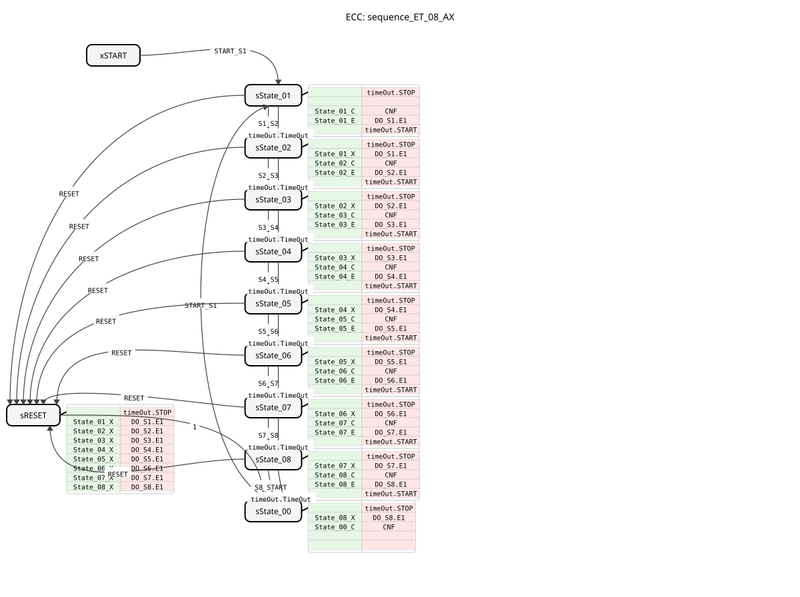
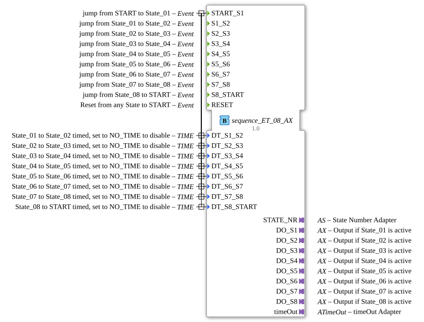

# sequence_ET_08_AX

* * * * * * * * * *
## Introduction
`sequence_ET_08_AX` is a variant of `sequence_ET_08` that additionally uses adapters (`AX`) for the outputs. It controls a sequence with 8 output states.

## Interface Structure

### **Event Inputs**

* **START_S1**: Starts the sequence at State_01.

* **S1_S2** ... **S7_S8**: Manual transitions between states.

* **S8_START**: Manual transition State_08 -> START.

* **RESET**: Resets the sequence.

### **Event Outputs**

* **CNF**: Confirmation of execution.

### **Data Inputs**

* **DT_S1_S2** ... **DT_S8_START**: Times for automatic transitions between states.

### **Data Outputs**

* **STATE_NR** (SINT): Current state number.

### **Adapters**
* **DO_S1** ... **DO_S8** (adapter::types::unidirectional::AX): Output adapter for State_01 to State_08.

* **timeOut** (iec61499::events::ATimeOut): Timer adapter.

## Functionality
Corresponds to `sequence_ET_08`, but uses adapters for the outputs.

## Technical Features
* Uses `adapter::types::unidirectional::AX`.

## Status Overview

See `sequence_ET_08`.

## Application Scenarios
For 8-step sequences with adapter connection.

## ⚖️ Comparison with Similar Components

* **sequence_ET_08**: Standard version without adapter.

## Conclusion
Adapter version of the 8-step sequencer.