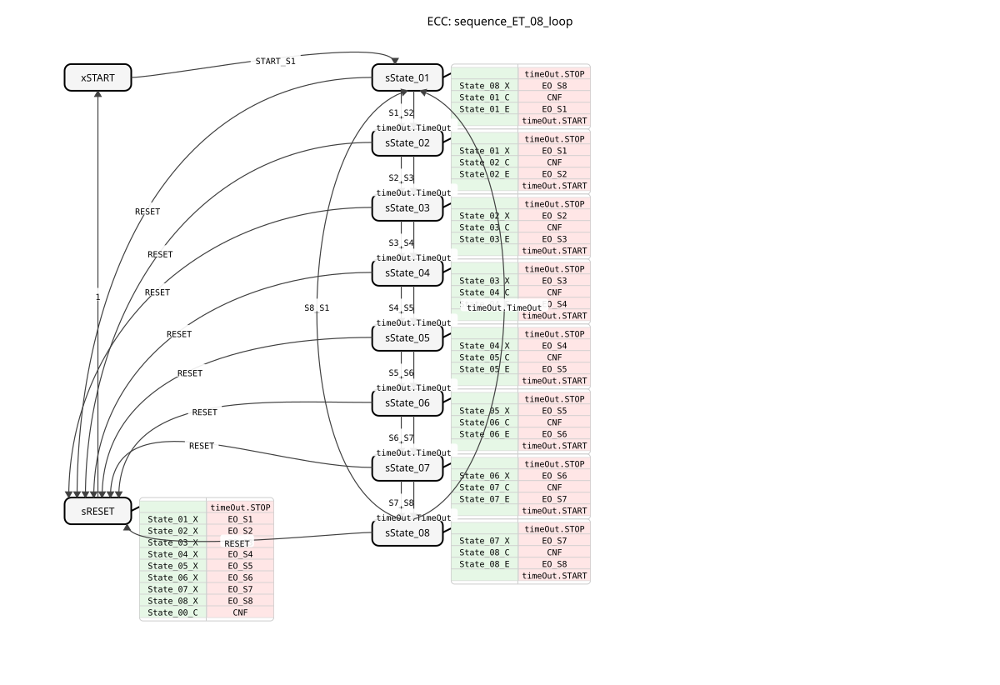
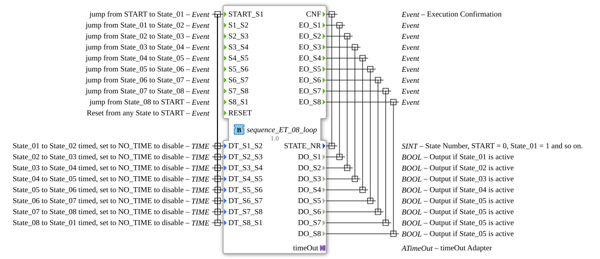

# sequence_ET_08_loop

* * * * * * * * * *

## Introduction

The function block `sequence_ET_08_loop` is a sequencer with eight output states that operates in a loop. It allows transitions between states either triggered by an external event or timed after an adjustable time interval. This block is designed for control tasks where a defined sequence of actions (represented by outputs `DO_S1` to `DO_S8`) must be executed. A key feature is the ability to individually configure each state transition as either event-driven or time-controlled.

## Interface Structure

### **Event Inputs**

- **`START_S1`**: Starts the sequence and transitions from state `START` to state `State_01`. Transfers all time data (`DT_S1_S2` to `DT_S8_S1`).
- **`S1_S2` to `S8_S1`**: Performs the transition from the corresponding source state to the next target state (e.g., `S1_S2` from `State_01` to `State_02`). These transitions are only effective if timing is disabled for this step.
- **`RESET`**: Resets the sequence from any state back to the initial state `START`.

### **Event Outputs**

- **`CNF`**: General execution confirmation event that is triggered on every state transition. Transmits the current state number `STATE_NR`.
- **`EO_S1` to `EO_S8`**: State-specific output events that are triggered upon entering the corresponding state (`State_01` to `State_08`). Each event transmits the corresponding Boolean data output (`DO_Sx`).

### **Data Inputs**

- **`DT_S1_S2` to `DT_S8_S1`** (Type: `TIME`): Define the duration for which the respective state remains active before an automatic, time-controlled transition to the next state occurs. To disable the time control for a specific transition and switch to purely event-driven transitions, the value must be set to the constant `NO_TIME`. Initially, all time inputs are preset to `NO_TIME`.

### **Data Outputs**

- **`STATE_NR`** (Type: `SINT`): Outputs the number of the currently active state (START = 0, State_01 = 1, ..., State_08 = 8).
- **`DO_S1` to `DO_S8`** (Type: `BOOL`): The physical outputs of the sequence. Each output is set to `TRUE` if the function block is in the corresponding state (`DO_S1` to `State_01`, etc.), otherwise it is `FALSE`.

### **Adapter**

- **`timeOut`** (Type: `ATimeOut`): A plug-in timeout adapter used to implement timed state transitions. The function block (FB) starts and stops the timer and passes it the respective time setting (`DT_Sx_Sy`).

## Functionality

The FB is implemented as a Basic Function Block (BFB) with an Execution Control Chart (ECC). The ECC consists of the states `xSTART` (initial state), `sState_01` to `sState_08` (active sequence states), and `sRESET` (reset state).

Upon entering an active state (e.g., `sState_01`), the following actions are executed sequentially:

1. The `timeOut` timer is stopped.
2. The exit algorithm (`X`) of the previous state is executed (setting the previous output `DO_Sx` to `FALSE`).
3. The confirmation algorithm (`C`) of the new state is executed (setting `STATE_NR` and configuring the `timeOut` adapter with the time set for this state, `DT`).
4. The entry algorithm (`E`) for the new state is executed (setting the corresponding output `DO_Sx` to `TRUE` and triggering the event `EO_Sx`).
5. The timer `timeOut` is started with the set time.

A state change can be triggered in two ways:

1. **Event-driven:** By the corresponding event `Sx_Sy`, provided the timer for this transition is disabled (`DT = NO_TIME`).
2. **Time-Controlled:** By the adapter's `TimeOut` event, provided a valid time (`DT != NO_TIME`) is set.

The `RESET` event leads to the `sRESET` state, disables all outputs, and confirms the `0` (`START`) state before the function block (FB) switches back to `xSTART`.

## Technical Features

- **Hybrid Triggering:** Each state transition can be individually configured. This offers maximum flexibility for sequences that are partly sensor-driven and partly time-controlled.
- **Initial Configuration:** By default, all transitions are event-driven (`NO_TIME`), which requires explicit configuration of the time values to utilize timing.
- **State Confirmation:** The `CNF` event with `STATE_NR` enables easy monitoring and visualization of the current sequence position.
- **Closed Loop:** The sequence automatically loops back from `State_08` to `State_01`, allowing for the implementation of cyclic processes.

## State Overview

The FB passes through the following states in the ECC:

- **`xSTART`:** Inactive initial state. Waiting for `START_S1`.
- **`sState_01` to `sState_08`:** Active operating states. Each state activates its specific output (`DO_Sx`) and waits for a trigger to transition to the next state.
- **`sRESET`:** Reset state. Exited from any state upon the `RESET` event, this state deactivates all outputs and returns to `xSTART`.

The transition conditions are defined in the ECC and combine the events `Sx_Sy`, `timeOut.TimeOut`, and `RESET`..

## Application Scenarios

- **Batch Process Control:** Sequence control for mixing, heating, or filling processes where individual steps have varying durations.
- **Linked Machine Sequences:** Control of a machine whose work cycle consists of several sequentially connected positions or functions (e.g., turning, drilling, milling).
- **Test Stands:** Automated execution of test sequences that combine tests (event-driven) with waiting times (time-driven).
- **Packaging Machines:** Control of the cycle "feed product - close packaging - label - discharge".

## ⚖️ Comparison with Similar Function Blocks

Compared to simpler timers or flip-flops, this function block offers a predefined, robust state machine for 8-step sequences. Compared to an individually programmed SFC (Sequential Function Chart) in a service or composite function block, `sequence_ET_08_loop` is a ready-to-use, tested, and reusable component that accelerates development and reduces the potential for errors. Function blocks with a fixed number of states are often more performant and easier to configure than fully programmable sequencers.

## Conclusion

The `sequence_ET_08_loop` is a powerful and flexible function block for controlling cyclic 8-step sequences. Its strength lies in its hybrid triggering, which is freely selectable for each step, and its clear, event-based interface according to IEC 61499. Thanks to its integrated timing and direct Boolean outputs, it is ideally suited for directly controlling actuators in a higher-level control network.
