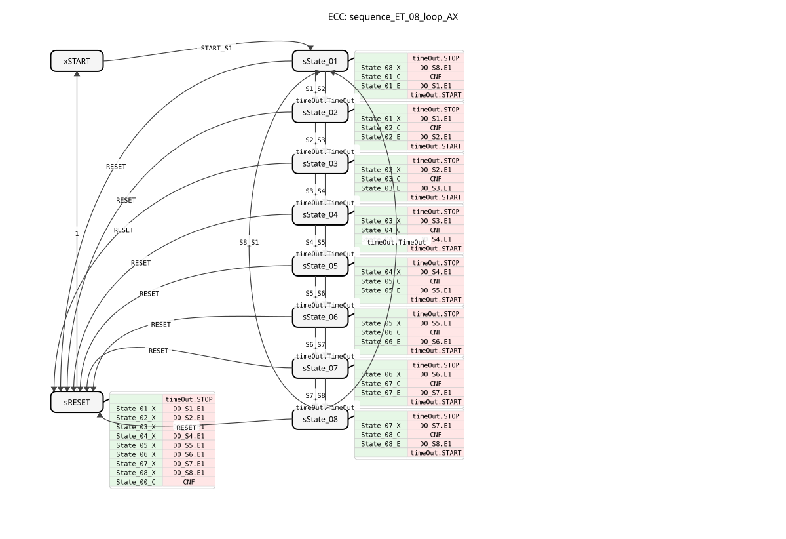
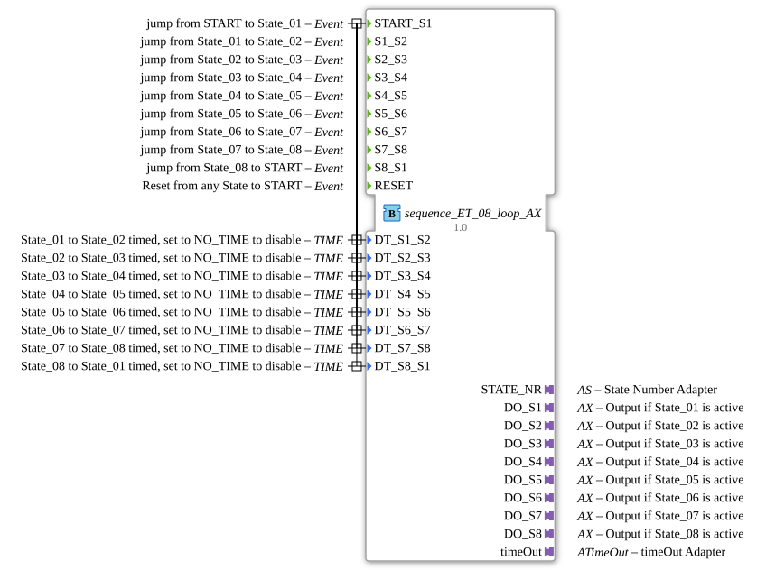

# sequence_ET_08_loop_AX

* * * * * * * * * *
## Introduction
`sequence_ET_08_loop_AX` is a variant of `sequence_ET_08_loop` that additionally uses adapters (`AX`) for the outputs. It controls a cyclic sequence with 8 output states.

## Interface Structure

### **Event Inputs**
* **START_S1**: Starts the sequence at State_01.
* **S1_S2** ... **S7_S8**: Manual transitions between states.
* **S8_S1**: Manual transition State_08 -> State_01 (loop).
* **RESET**: Resets the sequence.

### **Event Outputs**
* **CNF**: Acknowledgement of execution.

### **Data Inputs**
* **DT_S1_S2** ... **DT_S8_S1**: Times for automatic transitions between states.

### **Data Outputs**
* **STATE_NR** (SINT): Current state number.

### **Adapters**
* **DO_S1** ... **DO_S8** (adapter::types::unidirectional::AX): Output adapter for State_01 to State_08.
* **timeOut** (iec61499::events::ATimeOut): Timer adapter.

## Functionality
Corresponds to `sequence_ET_08_loop`, but uses adapters for the outputs.

## Technical Features
* Uses `adapter::types::unidirectional::AX`.

## Status Overview

See `sequence_ET_08_loop`.

## Application Scenarios
For cyclic 8-step processes with adapter connection.

## ⚖️ Comparison with Similar Function Blocks
* **sequence_ET_08_loop**: Standard version without adapter.

## Conclusion
Adapter version of the 8-step loop sequencer.