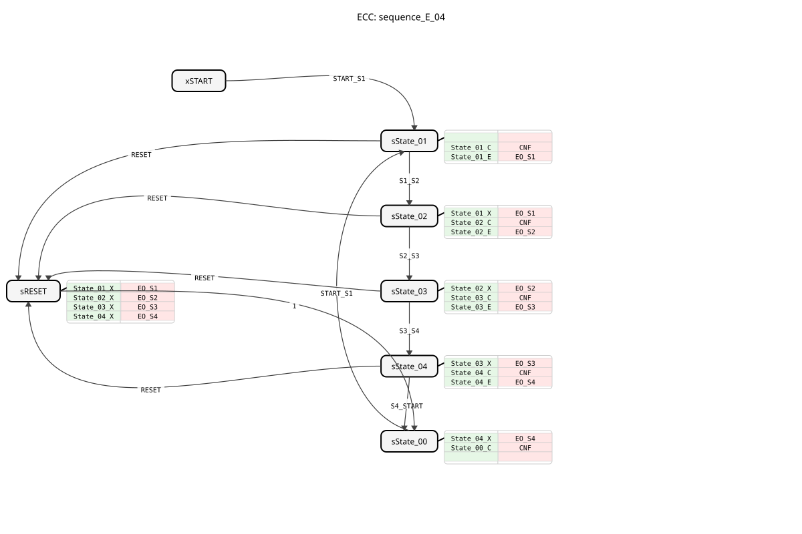

# sequence_E_04

* * * * * * * * * *
## Introduction

The function block `sequence_E_04` is a sequencer that implements a linear sequence of four states (State_01 to State_04) with a defined start state (START) and an end state (State_00). The transition between the individual states occurs exclusively through external events. The block is designed for control tasks where step-by-step, event-driven execution is required, such as in simple process or assembly sequences.

## Interface Structure

### **Event Inputs**

- **START_S1**: Switches from the START state or State_00 to the State_01 state.
- **S1_S2**: Changes from state State_01 to state State_02.
- **S2_S3**: Changes from state State_02 to state State_03.
- **S3_S4**: Changes from state State_03 to state State_04.
- **S4_START**: Changes from state State_04 to state State_00.
- **RESET**: Resets the function block from any state (State_01 to State_04) to state State_00.

### **Event Outputs**

- **CNF**: Acknowledge event triggered on every state change. It returns the current state number via `STATE_NR`.
- **EO_S1**: Triggered upon entering state State_01 and returns the value of `DO_S1` (TRUE). * **EO_S2**: Triggered upon entering state_02 and returns the value `DO_S2` (TRUE).
- **EO_S3**: Triggered upon entering state_03 and returns the value `DO_S3` (TRUE).
- **EO_S4**: Triggered upon entering state_04 and returns the value `DO_S4` (TRUE).

### **Data Inputs**

- None available.

### **Data Outputs**

- **STATE_NR** (SINT): Outputs the number of the current state. The encoding is: START = 0, State_01 = 1, State_02 = 2, State_03 = 3, State_04 = 4.
- **DO_S1** (BOOL): Is TRUE when state State_01 is active.
- **DO_S2** (BOOL): Is TRUE when state State_02 is active.
- **DO_S3** (BOOL): Is TRUE when state State_03 is active.
- **DO_S4** (BOOL): Is TRUE when state State_04 is active.

### **Adapter**

- None present.

## Functionality

The `sequence_E_04` is implemented as a Basic Function Block (BFB) and has an Execution Control Chart (ECC). The ECC defines the states and the event-driven transitions between them. Specific algorithms are executed during each state transition:

1. **Exit Algorithm (X)**: Executed when exiting a state to set the corresponding data output (`DO_Sx`) to FALSE.
2. **Entry Algorithm (E)**: Executed when entering a state to set the corresponding data output (`DO_Sx`) to TRUE and trigger the corresponding event (`EO_Sx`).
3. **Confirmation Algorithm (C)**: Executed in every state (except RESET) to update the state number (`STATE_NR`) and trigger the confirmation event (`CNF`).

An event `RESET` executes all necessary exit algorithms for the active states and transitions via an intermediate state (`sRESET`) to the final state `State_00`.

## Technical Features

- **Event-based Transition**: State changes are only possible through external events. There are no time- or data-driven transitions.
- **Explicit State Encoding**: The state numbers are defined as constants from the library `sequence`, which improves code reusability and readability.
- **Clean Reset**: The reset process deactivates all active outputs before the final state is reached to ensure clear and defined system behavior.
- **Initial State**: The function block starts in state `xSTART`. The first transition to the operational sequence occurs with the event `START_S1`.

## State Overview

1. **xSTART**: Initial resting state.
2. **sState_01**: First active step. `DO_S1` = TRUE.
3. **sState_02**: Second active step. `DO_S2` = TRUE.
4. **sState_03**: Third active step. `DO_S3` = TRUE.
5. **sState_04**: Fourth active step. `DO_S4` = TRUE.
6. **sState_00**: Final resting state after completion of the sequence. All `DO_Sx` = FALSE.
7. **sRESET**: Intermediate state during a reset operation. Deactivates all outputs.

## Application Scenarios

- **Step-by-Step Controls**: Control of machines or systems with a fixed, step-by-step workflow (e.g., pick-and-place, filling systems).
- **Process Timing**: Synchronization of subprocesses where each step is triggered manually or by a sensor signal.
- **Manual Operating Sequences**: Implementation of guided operating sequences where the operator must confirm each step.
*
## ⚖️ Comparison with Similar Function Blocks

Unlike a `E_CYCLE` or `E_DELAY` function block, `sequence_E_04` offers purely event-driven transitions, not time-controlled ones. Compared to a generic `E_SR` (flip-flop) or a combination of `E_D_FF` (D flip-flop), this function block implements a predefined state machine with multiple steps and clear reset logic. It is more specialized and structured than an ad-hoc implementation using multiple individual function blocks.

...
## Conclusion

The `sequence_E_04` is a robust and easy-to-use sequencer for IEC 61499. Its clear, event-driven interface and explicit state management make it ideal for applications requiring deterministic, step-by-step execution. The integrated reset functionality and state feedback via `CNF` and `STATE_NR` support secure and well-monitored integration into higher-level controllers.
