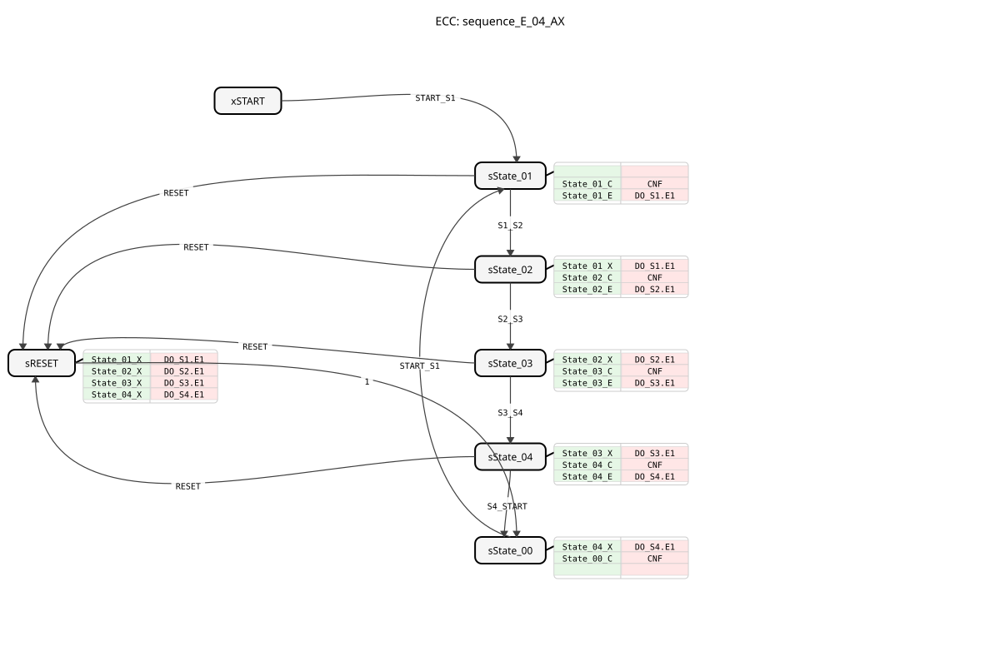
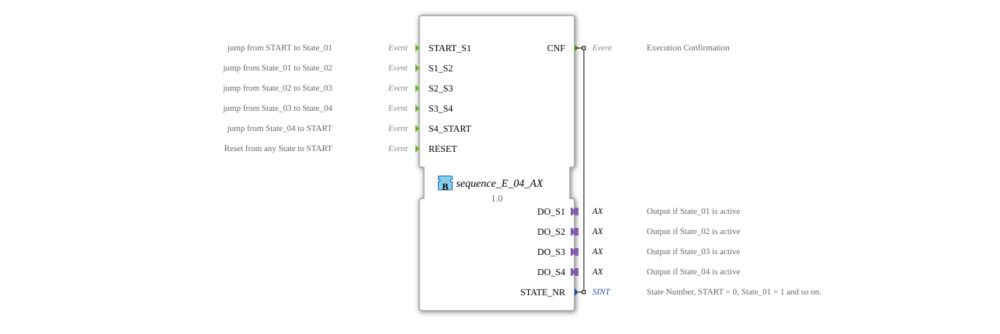

# sequence_E_04_AX

* * * * * * * * * *

## Introduction

The `sequence_E_04_AX` is a variant of the `sequence_E_04`, which additionally uses adapters (`AX`) for the outputs. It controls a purely event-driven sequence with 4 output states.

## Interface Structure

### **Event Inputs**

- **START_S1**: Starts the sequence at State_01.
- **S1_S2**: Transition State_01 -> State_02.
- **S2_S3**: Transition State_02 -> State_03.
- **S3_S4**: Transition State_03 -> State_04.
- **S4_START**: Transition State_04 -> START.
- **RESET**: Resets the sequence.

### **Event Outputs**

- **CNF**: Confirmation of execution.

### **Data Inputs**

- None.

### **Data Outputs**

- **STATE_NR** (SINT): Current state number.

### **Adapters**

- **DO_S1** (adapter::types::unidirectional::AX): Output adapter for State_01.
- **DO_S2** (adapter::types::unidirectional::AX): Output adapter for State_02.
- **DO_S3** (adapter::types::unidirectional::AX): Output adapter for State_03.
- **DO_S4** (adapter::types::unidirectional::AX): Output adapter for State_04.

## Functionality

Corresponds to `sequence_E_04`, but uses adapters for the outputs.

## Technical Features

- Uses `adapter::types::unidirectional::AX`.

## State Overview

See `sequence_E_04`.

## Application Scenarios

For event-driven sequences controlled via adapters.

## ⚖️ Comparison with Similar Function Blocks

- **sequence_E_04**: Standard version without adapters.

## Conclusion

Adapter version of the 4-step event sequencer.
