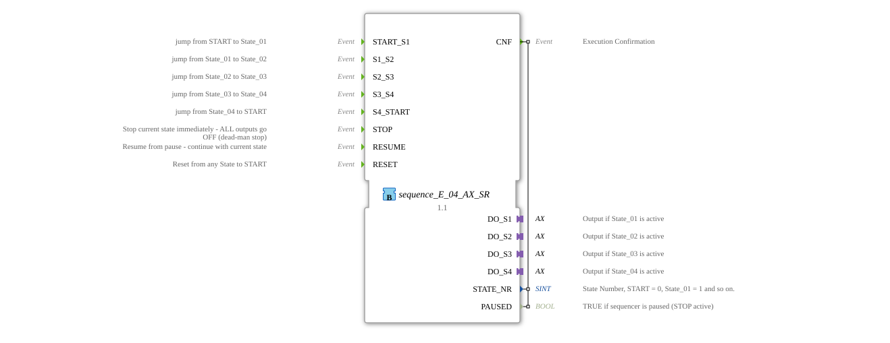

# sequence_E_04_AX_SR

* * * * * * * * * *
## Introduction
The function block `sequence_E_04_AX_SR` implements an event-driven sequencer with four outputs via an AX adapter. It also offers a safety stop (STOP), a resume (RESUME), and a reset (RESET). The sequence cycles through the states State_00, State_01, State_02, State_03, and State_04 and can be operated cyclically.
## Interface Structure
### **Event Inputs**

| Event | Description |

|----------|--------------|

| `START_S1` | Transition from START/State_00 to State_01 |

| `S1_S2` | Transition from State_01 to State_02 |

`S2_S3` | Transition from State_02 to State_03 |

`S3_S4` | Transition from State_03 to State_04 |

`S4_START` | Transition from State_04 back to State_00 |

`STOP` | Immediately interrupts the current state – all outputs are switched off (dead man stop) |

`RESUME` | Resumes the sequence from the paused state (outputs are reactivated) |

`RESET` | Resets the sequence from any state back to the START state (State_00) |

### **Event Outputs**

| Event | Description |

|----------|--------------|

| `CNF` | Execution confirmation. Included output data: `STATE_NR`, `PAUSED` |

### **Data Inputs**

No external data inputs.

### **Data Outputs**

| Variable | Type | Description |

|----------|-------|--------------|

| `STATE_NR` | SINT | Current state number: START = 0, State_01 = 1, …, State_04 = 4 |

| `PAUSED` | BOOL | `TRUE`, when the sequencer is paused (STOP active) |

### **Adapter**

| Adapter | Type | Description |

|----------|------------------------------------|--------------|

| `DO_S1` | `adapter::types::unidirectional::AX` | Output active in State_01 (D1 = TRUE) |

| `DO_S2` | `adapter::types::unidirectional::AX` | Output active in State_02 |

| `DO_S3` | `adapter::types::unidirectional::AX` | Output active in State_03 |

`DO_S4` | `adapter::types::unidirectional::AX` | Output active in State_04 |

## Functionality
The sequencer operates according to a finite state machine (ECM). The five sequential states are:

- `State_00` (START)
- `State_01`
- `State_02`
- `State_03`
- `State_04`

The normal process begins with `START_S1` (either from `xSTART` or from `State_00`), which then transitions to `State_01`. At each step, the FB activates the corresponding adapter output (e.g., DO_S1.D1 = TRUE in State_01), and the current values of `STATE_NR` and `PAUSED` are transmitted via the event output `CNF`. The transition to the next state occurs via the corresponding events (`S1_S2`, `S2_S3`, `S3_S4`), and the transition from `State_04` back to `State_00` with `S4_START`.

The transition to the next state is triggered by the corresponding events (`S1_S2`, `S2_S3`, `S3_S4`), and from `State_04` back to `State_00` with `S4_START`.

... Upon receiving `STOP`, the function block immediately deactivates the current output (exit step) and stores the current state in the internal variable `savedState`. The state then transitions to one of the paused states (`sPAUSED_S1` to `sPAUSED_S4` or `sPAUSED_S0`). The output `PAUSED` is set to `TRUE`. A `RESUME` event restores the stored state and reactivates the corresponding output.

The state then changes to one of the paused states (`sPAUSED_S1` to `sPAUSED_S4` or `sPAUSED_S0`). The ``RESET`` command puts the sequencer into a reset state, regardless of its current state. In this state, all four outputs are explicitly switched off, and then it immediately switches to ``State_00``.

## Technical Features
- **AX Adapters**: The four outputs are implemented using unidirectional AX adapters, each with a Boolean value, ``D1``. The outputs are only set in active states and are immediately reset upon exiting or stopping.
- **Pause/Resume Mechanism**: The internal variable ``savedState`` stores the state at the time of the stop, so that the exact same state can be resumed after ``RESUME``.
- **Pause/Resume Mechanism**: The internal variable ``savedState`` stores the state at the time of the stop, so that the exact same state can be resumed after ``RESUME``.
- **Safety Stop**: The `STOP` event causes all outputs to be switched off immediately (even without entering a paused state), which is designed as a dead-man stop.
- **Use of constants from the `sequence` package**: The state numbers (`State_00`, `State_01`, ...) are defined as named constants in the `logiBUS::utils::sequence::const::sequence` package.
- **Reset Behavior**: The `RESET` event switches off all four outputs before returning to State_00, thus ensuring a defined output state.

## State Overview

| State | Active Output | `STATE_NR` | `PAUSED` |

------------------|-----------------|------------|----------|

xSTART | none | 0 | FALSE |

sState_00 | none | 0 | FALSE |

sState_01 | DO_S1 | 1 | FALSE |

sState_02 | DO_S2 | 2 | FALSE |

sState_03 | DO_S3 | 3 | FALSE |

sState_04 | DO_S4 | 4 | FALSE |

sPAUSED_S0 | none | saved | TRUE |

sPAUSED_S1 | none | saved | TRUE |

sPAUSED_S2 | none | saved | TRUE |

sPAUSED_S3 | none | saved | TRUE |

sPAUSED_S4 | none | saved | TRUE |

sRESET | none | – | – |

## Application Scenarios
- **Control of Sequential Processes**: e.g., a machine that performs four work steps in succession, with each step controlling its own actuator.
- **Safety-Critical Applications**: When a `STOP` signal must immediately shut down all actuators (e.g., emergency stop), and the exact state is restored after release.
- **Cyclic Processes**: from step 1 to 4 and back to step 0 (e.g., in packaging machines).
- **Manual Intervention**: the process can be reset to the beginning at any time using `RESET`.

## Comparison with Similar Function Blocks
Unlike simpler sequencers (e.g., without STOP/RESUME), `sequence_E_04_AX_SR` offers:

- **Safety interrupt with defined shutdown of all outputs**.
- **Pause and resume function** that saves the current state.
- **Cyclic return capability** from step 4 to step 0.
- **Output of the current state** as a number and pause status.

Other function blocks with the same number of outputs, but without STOP/RESUME, are easier to use but do not offer a safety function.

## Conclusion
The `sequence_E_04_AX_SR` function blockis a versatile, safety-conscious four-step sequencer. It is particularly suitable for controllers where an interruptible sequence with defined output states and a resume option is required. The interface is clearly structured, the implementation robust, and it integrates well into automation environments through the use of AX adapters.
