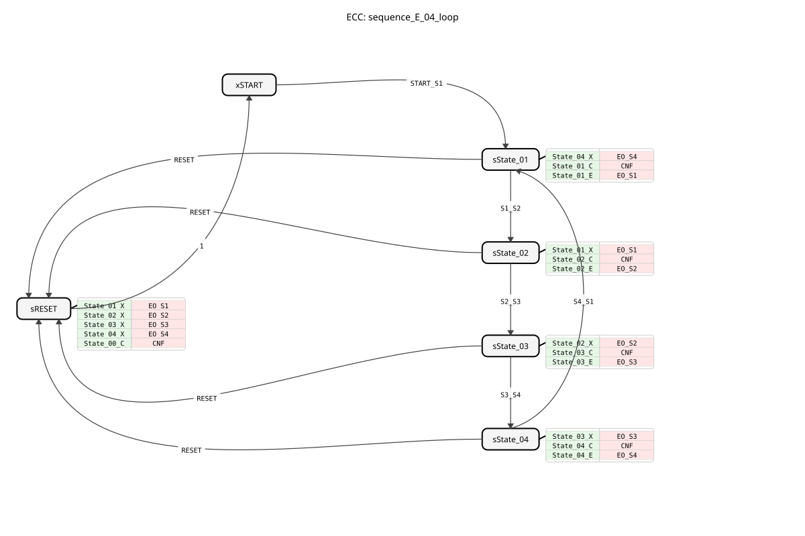

# sequence_E_04_loop

* * * * * * * * * *
## Introduction
The function block `sequence_E_04_loop` implements a cyclic sequence with four states. State transitions are triggered exclusively by external events. This block is designed for control tasks where a fixed sequence of actions (represented by outputs `DO_S1` to `DO_S4`) must be executed and a reset from any state is required.

## Interface Structure

### **Event Inputs**
* **`START_S1`**: Changes from the initial state `START` to the first active state `State_01`.
* **`S1_S2`**: Changes from `State_01` to `State_02`.
* **`S2_S3`**: Changes from `State_02` to `State_03`.
* **`S3_S4`**: Switches from `State_03` to `State_04`.
* **`S4_S1`**: Switches from `State_04` back to `State_01`, thus closing the cycle.
* **`RESET`**: Resets the function block from any active state (`State_01` to `State_04`) to the initial state `START`.

### **Event Outputs**
* **`CNF`**: Triggered on every state change and confirms execution. Transports the current status code for `STATE_NR`.
* **`EO_S1`**: Triggered upon entering `State_01`. Transports the value `TRUE` for `DO_S1`.
* **`EO_S2`**: Triggered upon entering `State_02`. Transports the value `TRUE` for `DO_S2`.
* **`EO_S3`**: Triggered upon entering `State_03`. Transports the value `TRUE` for `DO_S3`.
* **`EO_S4`**: Triggered upon entering `State_04`. Transports the value `TRUE` for `DO_S4`.

### **Data Inputs**
* This function block has no data inputs.

### **Data Outputs**
* **`STATE_NR`** (SINT): Outputs the number of the current state. The encoding is: START = 0, State_01 = 1, State_02 = 2, State_03 = 3, State_04 = 4.
* **`DO_S1`** (BOOL): Is `TRUE` when state `State_01` is active.
* **`DO_S2`** (BOOL): Is `TRUE` when state `State_02` is active.
* **`DO_S3`** (BOOL): Is `TRUE` when state `State_03` is active.
* **`DO_S4`** (BOOL): Is `TRUE` when state `State_04` is active.

### **Adapters**
* This function block does not use any adapters.

## Functionality

The block is implemented as a Basic Function Block (BFB) with an Execution Control Chart (ECC). The internal logic is based on six states: an initial state (`xSTART`), four active operating states (`sState_01` to `sState_04`), and a special reset state (`sRESET`).

During a state transition, three actions are executed sequentially:

1. **Exit Algorithm (X)**: The output of the previous state is set to `FALSE`.

2. **Confirmation Algorithm (C)**: The state number `STATE_NR` is updated, and the `CNF` event is triggered.

3. **Entry Algorithm (E)**: The output of the new state is set to `TRUE`, and the corresponding event (`EO_Sx`) is triggered.

A `RESET` event always leads to the `sRESET` state, where all outputs (`DO_S1` to `DO_S4`) are deactivated, the state number is set to 0 (`START`), and a `CNF` is sent. The function block then automatically returns to the initial `xSTART` state.

## Technical Features
* **Event-driven transitions**: Unlike time- or condition-driven sequencers, all state transitions occur only upon the occurrence of the specific event. There are no automatic or time-controlled advances.
* **Explicit Reset Logic**: The reset process is modeled as a separate state (`sRESET`) that cleanly resets all outputs before the initial state is reached again.
* **State Encoding**: Using the constants from `sequence::State_xx` for assignment to `STATE_NR` improves the maintainability and readability of the code.

## State Overview

1. **xSTART**: Initial, inactive state. All outputs are `FALSE`, `STATE_NR` is 0.

2. **sState_01**: First active state. `DO_S1 = TRUE`, `STATE_NR = 1`.

3. **sState_02**: Second active state. `DO_S2 = TRUE`, `STATE_NR = 2`.

4. **sState_03**: Third active state. `DO_S3 = TRUE`, `STATE_NR = 3`.

5. **sState_04**: Fourth active state. `DO_S4 = TRUE`, `STATE_NR = 4`.

6. **sRESET**: Temporary reset state. Sets all actuator outputs (`DO_Sx`) to `FALSE` and `STATE_NR` to 0.

The permitted transitions are: `START -> S1 -> S2 -> S3 -> S4 -> (S1)` and from any state `S1-S4` via `RESET` back to `START`.

## Application Scenarios
* **Step-by-Step Controls**: Control of machine processes where each step must be enabled manually or by a sensor signal (e.g., manual assembly stations).
* **Clock-Controlled Processes**: In production lines where a central clock signal (`Sx_Sy` events) signals the progress of the assembly from station to station.
* **Test and commissioning sequences**: A structured sequence of tests that must be confirmed by the operator.

## ⚖️ Comparison with similar modules
Compared to a **Cyclic sequencer with timer** (e.g., `E_CYCLE`), this module lacks integrated timing; transitions are purely event-driven. Compared to a **Binary shift register** or counter, this module offers an explicit, easily understandable state machine with clear entry/exit actions and a dedicated reset path, simplifying troubleshooting.

## Conclusion
The `sequence_E_04_loop` is a robust and clearly structured function block for implementing an event-driven 4-state sequence. Its strengths lie in the explicit modeling of each state transition, the clean reset logic, and the clear separation of entry, exit, and confirmation actions. It is ideally suited for applications where the sequence control is to be carried out by external signals (buttons, sensors, higher-level controllers).