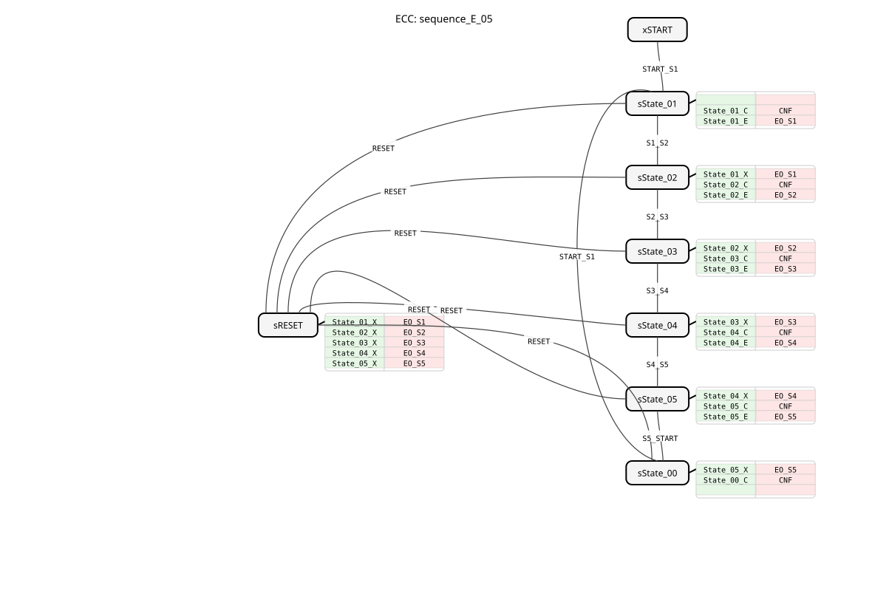

# sequence_E_05

* * * * * * * * * *
## Introduction

The function block `sequence_E_05` is a sequential state machine that cycles through a fixed sequence of five states. The transition between individual states occurs exclusively through external events. This block is designed for control tasks requiring the step-by-step execution of a process sequence, such as in handling or packaging systems. Each active state sets its own binary output and confirms execution.

## Interface Structure

The function block has a pure event-based interface. State transitions are triggered by input events, and the active state is signaled via output events and data outputs.

### **Event Inputs**

- `START_S1`: Changes from the initial START state or from state `sState_00` to the first state `State_01`.
- `S1_S2`: Changes from `State_01` to `State_02`.
- `S2_S3`: Changes from `State_02` to `State_03`.
- `S3_S4`: Changes from `State_03` to `State_04`.
- `S4_S5`: Changes from `State_04` to `State_05`.
- `S5_START`: Changes from `State_05` back to the inactive state `sState_00`.
- `RESET`: Immediately resets the automaton from any state to the inactive state `sState_00`.

### **Event Outputs**

- `CNF`: General confirmation event. Triggered on every state change and returns the current state number `STATE_NR`.
- `EO_S1`: Triggered upon entry into `State_01` and returns the value `DO_S1`.
- `EO_S2`: Triggered upon entry into `State_02` and returns the value `DO_S2`.
- `EO_S3`: Triggered upon entry into `State_03` and returns the value `DO_S3`.
- `EO_S4`: Triggered upon entry into `State_04` and returns the value `DO_S4`.
- `EO_S5`: Triggered upon entering `State_05` and returns the value `DO_S5`.

### **Data Inputs**

There are no data inputs.

### **Data Outputs**

- `STATE_NR` (SINT): Numeric identifier of the current state. START = 0, State_01 = 1, State_02 = 2, ..., State_05 = 5.
- `DO_S1` (BOOL): Is `TRUE` when state `State_01` is active.
- `STATE_NR` (SINT): Numeric identifier of the current state. START = 0, State_01 = 1, State_02 = 2, ..., State_05 = 5.
- `DO_S1` (BOOL): Is `TRUE` when state `State_01` is active. * `DO_S2` (BOOL): Is `TRUE` when state `State_02` is active.
- `DO_S3` (BOOL): Is `TRUE` when state `State_03` is active.
- `DO_S4` (BOOL): Is `TRUE` when state `State_04` is active.
- `DO_S5` (BOOL): Is `TRUE` when state `State_05` is active.

### **Adapter**

No adapter interfaces are available.

## Functionality

The FB is implemented as a Basic Function Block (BFB) with an Execution Control Chart (ECC). The ECC consists of seven states: an initial state (`xSTART`), five active states (`sState_01` to `sState_05`), an inactive end state (`sState_00`), and a special reset state (`sRESET`).

... Upon entering an active state (e.g., `sState_01`), two algorithms are executed sequentially:

1. A Confirmation Step (e.g., `State_01_C`) that sets `STATE_NR` to the corresponding constant and triggers the `CNF` event.
2. An Entry Step (e.g., `State_01_E`) that sets the associated binary output (e.g., `DO_S1`) to `TRUE` and triggers the corresponding event (e.g., `EO_S1`).

When exiting an active state, an *Exit Step* (e.g., `State_01_X`) is executed, which resets the corresponding binary output to `FALSE`. State transitions are strictly controlled by the incoming event inputs. An event `RESET` leads, via the intermediate state `sRESET`, to the deactivation of all active outputs (`DO_S1` to `DO_S5`) before the automaton transitions to the inactive state `sState_00`.

## Technical Features

- **Event-driven Transitions:** Unlike time- or condition-driven sequencers, state changes here occur exclusively through external events. This enables close coupling to other process steps or operator actions.
- **Explicit Reset Logic:** The reset process is modeled as a separate ECC state (`sRESET`), ensuring that all five outputs (`DO_S1` to `DO_S5`) are properly deactivated during a reset, regardless of their current state.
- **Separate Entry/Exit Actions:** The logic for setting and resetting the outputs is divided into separate algorithms (E for Entry, X for Exit). This promotes a clear and maintainable structure.
- **Constants for State Numbers:** The values for `STATE_NR` are retrieved from an imported library (`sequence::State_01`, etc.), facilitating reusability and centralized maintenance.
*
## State Overview

1. **xSTART:** Initial state after startup. Waiting for `START_S1`.
2. **sState_01:** First active step. Sets `DO_S1=TRUE` and `STATE_NR=1`. Waits for `S1_S2` or `RESET`.
3. **sState_02:** Second active step. Sets `DO_S2=TRUE` and `STATE_NR=2`. Waits for `S2_S3` or `RESET`.
4. **sState_03:** Third active step. Sets `DO_S3=TRUE` and `STATE_NR=3`. Waits for `S3_S4` or `RESET`.
5. **sState_04:** Fourth active step. Sets `DO_S4=TRUE` and `STATE_NR=4`. Waits for `S4_S5` or `RESET`.
6. **sState_05:** Fifth active step. Sets `DO_S5=TRUE` and `STATE_NR=5`. Waiting for `S5_START` or `RESET`.
7. **sState_00:** Inactive end state. All outputs are `FALSE` or `STATE_NR=0`. Waiting for `START_S1` for a new cycle.
8. **sRESET:** Temporary reset state. Disables all active outputs and then switches to `sState_00`..

## Application Scenarios

- **Step Sequence in Handling Devices:** Control of a pick-and-place robot (grasping → lifting → moving → lowering → releasing), where each step is triggered by a sensor event (e.g., "part detected," "position reached").
- **Manual Operating Sequences:** Execution of a sequence specified by the operator, e.g., in a machine setup ("Release step 1" → "Release step 2").
- **Synchronization with Higher-Level Controllers:** The sequence serves as a subroutine of a main controller, which dictates the progress via the events.

## ⚖️ Comparison with Similar Function Blocks

Unlike a cyclically running sequencer (e.g., `CYCLE_5`), which automatically advances after a fixed time, `sequence_E_05` remains in each state until the corresponding next event occurs. This makes it more deterministic with respect to external conditions, but requires reliable event generation by the peripherals or higher-level logic. It is simpler and more transparent than a complete sequential function block (SFC) for fixed, linear sequences.

## Conclusion

The `sequence_E_05` is a robust and easy-to-configure function block for event-driven, fixed-length sequences. Its clear separation of state logic and output actions, as well as the integrated reset mechanism, make it a reliable component for sequential control tasks in 4diac-based automation systems. The lack of flexibility in the number of steps or transition conditions is an advantage for defined, linear processes in terms of clarity and predictability.

---

### 🌐 Related topic subpages on ms-muc-docs.de

- [🌐 Eclipse 4diac IDE & Color Reference on ms-muc-docs.de](https://www.ms-muc-docs.de/iec-61499/eclipse-4diac/)

]
