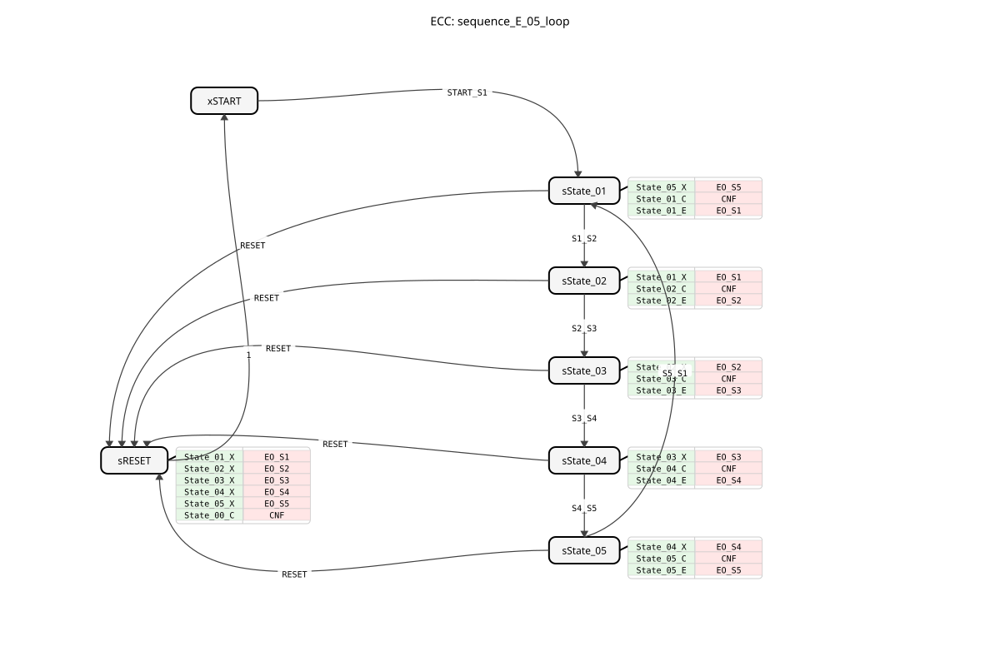
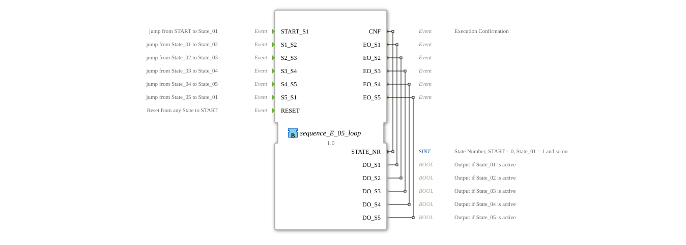

# sequence_E_05_loop

* * * * * * * * * *
## Introduction

The function block `sequence_E_05_loop` implements a cyclic sequence with five states. The transition between the individual states occurs exclusively via external events. The block is designed for applications in which a process step may only begin after the completion of a previous step and the arrival of a specific enable signal. The sequence can be reset to the initial start state from any state.

## Interface Structure

### **Event Inputs**

* `START_S1`: Switches from the start state (`START`) to the first active state (`State_01`).
* `S1_S2`: Changes from `State_01` to `State_02`.
* `S2_S3`: Changes from `State_02` to `State_03`.
* `S3_S4`: Changes from `State_03` to `State_04`.
* `S4_S5`: Changes from `State_04` to `State_05`.
* `S5_S1`: Switches from `State_05` back to `State_01` (cycle).
* `RESET`: Resets the sequence from any state to the initial start state (`START`).

### **Event Outputs**

* `CNF`: General acknowledgment event that is triggered on every state change. It returns the current state number (`STATE_NR`).
* `EO_S1`: Triggered upon entering `State_01` and returns the corresponding data output `DO_S1`.
...* `EO_S1`: Triggered upon entering `State_01` and returns the corresponding data output `DO_S1`. * `EO_S2`: Triggered upon entry into `State_02` and outputs the corresponding data output `DO_S2`.

* `EO_S3`: Triggered upon entry into `State_03` and outputs the corresponding data output `DO_S3`.
* `EO_S4`: Triggered upon entry into `State_04` and outputs the corresponding data output `DO_S4`.
* `State_04`: Triggered upon entry into `State_04` and outputs the corresponding data output `DO_S4`.
* `EO_S3`: Triggered upon entry into `State_04`.
* qzmsdocs000036 ... * `EO_S5`: Triggered upon entering `State_05` and outputs the corresponding data output `DO_S5`.

### **Data Inputs**

* This function block has no data inputs.

### **Data Outputs**

* `STATE_NR` (SINT): Outputs the number of the currently active state. The encoding is: START = 0, State_01 = 1, State_02 = 2, ..., State_05 = 5.
* `DO_S1` (BOOL): Is `TRUE` when `State_01` is active.
* `DO_S2` (BOOL): Is `TRUE` when `State_02` is active.
* `DO_S3` (BOOL): Is `TRUE` when `State_03` is active.
* `DO_S4` (BOOL): Is `TRUE` when `State_04` is active.
* `DO_S5` (BOOL): Is `TRUE` when `State_05` is active.

### **Adapters**

* This function block does not use adapters.

## Functionality

The FB is implemented as a Basic Function Block (BFB) with an Execution Control Chart (ECC). The internal logic is based on seven states: an initial start state (`xSTART`), five active states (`sState_01` to `sState_05`), and a separate reset state (`sRESET`).

Upon entering an active state, three actions are executed sequentially:

1. **Exit action of the previous state:** The corresponding algorithm (`State_XX_X`) sets the associated data output (`DO_Sx`) to `FALSE`.
2. **Confirmation Action:** The `State_XX_C` algorithm sets the state number `STATE_NR` and triggers the `CNF` event.
3. **Entry Action of the New State:** The `State_XX_E` algorithm sets the corresponding data output (`DO_Sx`) to `TRUE` and triggers the corresponding event `EO_Sx`.

A `RESET` event leads to the `sRESET` state. Here, all potentially active outputs (`DO_S1` to `DO_S5`) are deactivated via their respective exit algorithms, the state number is set to 0 (`START`), and a `CNF` event is triggered. The function block then automatically switches back to the initial `xSTART` state (condition = `1`, i.e., always true).

## Technical Features

* **Event-driven transitions:** Every state transition must be explicitly triggered by the corresponding input event. There are no time- or data-driven automatic transitions.
* **Decoupled Signals:** The Boolean state outputs (`DO_Sx`) and the associated event outputs (`EO_Sx`) are set and triggered synchronously. This allows for flexible integration with subsequent logic.
* **Explicit Reset Logic:** The reset process systematically deactivates all outputs before restoring the initial state, ensuring clean and defined behavior.
* **Constants for State Numbers:** State numbers are assigned via the imported namespace `sequence::` (e.g., `sequence::State_01`), which improves maintainability and code readability.

## State Overview

The ECC consists of the following states and possible transitions:

* **xSTART:** Initial, inactive state. Transition to `sState_01` via `START_S1`.
* **sState_01:** First active state. Transitions to `sState_02` via `S1_S2` or to `sRESET` via `RESET`.
* **sState_02:** Second active state. Transitions to `sState_03` via `S2_S3` or to `sRESET` via `RESET`.
* **sState_03:** Third active state. Transitions to `sState_04` via `S3_S4` or to `sRESET` via `RESET`.
* **sState_04:** Fourth active state. Transitions to `sState_05` via `S4_S5` or to `sRESET` via `RESET`.
* **sState_05:** Fifth active state. Transitions to `sState_01` via `S5_S1` (cycle) or to `sRESET` via `RESET`.
* * **sRESET:** Reset state. Executes reset actions and then unconditionally reverts to `xSTART`.

## Application Scenarios

* **Sequence-Step Controls:** Control of machine processes where each step must be enabled manually or by a sensor signal (e.g., manual workstation with enable button).
* **Batch Processes:** Execution of recipe steps where the operator or a higher-level system must confirm the next step.
* **Safety-Critical Sequences:** Processes where uncontrolled automatic switching must be avoided.
* **Test and Commissioning Sequences:** Manually cycling through individual functions of a system.

## ⚖️ Comparison with similar building blocks

In contrast to **cyclically running sequencers** (e.g., `E_CYCLE`) or **time-controlled sequencers** (with `DELAY`)(In blocks) this function block remains in each state until the specific change event occurs. It thus offers maximum external control. Compared to a generic **counter** (`CTU`) with downstream decoding logic, this function block provides a fully encapsulated, state-based solution with clear entry/exit actions and an integrated reset mechanism.

## Conclusion

The `sequence_E_05_loop` is a robust and easy-to-configure function block for event-driven sequences with five states. Its clear interface, clean separation of entry/exit logic, and reliable reset mechanism make it ideal for applications where each process step must be explicitly enabled. The included data outputs and acknowledgment events allow for easy integration into higher-level control and visualization systems.
