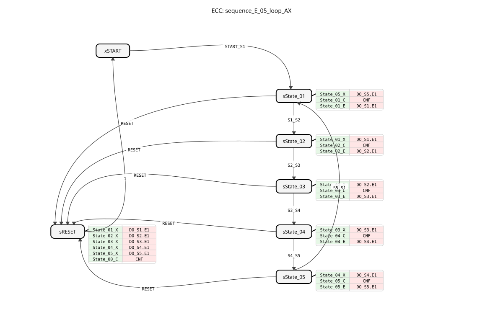
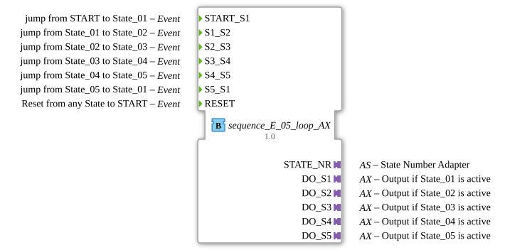

# sequence_E_05_loop_AX

* * * * * * * * * *
## Introduction
`sequence_E_05_loop_AX` is a variant of `sequence_E_05_loop` that additionally uses adapters (`AX`) for the outputs. It controls a purely event-driven, cyclic sequence with 5 output states.

## Interface Structure

### **Event Inputs**
* **START_S1**: Starts the sequence at State_01.
* **S1_S2**: Transition State_01 -> State_02.
* **S2_S3**: Transition State_02 -> State_03.
* **S3_S4**: Transition State_03 -> State_04.
* **S4_S5**: Transition State_04 -> State_05.
* **S5_S1**: Transition State_05 -> State_01 (Loop).
* **RESET**: Resets the sequence.

### **Event Outputs**
* **CNF**: Acknowledges execution.

### **Data Inputs**
* None.

### **Data Outputs**
* **STATE_NR** (SINT): Current state number.

### **Adapters**
* **DO_S1** (adapter::types::unidirectional::AX): Output adapter for State_01.
* **DO_S2** (adapter::types::unidirectional::AX): Output adapter for State_02.
* **DO_S3** (adapter::types::unidirectional::AX): Output adapter for State_03.
* **DO_S4** (adapter::types::unidirectional::AX): Output adapter for State_04.
* **DO_S5** (adapter::types::unidirectional::AX): Output adapter for State_05.

## Functionality
Corresponds to `sequence_E_05_loop`, but uses adapters for the outputs.

## Technical Features
* Uses `adapter::types::unidirectional::AX`.

## State Overview
See `sequence_E_05_loop`.

## Application Scenarios
For cyclic, event-driven, 5-stage sequences with adapter connectivity.

## ⚖️ Comparison with similar components
* **sequence_E_05_loop**: Standard version without adapter.

## Conclusion
Adapter version of the 5-step loop event sequencer.