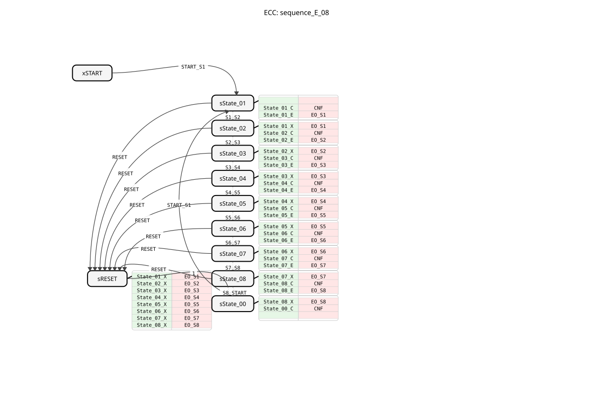
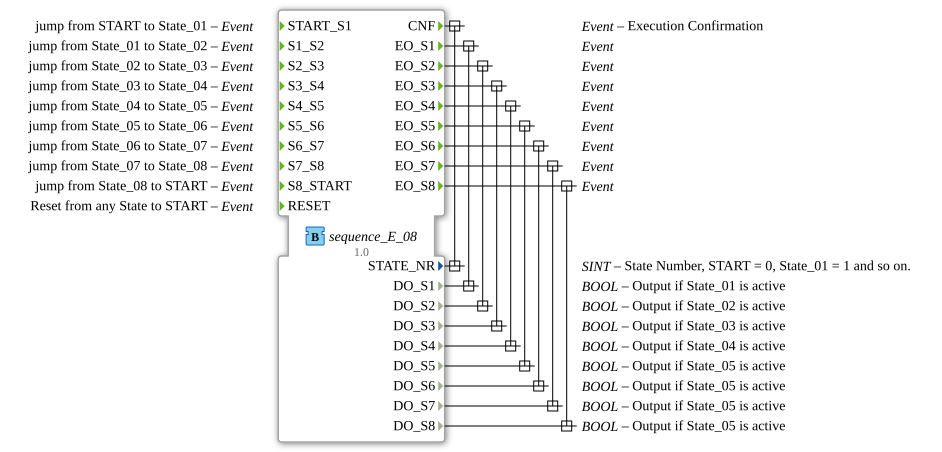

# sequence_E_08

* * * * * * * * * *
## Introduction
The function block `sequence_E_08` is an eight-output sequencer controlled by events. It implements a linear state machine with a defined start state and eight active states. The transition from one state to the next occurs exclusively upon the occurrence of a specific event. This block is suitable for control tasks where process steps must be executed sequentially and in response to events, such as in handling or assembly processes.

## Interface Structure

### **Event Inputs**
* **START_S1**: Changes from the start state (`START`) to the state `State_01`.
* **S1_S2**: Changes from `State_01` to `State_02`.
* **S2_S3**: Changes from `State_02` to `State_03`.
* **S3_S4**: Changes from `State_03` to `State_04`.
* **S4_S5**: Changes from `State_04` to `State_05`.
* **S5_S6**: Changes from `State_05` to `State_06`.
* **S6_S7**: Changes from `State_06` to `State_07`.
* **S7_S8**: Changes from `State_07` to `State_08`.
* **S8_START**: Switches from `State_08` back to the `START` state (represented by `sState_00`).
* **RESET**: Immediately resets the function block from *any state* to the `START` state.

### **Event Outputs**
* **CNF**: Execution Confirmation. Triggered on every state change and returns the new state number (`STATE_NR`).
* **EO_S1**: Triggered upon entering `State_01` and returns the value of `DO_S1` (TRUE).
* **EO_S2**: Triggered upon entry into `State_02` and returns the value of `DO_S2` (TRUE).
* **EO_S3**: Triggered upon entry into `State_03` and returns the value of `DO_S3` (TRUE).
* **EO_S4**: Triggered upon entry into `State_04` and returns the value of `DO_S4` (TRUE).
* **EO_S5**: Triggered upon entry into `State_05` and returns the value of `DO_S5` (TRUE).
* **EO_S6**: Triggered upon entry into `State_06` and returns the value of `DO_S6` (TRUE).
* **EO_S7**: Triggered upon entry into `State_07` and returns the value of `DO_S7` (TRUE).
* **EO_S8**: Triggered upon entry into `State_08` and returns the value of `DO_S8` (TRUE).

### **Data Inputs**
* This function block has no data inputs.

### **Data Outputs**
* **STATE_NR** (SINT): Current state number. `START` = 0, `State_01` = 1, `State_02` = 2, ..., `State_08` = 8. The values are loaded from the constant library `sequence`.
* **DO_S1** (BOOL): Is `TRUE` when state `State_01` is active.
* **DO_S2** (BOOL): Is `TRUE` when state `State_02` is active.
* **DO_S3** (BOOL): Is `TRUE` when state `State_03` is active.
* **DO_S4** (BOOL): Is `TRUE` when state `State_04` is active.
* **DO_S5** (BOOL): Is `TRUE` when state `State_05` is active.
* **DO_S6** (BOOL): Is `TRUE` when state `State_06` is active.
* **DO_S7** (BOOL): Is `TRUE` when state `State_07` is active.
* **DO_S8** (BOOL): Is `TRUE` when state `State_08` is active.

### **Adapters**
* This function block does not use any adapters.

## Functionality
The `sequence_E_08` function block is implemented as a BASIC function block with a detailed Execution Control Chart (ECC). The logic follows a linear sequence of states (`sState_01` to `sState_08`), a start/idle state (`sState_00`), and an explicit reset state (`sRESET`).

Three actions are performed on each state transition:

1. **Exit action of the previous state**: An algorithm (`State_XX_X`) sets the corresponding data output (`DO_Sx`) to `FALSE`.

2. **Confirmation Action of the New State**: A `State_XX_C` algorithm sets the `STATE_NR` and triggers the `CNF` event.

3. **Entry Action of the New State**: A `State_XX_E` algorithm sets the corresponding data output (`DO_Sx`) to `TRUE` and triggers the corresponding `EO_Sx` event.

A `RESET` event leads directly to the `sRESET` state. There, exit algorithms set *all* potentially active outputs (`DO_S1` to `DO_S8`) to `FALSE`. An automatic transition then occurs (Condition=`1`, i.e., always true) to `sState_00` (START).

## Technical Features
* **Event-Based Transitions**: State transitions are strictly tied to the occurrence of defined events. There are no time- or data-triggered transitions.
* **Explicit Reset Path**: The reset process runs through a dedicated state (`sRESET`), which ensures that all outputs are deactivated before the start state (`sState_00`) is reached. This ensures a clean and defined restart.
* **Consistent Interface**: The naming convention for events (e.g., `S1_S2`) makes the expected transition intuitively understandable.
* **Use of Constants**: The state numbers (`STATE_NR`) are retrieved from a central constant library (`sequence`), which improves maintainability and consistency.

## State Overview
* **sState_00**: Start or idle state. `STATE_NR` = 0. All outputs are `FALSE`.
* **sState_01** to **sState_08**: Active process states 1 to 8. The respective output `DO_Sx` corresponds to `TRUE`, and `STATE_NR` corresponds to the state number.
* **sRESET**: Intermediate state during a reset operation. Resets all outputs.
* **xSTART**: Initial ECC state (only executed once at application startup).

## Application Scenarios
* **Sequential Control Systems**: Control of machines with clearly sequential workflows, such as presses, welding systems, or packaging machines.
* **Handling Devices**: Control of a robot arm that picks up, transports, and places parts sequentially.
* **Test Stands**: Automated sequence of test and inspection steps on a component.
* **Batch Processes**: Control of reactors or mixing vessels in which different ingredients must be added or process parameters changed sequentially.

## ⚖️ Comparison with similar building blocks
* **VS. `E_R_TRIG` / `E_F_TRIG`**: These building blocks detect edges. `sequence_E_08`It typically uses such edge detectors as a source for its transition events, but is itself a complex state machine.
* **VS. `E_DELAY`**: A pure delay component. `sequence_E_08` can implement time-controlled processes through external timers and appropriate linking, but does not offer integrated timing by default.
* **VS. `E_SR` (Flip-Flop)**: An elementary memory component with set/reset functionality. `sequence_E_08` can be understood as a chain of such memories, where setting a state implies resetting the previous one.
* **VS. SFC (Sequential Function Chart)**: Its operation is essentially the same as a simple SFC sequence. `sequence_E_08` encapsulates this SFC-like logic in a reusable function block.

## Conclusion

The `sequence_E_08` is a robust and well-structured tool for implementing event-driven sequences in IEC 61499. Its clear interface and explicit reset mechanism make it reliable and easy to integrate into higher-level controllers. It is ideally suited for applications where a fixed, linear sequence of actions is driven by external signals (e.g., limit switches, user commands). For cyclical or complex branched sequences, the function block would need to be extended or a different approach chosen.
