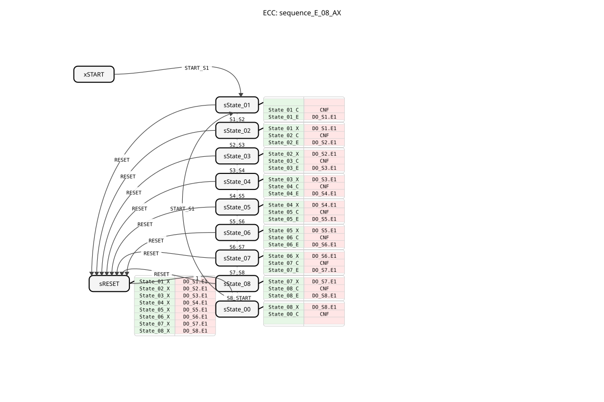
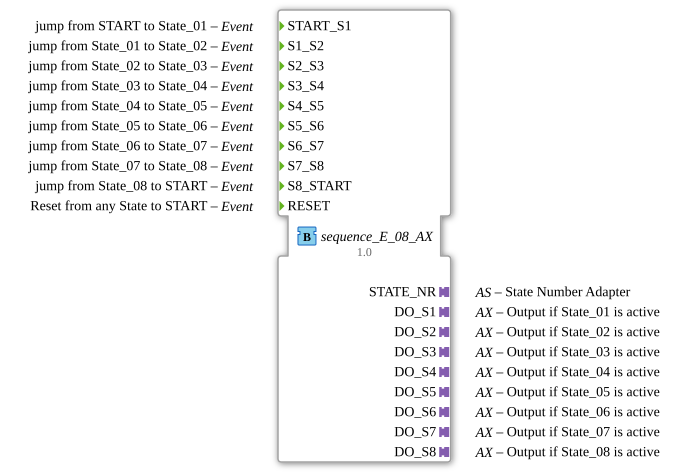

# sequence_E_08_AX

* * * * * * * * * *
## Introduction
`sequence_E_08_AX` is a variant of `sequence_E_08` that additionally uses adapters (`AX`) for the outputs. It controls a purely event-driven sequence with 8 output states.

## Interface Structure

### **Event Inputs**
* **START_S1**: Starts the sequence at State_01.
* **S1_S2** ... **S7_S8**: Manual transitions between states.
* **S8_START**: Manual transition State_08 -> START.
* **RESET**: Resets the sequence.

### **Event Outputs**
* **CNF**: Execution acknowledgement.

### **Data Inputs**
* None.

### **Data Outputs**
* **STATE_NR** (SINT): Current state number.

### **Adapters**
* **DO_S1** ... **DO_S8** (adapter::types::unidirectional::AX): Output adapter for State_01 to State_08.

## Functionality
Corresponds to `sequence_E_08`, but uses adapters for the outputs.

## Technical Features
* Uses `adapter::types::unidirectional::AX`.

## State Overview
See `sequence_E_08`.

## Application Scenarios
For event-driven 8-step sequences with adapter connectivity.

## ⚖️ Comparison with similar components
* **sequence_E_08**: Standard version without adapter.

## Conclusion
Adapter version of the 8-step event sequencer.