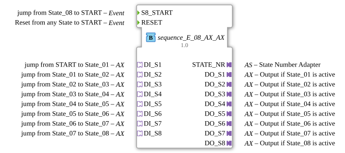

# sequence_E_08_AX_AX

* * * * * * * * * *
## Introduction
The function block **sequence_E_08_AX_AX** implements a sequential control loop with eight output stages. It enables the step-by-step switching of states, with each state being exited by an event via an AX adapter input. An AX adapter provides a unidirectional interface with a data value (`D1`) that is transferred from the input adapter to the corresponding output adapter upon entering a state. The block is designed for use in automation systems that require a clear, event-driven sequence of steps.
## Interface Structure

### **Event Inputs**

| Name | Type | Comment |

|------|-----|-----------|

| `S8_START` | Event | Jumps from `State_08` back to the initial state `START` |

| `RESET` | Event | Resets from any state back to the initial state `START` |

### **Event Outputs**

| Name | Type | Comment |

|------|-----|-----------|

| `CNF` | Event | Confirmation of execution (coupled with `STATE_NR`) |

### **Data Inputs**

None (state transitions are controlled exclusively via events).

### **Data Outputs**

| Name | Type | Comment |

|------|-----|-----------|

| `STATE_NR` | SINT | Current state number: `START` = 0, `State_01` = 1, …, `State_08` = 8 |

### **Adapter**

**Plugs (Outputs – Unidirectional AX Adapter)**

| Name | Type | Comment |

|------|------|-----------|

| `DO_S1` | adapter::types::unidirectional::AX | Output active when `State_01` is active |

| `DO_S2` | adapter::types::unidirectional::AX | Output active when `State_02` is active |

`DO_S3` | adapter::types::unidirectional::AX | Output active when `State_03` is active |

`DO_S4` | adapter::types::unidirectional::AX | Output active when `State_04` is active |

`DO_S5` | adapter::types::unidirectional::AX | Output active when `State_05` is active |

`DO_S6` | adapter::types::unidirectional::AX | Output active when `State_06` is active |

| `DO_S7` | adapter::types::unidirectional::AX | Output active when `State_07` is active |

| `DO_S8` | adapter::types::unidirectional::AX | Output active when `State_08` is active |

**Sockets (Inputs – Unidirectional AX Adapter)**

| Name | Type | Comment |

|------|------|-----------|

| `DI_S1` | adapter::types::unidirectional::AX | Jumps from `START` to `State_01` |

| `DI_S2` | adapter::types::unidirectional::AX | Jumps from `State_01` to `State_02` |

| `DI_S3` | adapter::types::unidirectional::AX | Jumps from `State_02` to `State_03` |

| `DI_S4` | adapter::types::unidirectional::AX | Jumps from `State_03` to `State_04` |

| `DI_S5` | adapter::types::unidirectional::AX | Jumps from `State_04` to `State_05` |
| `DI_S6` | adapter::types::unidirectional::AX | Jumps from `State_05` to `State_06` |
| `DI_S7` | adapter::types::unidirectional::AX | Jumps from `State_06` to `State_07` |
| `DI_S8` | adapter::types::unidirectional::AX | Jumps from `State_07` to `State_08` |

## Functionality

The function block operates on the principle of an event-driven step sequence. After starting, it is in state `xSTART`. As soon as an event arrives at socket `DI_S1`, it switches to state `sState_01`. Upon entering a state, the current data value of the associated input adapter (`DI_Sx.D1`) is transferred to the corresponding output adapter (`DO_Sx.D1`), and simultaneously, the event `CNF` with the current state number (`STATE_NR`) is triggered. When the component exits a state (e.g., due to an event at the next `DI_Sx`), the corresponding output adapter is set to `FALSE` (exit algorithm). The transition occurs stepwise: `State_01` → `State_02` → … → `State_08`. After `State_08`, the event `S8_START` returns the component to the idle state `sState_00`. From there, a new sequence can be started with `DI_S1`. The event `RESET` interrupts the sequence at any time, sets all output adapters to `FALSE`, and returns to the idle state `sState_00`.

## Technical Features
- **Use of AX Adapters**: All inputs and outputs are implemented as unidirectional AX adapters, which transmit a data value (`D1`) in addition to the event channel. This allows not only the event but also an associated value (e.g., a setpoint for an actuator) to be transmitted during a state change.
- **Entry/Exit Logic**: Deterministic state changes are ensured by the strict separation of entry (`State_xx_E`) and exit (`State_xx_X`) actions. The output of a state is always deactivated upon exiting to prevent looping.
- **Configurable Start Condition**: The input `DI_S1` serves as the start condition both on the initial startup and after each sequence iteration. The separate event input `S8_START` allows for a manual or externally triggered return from the last state.
- **State Numbering**: The output `STATE_NR` always outputs the current state number, with `0` corresponding to the idle state.

## State Overview

| State (ECC) | Meaning | Actions |

|---------------|-----------|----------|

| `xSTART` | Initial sleep state after activation | No output, expects `DI_S1` |

| `sState_01` | First step of the sequence | Sets `DO_S1.D1` to `DI_S1.D1`; output `STATE_NR=1` |

| `sState_02` | Second step | Sets `DO_S2.D1` to `DI_S2.D1`; `STATE_NR=2` |

| `sState_03` | Third step | Sets `DO_S3.D1` to `DI_S3.D1`; `STATE_NR=3` |

| `sState_04` | Fourth Step | Sets `DO_S4.D1` to `DI_S4.D1`; `STATE_NR=4` |

| `sState_05` | Fifth Step | Sets `DO_S5.D1` to `DI_S5.D1`; `STATE_NR=5` |

| `sState_06` | Sixth Step | Sets `DO_S6.D1` to `DI_S6.D1`; `STATE_NR=6` |

`sState_07` | Seventh Step | Sets `DO_S7.D1` to `DI_S7.D1`; `STATE_NR=7` |

| `sState_08` | Eighth Step | Sets `DO_S8.D1` to `DI_S8.D1`; `STATE_NR=8` |

| `sState_00` | Idle State After Sequence Iteration or Reset | No Output; `STATE_NR=0` |

| `sRESET` | Intermediate State on Reset | Sets **all** `DO_Sx.D1` to`FALSE`; then transition to `sState_00` |

## Application Scenarios
- **Multi-stage Conveyor Control**: Each step activates a different conveyor section or a different diverter. The data value `D1` can contain the speed or the direction of travel.
- **Program Flow in Machine Tools**: E.g., sequential approach to tools or stations, where each step receives a configurable parameter (e.g., pressure, temperature) via the AX adapter.
- **Lighting Control with Scenes**: Eight steps can activate different lighting scenes, where the data value of a scene (e.g., brightness values) is transferred from the input adapter to the output.
- **Test and Inspection Sequences**: Automated test sequences with eight consecutive test steps, where the measured values of the previous step serve as the target value for the next.

## Comparison with Similar Function Blocks
- **sequence_E_08 (without AX)**: A simple sequential function block that only controls Boolean signals. The function block described here extends this functionality with AX adapters, enabling the additional transfer of data values.
- **sequence_E_08_AX (with fewer adapters)**: Versions with fewer than eight stages offer a smaller number of steps, which may be sufficient or too restrictive depending on the application.
- **SFC Function Blocks (Step Function Chart)**: High-level language function blocks such as `SFC` allow parallel branching, which this simple sequencer does not support. However, it is significantly more resource-efficient and deterministic in its execution.

The function block presented here represents an optimized compromise between flexibility (through AX adapters) and clarity – ideal for standard step sequences with data transfer.

## Conclusion

The `sequence_E_08_AX_AX` function block is a modular, event-driven sequencer with eight stages. Using AX adapters, it enables compact data transfer between steps. Its clear entry/exit logic, separate reset behavior, and state numbering make it a reliable tool for simple to medium-complexity sequence control applications in automation technology. It is particularly advantageous when each step needs to transmit not only a signal but also a configurable value to the actuator.