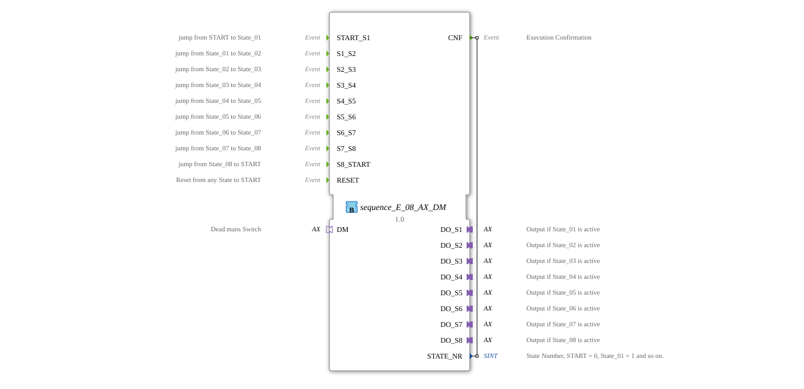

# sequence_E_08_AX_DM

* * * * * * * * * *
## Introduction

The function block `sequence_E_08_AX_DM` implements an event-driven sequence control with eight sequentially switchable outputs. It is based on a finite state machine with nine states and allows switching between states via explicit events. An integrated deadman switch (DM) allows monitoring and controlled reset of the outputs. The function block is specifically designed for use in safety-critical or monitored control sequences in agricultural technology.
## Interface Structure

### **Event Inputs**

| Event | Description |
|----------|---------------|
| `START_S1` | Transition from start state to state 1 (State_01) |
| S1_S2` | Transition from state 1 to state 2 (State_02) |
| S2_S3` | Transition from state 2 to state 3 (State_03) |
| S3_S4` | Transition from state 3 to state 4 (State_04) |
| S4_S5` | Transition from state 4 to state 5 (State_05) |
| S5_S6` | Transition from state 5 to state 6 (State_06) |
| S6_S7` | Transition from state 6 to state 7 (State_07) |
| S7_S8` | Change from state 7 to state 8 (State_08) |
| `S8_START` | Change from state 8 to the start state (State_00) |
| `RESET` | Reset from any state to the start state (State_00) |

### **Event Outputs**

| Event | With Variable | Description |
|----------|--------------|--------------|
| `CNF` | `STATE_NR` | Confirmation of state change; also returns the current state number |

### **Data Inputs**

No data inputs available.

### **Data Outputs**

| Variable | Type | Description |
|----------|-----|--------------|
| `STATE_NR` | SINT | Current state number (0 = State_00, 1 = State_01, …, 8 = State_08) |

### **Adapters**

| Direction | Name | Type | Description |
|----------|------|-----|--------------|
| Plug | `DO_S1` | unidirectional::AX | Output for state 1 (State_01 active) |
| Plug | `DO_S2` | unidirectional::AX | Output for State 2 (State_02 active) |
| Plug | `DO_S3` | unidirectional::AX | Output for State 3 (State_03 active) |
| Plug | `DO_S4` | unidirectional::AX | Output for State 4 (State_04 active) |
| Plug | `DO_S5` | unidirectional::AX | Output for State 5 (State_05 active) |
| Plug | `DO_S6` | unidirectional::AX | Output for State 6 (State_06 active) |
| Plug | `DO_S7` | unidirectional::AX | Output for State 7 (State_07 active) |
| Plug | `DO_S8` | unidirectional::AX | Output for state 8 (State_08 active) |
| Socket | `DM` | unidirectional::AX | Deadman switch; returns the event `DM.E1` and the data value `DM.D1` |

## Functionality

The function block operates as a finite automaton with the following states: `xSTART` (initial), `sState_01` to `sState_08` (active sequence states), `sState_00` (start/wait state after sequence completion), and `sRESET` (intermediate state for reset).

**Start and Process**: After starting, the automaton is in state `xSTART`. The event `START_S1` transitions it to state `sState_01`. From there, the events `S1_S2`, `S2_S3`, ... up to `S7_S8` sequentially cycle through the eight states. The last state, `sState_08`, is transitioned to state `sState_00` by `S8_START`. This state serves as the rest point after the sequence and can be restarted via `START_S1`.

... - **Outputs**: Each state activates the corresponding plug adapter (`DO_Sx`). Upon entering a state, the data value of the deadman adapter (`DM.D1`) is passed to the output adapter (`DO_Sx.D1 := DM.D1`). Upon exiting a state, the output is deactivated (`DO_Sx.D1 := FALSE`).

- **Deadman Switch**: The event `DM.E1` triggers a self-transition in the current state (e.g., `sState_01 → sState_01`). This results in the exit and entry actions being re-executed, so that the current value from `DM.D1` is updated and passed to the output adapter. As long as the Deadman event is active (i.e., `DM.E1` occurs repeatedly), the output value remains at the current `DM.D1` state. If the Deadman event is no longer triggered, the state remains until a normal sequence event or `RESET` occurs.
- **Reset**: The event `RESET` transitions from every state (except `xSTART` and `sRESET`) to the intermediate state `sRESET`. There, all eight outputs are deactivated by calling the exit algorithms. The system then automatically transitions (with `1`) to the state `sState_00`. From there, the sequence can be restarted with `START_S1`.
- **Confirmation**: With each state change (except within `sRESET`), the event `CNF` is output with the current state number `STATE_NR`. The state number is set via the constants `sequence::State_00` to `sequence::State_08`.

## Technical Features

- **Adapter-Based Outputs**: All eight outputs and the dead man's switch are implemented as unidirectional AX adapters. This allows for flexible connection to external hardware (e.g., analog or digital actuators) via the adapter frame.
- **Reusable Sequence Constants**: The state numbers are retrieved from a separate library (`logiBUS::utils::sequence::const::sequence`), allowing for consistent numbering across different sequence blocks.
- **Deadman Integration**: The deadman switch does not act as a block, but rather as a dynamic value generator for the outputs. Each state inherits the current value from `DM.D1` upon entry and can be updated by a repeated `DM.E1` event.
- **Explicit Reset**: The `RESET` event immediately deactivates all outputs and returns to a defined initial state – an important safety feature.

## State Overview

| State | Label | Output Active | Transitions |
|---------|-------------|---------------|--------------|
| `xSTART` | Initial state | none | → `sState_01` at `START_S1`; Self-transition at `DM.E1` |
| `sState_01` | Sequence step 1 | `DO_S1` | → `sState_02` at `S1_S2`; Self-transition at `DM.E1`; → `sRESET` at `RESET` |
| `sState_02` | Sequence step 2 | `DO_S2` | → `sState_03` at `S2_S3`; Self-translation at `DM.E1`; → `sRESET` at `RESET` |
| `sState_03` | Sequence step 3 | `DO_S3` | → `sState_04` at `S3_S4`; Self-translation at `DM.E1`; →`sRESET` at `RESET` |
| `sState_04` | Sequence step 4 | `DO_S4` | → `sState_05` at `S4_S5`; Self-translation at `DM.E1`; → `sRESET` at `RESET` |
| `sState_05` | Sequence step 5 | `DO_S5` | → `sState_06` at `S5_S6`; Self-translation at `DM.E1`; → `sRESET` at `RESET` |
| `sState_06` | Sequence step 6 | `DO_S6` | → `sState_07` at `S6_S7`; Self-translation at `DM.E1`; → `sRESET` at `RESET` |
| `sState_07` | Sequence step 7 | `DO_S7` | → `sState_08` at `S7_S8`; Self-translation at `DM.E1`; → `sRESET` at `RESET` |
| `sState_08` | Sequence step 8 | `DO_S8` | → `sState_00` at `S8_START`; Self-translation at `DM.E1`; → `sRESET` at `RESET` |
| `sState_00` | Sleep state (after sequence) | None | → `sState_01` at `START_S1`; Self-transaction at `DM.E1` |
| `sRESET` | Reset state | All disabled | Automatic → `sState_00` |

## Application Scenarios

- **Agricultural Control Systems**: Step-by-step control of eight valves, actuators, or lighting units, e.g., for irrigation sequences or harvesting machines.
- **Safety-Monitored Processes**: Use in systems requiring a deadman's switch – the operator must keep the outputs active by repeatedly pressing the deadman switch.
- **Test and Inspection Stations**: Sequential activation of test steps with manual release by the operator (via events).
- **Modular Sequence Control**: Combination of multiple `sequence_E_08_AX_DM` blocks for more complex sequences with more than eight steps.

## Comparison with Similar Blocks

- **`sequence_E_08_AX` (without deadman)**: Does not have a deadman switch – the outputs are permanently activated upon entry (e.g., with `TRUE`) and only deactivated upon exit. Suitable for non-critical control systems.
- **`sequence_E_04_AX_DM`**: Four-stage variant with correspondingly fewer outputs and events. Offers identical deadman functionality.
- **`sequence_T_08_AX_DM`**: Time-controlled variant – state transitions occur via timers instead of external events. Comparable deadman integration.

## Conclusion

The `sequence_E_08_AX_DM` function block is a powerful and safe component for event-driven processes with up to eight steps. The integration of a deadman switch increases operational safety by requiring operator interaction. The adapter-based output interface allows for easy connection to various actuators. Thanks to its clearly structured state machine and explicit reset capability, this module is particularly suitable for safety-critical control tasks in agricultural technology and beyond.
