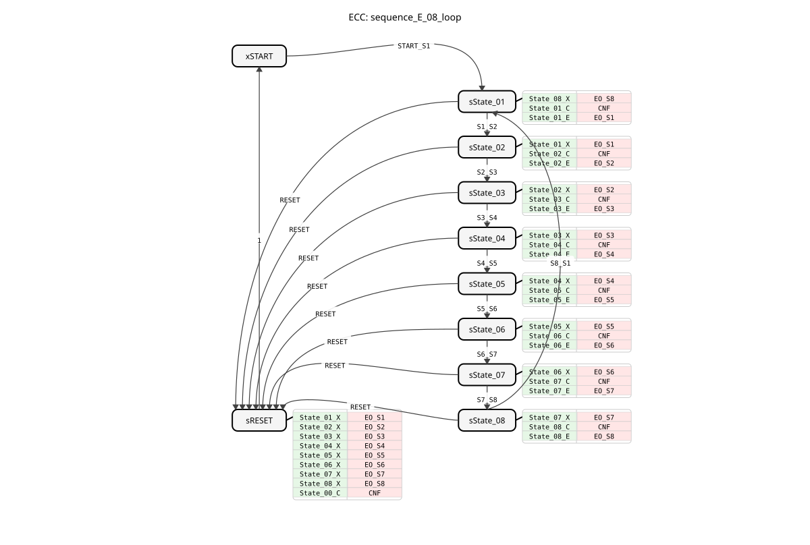
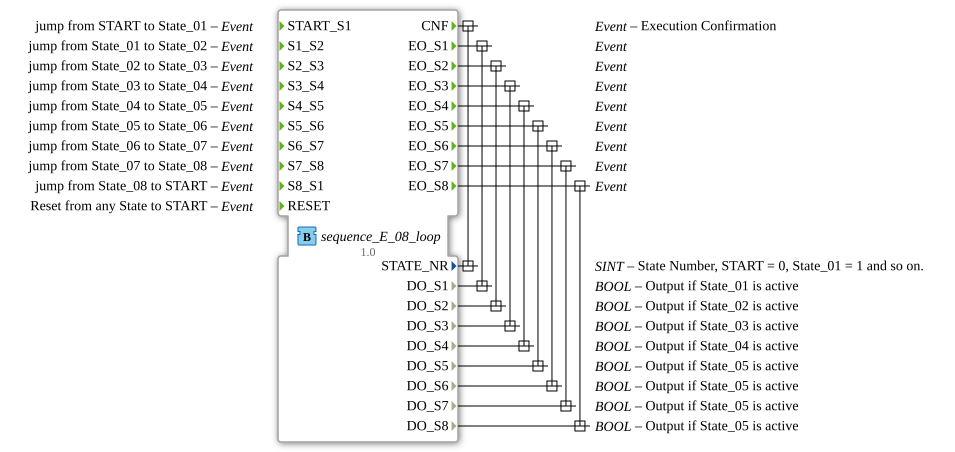

# sequence_E_08_loop

* * * * * * * * * *
## Introduction
The function block `sequence_E_08_loop` is a sequencer with eight output states that operates in a loop. It is used to control sequential processes where each step is triggered by an external event. The block is implemented as a Basic Function Block (BasicFB) according to IEC 61499 and is suitable for applications that require a clear, event-driven state machine.

## Interface Structure
### **Event Inputs**
* `START_S1`: Changes from the start state (`START`) to the state `State_01`.
* `S1_S2`: Changes from `State_01` to `State_02`.
* `S2_S3`: Changes from `State_02` to `State_03`.
* `S3_S4`: Changes from `State_03` to `State_04`.
* `S4_S5`: Changes from `State_04` to `State_05`.
* `S5_S6`: Changes from `State_05` to `State_06`.
* `S6_S7`: Changes from `State_06` to `State_07`.
* `S7_S8`: Switches from `State_07` to `State_08`.
* `S8_S1`: Switches from `State_08` back to state `State_01` (loop).
* `RESET`: Resets from any state back to the initial state (`START`).

### **Event Outputs**
* `CNF` (Execution Confirmation): Triggered on every state change and returns the current state number (`STATE_NR`).
* `EO_S1` ... `EO_S8`: These are triggered upon entering the respective state (`State_01` to `State_08`) and provide the corresponding Boolean data output (`DO_S1` ... `DO_S8`).

### **Data Inputs**
* None present.

### **Data Outputs**
* `STATE_NR` (SINT): The number of the active state. `START` = 0, `State_01` = 1, `State_02` = 2, etc.
* `DO_S1` ... `DO_S8` (BOOL): Logical outputs that are `TRUE` when the corresponding state is active.

### **Adapter**
* No adapter interfaces are available.

## Functionality
The function block operates as an event-driven state machine (ECC). The initial state is `xSTART`. An incoming event at one of the named event inputs (e.g., `START_S1`) triggers a transition to the next state (e.g., `sState_01`).

Three actions are performed during each state transition:

1. **Exit action (X) of the previous state**: Sets the corresponding data output (`DO_Sx`) to `FALSE`.

2. **Confirmation action (C) of the new state**: Sets the state number `STATE_NR` and triggers the `CNF` event.

3. **Entry Action (E) of the new state**: Sets the associated data output (`DO_Sx`) to `TRUE` and triggers the corresponding event `EO_Sx`.

The sequence traverses states 1 through 8 linearly. From `State_08`, the event `S8_S1` returns to `State_01`, creating an infinite loop. The `RESET` event always returns to the initial state `xSTART` via a dedicated reset state (`sRESET`), resetting all active outputs in the process.

## Technical Features
* **Pure Event Trigger**: State transitions occur exclusively through external events, not through conditions or timers.
* **Explicit Reset Logic**: The reset process uses a dedicated state (`sRESET`) in which all possible exit actions are invoked to ensure that all outputs are disabled before the initial state is reached.
* **State Confirmation**: The `CNF` event and the `STATE_NR` output provide clear feedback on the current system status.
* **Consistent Naming Scheme**: The names of events, states, and algorithms follow a consistent scheme (e.g., `S1_S2`, `sState_01`, `State_01_C`), which facilitates readability and maintenance.

## State Overview

The ECC (Execution Control Chart) comprises the following states:

* `xSTART`: Initial, inactive wait state (state number 0).
* `sState_01` to `sState_08`: The eight active sequence states (state numbers 1-8). Each activates its specific output.
* `sRESET`: Dedicated reset state. Upon entering this state, all potentially active outputs (`DO_S1` to `DO_S8`) are deactivated, the state number is set to 0, and a transition to `xSTART` is executed.

## Application Scenarios
* Control of cyclical manufacturing or assembly processes with manual or sensor-based release for the next step.
* Control of test sequences where each test step is started manually.
* Monitoring and control of batch processes where an operator initiates the next phase.
* As a central control module in machines with a clearly defined, step-by-step workflow.

## ⚖️ Comparison with Similar Modules

Compared to sequencers with time-controlled transitions (e.g., `sequence_T_08_loop`), this function block offers maximum flexibility because the dwell time in each state is externally defined. It has a simpler structure than building blocks with integrated error handling or complex branching, but provides a robust foundation for event-driven processes. Alternative implementations using `E_SR` or `E_CTUD` blocks would be significantly more complex and less user-friendly.

## 🛠️ Related Exercises
* [Exercise_040](../../../../../../Uebungen/test_B/Uebungen_doc/Uebung_040.md)]
* [Exercise_040_2](../../../../../../Uebungen/test_B/Uebungen_doc/Uebung_040_2.md)]
* [Exercise_041](../../../../../../Uebungen/test_B/Uebungen_doc/Uebung_041.md)]

## Conclusion
The `sequence_E_08_loop` is a specialized, reliable, and easy-to-configure function block for event-driven sequence flows. Its clear structure, consistent interface, and integrated reset functionality make it particularly suitable for applications where a step-by-step process needs to be driven by external signals (e.g., buttons, sensors, higher-level controllers). The output of the status number and the confirming events enable easy integration with visualization and monitoring systems.

---

### 🌐 Related topic subpages on ms-muc-docs.de
* [🌐 E_CTU Event Counter module on ms-muc-docs.de](https://www.ms-muc-docs.de/iec-61499/event-function-blocks/e_ctu/)
