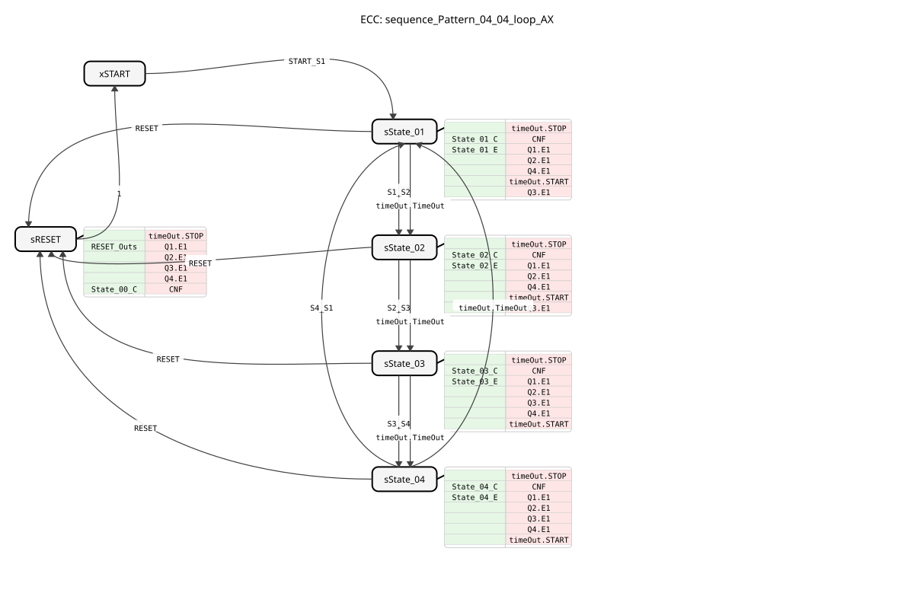

# sequence_Pattern_04_04_loop_AX

* * * * * * * * * *

## Introduction

The function block **sequence_Pattern_04_04_loop_AX** is a sequencer (step switch) that controls a sequence of four states in an endless loop. It functions similarly to an electronic cam switch. A specific output pattern can be defined for each of the four steps, controlling four outputs (Q1 to Q4).

The block uses **AX adapters** for the outputs and supports both timed transitions (timeouts) and event-driven manual advancement. After the fourth step, the sequence automatically or manually returns to the first step (loop behavior).

## Interface Structure

### **Event Inputs**

* **START_S1**: Starts the sequence and jumps directly to state 1 (`State_01`). The configuration data (times and patterns) is read in.

* **S1_S2**: Manual trigger for the transition from step 1 to step 2.

* **S2_S3**: Manual trigger for the transition from step 2 to step 3.

* **S3_S4**: Manual trigger for the transition from step 3 to step 4.

* **S4_S1**: Manual trigger for the transition from step 4 back to step 1 (loop closure).

* **RESET**: Resets the function block from any state to its initial state (`START`). All outputs are deactivated.

### **Event Outputs**

* **CNF**: Execution Confirmation Event. Fires when the state changes or the function block is initialized.

### **Data Inputs**

* **DT_S1_S2** (TIME): Dwell time in step 1 before automatically switching to step 2. Default value: `NO_TIME` (no automatic switch).

* **DT_S2_S3** (TIME): Dwell time in step 2.

* **DT_S3_S4** (TIME): Dwell time in step 3.

* **DT_S4_S1** (TIME): Dwell time in step 4 before automatically switching back to step 1.

* **P_S1** (BYTE): Output pattern for step 1.

* Bit 0 controls Q1

* Bit 1 controls Q2

* Bit 2 controls Q3

* Bit 3 controls Q4

* **P_S2** (BYTE): Output pattern for step 2.

* **P_S3** (BYTE): Output pattern for step 3.

* **P_S4** (BYTE): Output pattern for step 4.

### **Data Outputs**

* **STATE_NR** (SINT): Current state number (0 = START, 1 = State_01, ..., 4 = State_04).

### **Adapter**

* **Q1** (`adapter::types::unidirectional::AX`): Output 1 (controlled by bit 0 of the pattern).

* **Q2** (`adapter::types::unidirectional::AX`): Output 2 (controlled by bit 1 of the pattern).

* **Q3** (`adapter::types::unidirectional::AX`): Output 3 (controlled by bit 2 of the pattern).

* **Q4** (`adapter::types::unidirectional::AX`): Output 4 (controlled by bit 3 of the pattern).

* **timeOut** (`iec61499::events::ATimeOut`): Internal adapter for managing time delays (timers).

## Functionality

The function block implements a state machine (ECC) that cycles through four active states.

1. **Initialization**: The function block starts in state `xSTART`. Upon the event `START_S1`, it transitions to state `sState_01`.

2. **State Processing**: In each state (`sState_01` to `sState_04`):

* The timer (`timeOut`) is stopped and restarted with the corresponding time (`DT_xx`).

* The current state number (`STATE_NR`) is updated and sent (`CNF`).

* The outputs (`Q1` to `Q4`) are set based on the corresponding input byte (`P_Sx`). The mapping is bitwise (bit 0 -> Q1, bit 1 -> Q2, etc.).

* The outputs (`Q1` to `Q4`) are set based on the corresponding input byte (`P_Sx`). * Events are fired at the adapters `Qx` (`Qx.E1`) to signal the data change.

3. **Transitions**: A transition to the next step occurs either:

* **Automatic**: When the configured time (`DT_...`) has expired (`timeOut.TimeOut`).

* **Manual**: When the explicit transition event (e.g., `S1_S2`) arrives.

4. **Loop**: After `sState_04`, the transition back to `sState_01` (loop) occurs, unless a reset is triggered.

5. **Reset**: The `RESET` event causes all outputs to be set to `FALSE`, `STATE_NR` to be reset to 0, and the function block to wait for a new start command in the `xSTART` state.

## Technical Features

* **Bit Mapping**: Output control is efficiently achieved via byte patterns. This allows any combination of the four outputs per step to be defined with a single parameter.

* Example: `P_S1 = 5` (binary `0000 0101`) activates Q1 and Q3.

* **AX Adapter**: The use of AX adapters indicates that this function block is designed for modular systems where actuators are connected via standardized interfaces.

* **Time & Event Duality**: The flexibility to exit steps based on both time and event allows for mixed operating modes (e.g., Step 1 exits after a time delay, Step 2 waits for manual confirmation).

## State Overview

| State | Description | Exit Logic (Q1-Q4) | Next State (Auto/Manual) |

| :--- | :--- | :--- | :--- |

| **xSTART** | Idle State | Inactive | sState_01 (via `START_S1`) |

| **sState_01** | Step 1 | P_S1 | sState_02 |

| **sState_02** | Step 2 | P_S2 | sState_03 |

| **sState_03** | Step 3 | P_S3 | sState_04 |

**sState_04** | Step 4 | P_S4 | sState_01 (Loop) |

| **sRESET** | Reset Logic | All FALSE | xSTART |

## Application Scenarios

* **Running Light / Flashing Light**: Simple cyclical light control.

* **Cam Switch Simulation**: Control of recurring machine cycles (e.g., gripping, lifting, moving, lowering).

* **Traffic Light Control**: Simple traffic light phases can be implemented by adjusting the `DT` times (where 4 steps are usually sufficient, e.g., red, red-yellow, green, yellow).

* **Test Pattern Generator**: Generation of defined signal sequences for testing purposes.

## ⚖️ Comparison with Similar Function Blocks

Unlike simple counters, this function block offers integrated timers per step and direct pattern assignment. Compared to more complex sequencers (e.g., SFC / Sequential Function Chart), it is more compact but limited to exactly 4 steps and 4 outputs. The "loop" variant differs from "single-shot" sequencers in that it does not stop at the end but repeats indefinitely.

## Conclusion

The `sequence_Pattern_04_04_loop_AX` is a robust and flexible function block for small, cyclic control tasks in IEC 61499 applications. Its combination of time and event control, along with direct bit-to-adapter assignment, makes it ideally suited for repetitive automation sequences.