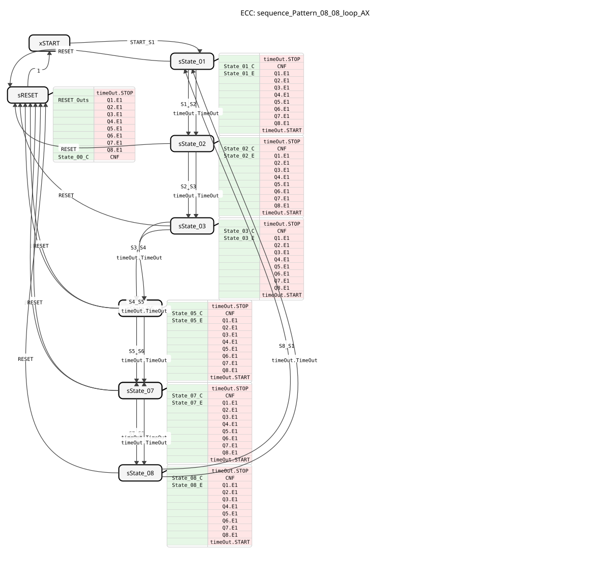

# sequence_Pattern_08_08_loop_AX

[Image of sequence_Pattern_08_08_loop_AX, if available]

* * * * * * * * * *

## Introduction

The function block **sequence_Pattern_08_08_loop_AX** is a sequencer (step chain) that implements a configurable cam switch with 8 states (steps) and 8 outputs. It is designed to operate cyclically (loop behavior), transitioning from step 8 back to step 1.

This block allows the definition of bit patterns for each of the 8 steps, which are output via special adapters (AX interface). Transitions between states can be either event-driven or time-controlled.

## Interface Structure

### **Event Inputs**

- **START_S1**: Initializes the sequence and jumps directly to state 1 (`State_01`). This event also inherits the parameterized time values (`DT_...`) and bit patterns (`P_...`).
- **S1_S2** to **S8_S1**: Manual trigger events to immediately switch from the current state to the next (e.g., `S1_S2` jumps from state 1 to 2).
- **RESET**: Resets the function block from any state to the initial state (`START`) and disables all outputs.
- **S1_S2** to **S8_S1**: Manual trigger events to immediately switch from the current state to the next (e.g., `S1_S2` jumps from state 1 to 2).

### **Event Outputs**

- **CNF**: Execution Confirmation event. It fires as soon as a new state is reached and the outputs are updated.

### **Data Inputs**

- **DT_S1_S2** to **DT_S8_S1** (Type: `TIME`): Define the dwell time in the respective state before automatically switching to the next one. The default value is `NO_TIME` (no automatic switching based on time).
- **P_S1** to **P_S8** (Type: `BYTE`): Define the output pattern for the respective state.
- Bit 0 controls adapter Q1
- Bit 1 controls adapter Q2
- ...
- Bit 7 controls adapter Q8

### **Data Outputs**

- **STATE_NR** (Type: `SINT`): Outputs the current state number (0 = START, 1 = State_01, ..., 8 = State_08).

### **Adapters**

- **Q1** to **Q8** (Type: `adapter::types::unidirectional::AX`): The 8 physical or logical outputs. Each adapter receives a data signal (`D1`) and an event signal (`E1`).
- **timeOut** (Type: `iec61499::events::ATimeOut`): An internal adapter for handling timed transitions between steps.

## Functionality

The component operates as a finite state machine with a cyclic structure:

1. **Initialization**: The sequence is started by the event `START_S1`. The configured time values and bit patterns are read in. The state machine transitions to **State_01**.
2. **State Logic**: In each state (`State_01` to `State_08`), the corresponding byte pattern (`P_Sn`) is parsed.

- If bit 0 of `P_S1` is set, `Q1.D1` is set to TRUE.

- If bit 1 of `P_S1` is set, `Q2.D1` is set to TRUE, and so on.

- Simultaneously, the event `E1` is triggered on all adapters `Q1` through `Q8` to signal the change.
1. **Transitions**: The transition to the next state occurs when:

- The explicit event is received (e.g., `S1_S2`).
- OR the configured time (`DT_S1_S2`) has expired (via the `timeOut` adapter).
- 1. **Cycle**: After **State_08**, the process transitions back to **State_01** (`S8_S1` or timeout), creating an infinite loop.
1. **Reset**: The event `RESET` immediately interrupts the process, sets all outputs (`Q1` to `Q8`) to `FALSE`, and sets the state number to 0.

## Technical Features

- **AX Adapter Usage**: Instead of classic `BOOL` outputs, this function block uses adapters of type `AX`. This allows for more flexible integration, e.g., with hardware abstraction layers or complex actuators that require an event signal for data transfer.
- **Bit Mapping**: The 8 outputs are efficiently controlled via `BYTE` variables. This drastically reduces the number of required input pins on the function block compared to individual Boolean inputs per step and output.
- **Hybrid Control**: The function block supports both time-controlled (timer) and event-controlled (external trigger) sequences, making it highly flexible.

## State Overview

| State ID | Name | Description | Output Logic | Transition to |
| :--- | :--- | :--- | :--- | :--- |
| **0** | xSTART | Waiting State / Reset | None | State_01 (at START_S1) |
| **1** | sState_01 | Step 1 | Q1-Q8 according to P_S1 | State_02 |
| **2** | sState_02 | Step 2 | Q1-Q8 according to P_S2 | State_03 |
| **3** | sState_03 | Step 3 | Q1-Q8 according to P_S3 | State_04 |
| **4** | sState_04 | Step 4 | Q1-Q8 according to P_S4 | State_05 |
| **5** | sState_05 | Step 5 | Q1-Q8 according to P_S5 | State_06 |
| **6** | sState_06 | Step 6 | Q1-Q8 according to P_S6 | State_07 |
| **7** | sState_07 | Step 7 | Q1-Q8 according to P_S7 | State_08 |
| **8** | sState_08 | Step 8 | Q1-Q8 according to P_S8 | State_01 (Loop) |
| **-** | sRESET | Reset State | Q1-Q8 = FALSE | xSTART |

## Application Scenarios

- **Running Light Controls**: A simple running light effect can be implemented by setting `P_S1=1`, `P_S2=2`, `P_S3=4`, etc.
- **Cam Switches**: Control of mechanical processes where multiple actuators (cylinders, valves) must be activated in a fixed sequence.
- **Traffic Light Controls**: Cyclic sequence of red-yellow-green phases.
- **Cleaning Cycles**: Rinsing, washing, and drying at recurring intervals.
-

## ⚖️ Comparison with Similar Function Blocks

Unlike linear sequencers (without a loop), this function block is explicitly designed for recurring processes. It differs from simple counters in that an individual output pattern and time can be defined for each step. The use of AX adapters distinguishes it from standard IEC 61499 function blocks, which mostly use direct Boolean outputs, and makes it ideal for structured, object-oriented control designs.

## Conclusion

The **sequence_Pattern_08_08_loop_AX** is a powerful and compact function block for implementing complex, cyclic sequences. Parameterization via byte patterns and time values allows for the implementation of diverse control tasks without modifying the internal logic. The integrated reset functionality and adapter interface ensure seamless integration into modern 4diac applications.

---

### 🌐 Related topic subpages on ms-muc-docs.de

- [🌐 Eclipse 4diac IDE & Color Reference on ms-muc-docs.de](https://www.ms-muc-docs.de/iec-61499/eclipse-4diac/)

]
