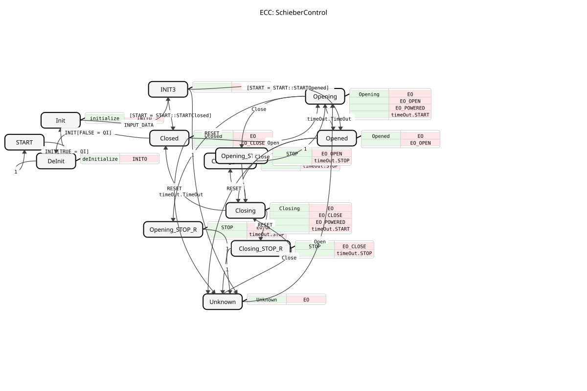

# Slide Control

* * * * * * * * * *
## Introduction

The function block `SchieberControl` is a basic function block (FB) according to IEC 61499 for controlling a slide actuator (e.g., pneumatic). It implements a complete state control (ECC) that manages the movement (open/close), holding states, and fault states of a slide. The block offers a comprehensive interface for parameterization, operation via pushbuttons, softkeys, and auxiliary controls, as well as for outputting control signals to the actuators.

## Interface Structure

### **Event Inputs**

- **`INIT`**: Initialization request. Sets all values. A complete de-initialization is not fully supported. Associated with the data `QI`, `DT_Opening`, `DT_Closing`, and `START`.
- **`Open`**: Starts the opening process of the slide.
- **`Close`**: Starts the closing process of the slide.
- **`RESET`**: Resets the internal state to "Unknown".
- **`INPUT_DATA`**: Transmits the configured input data for pushbuttons, softkeys, and auxiliary controls. Linked to the data outputs `BT`, `SK`, and `AUXC`.

### **Event Outputs**

- **`INITO`**: Initialization confirmation. Linked to the data output `QO`.
- **`EO`**: General output event that provides the current system state and the configured output values. Linked to `Button`, `Softkey`, `Auxiliary`, and `STATE`.
- **`EO_POWERED`**: Control signal for actuating the "open" valve for the pneumatic system. Linked to `DO_POWERED`.
- **`EO_OPEN`**: Control signal for actuating the "open" valve. Linked to `DO_OPEN`.
- **`EO_CLOSE`**: Control signal for actuating the "close" valve. Linked to `DO_CLOSE`.
- **`EO1`**: Additional output event without data.

### **Data Inputs**

- **`QI` (BOOL)**: Qualifier for the INIT event.
- **`BT` (SliderStruct)**: Configuration for the push-button controls.
- **`SK` (SliderStruct)**: Configuration for the softkey controls.
- **`AUXC` (SliderAuxInStruct)**: Configuration for the auxiliary controls (image and color).
- **`DT_Opening` (TIME)**: Time duration for the opening process.
- **`DT_Closing` (TIME)**: Duration of the closing process.
- **`START` (UINT)**: Defines the desired start state after initialization (e.g., `START::STARTClosed`, `START::STARTOpened`, `START::STARTUnknown`).

### **Data Outputs**

- **`QO` (BOOL)**: Qualifier for the INITO event.
- **`Button` (UINT)**: Current value for the button output, depending on the state.
- **`Softkey` (UINT)**: Current value for the softkey output, depending on the state.
- **`Auxiliary` (SchieberAuxOutStruct)**: Current values for the auxiliary control output (image and color).
- **`DO_POWERED` (BOOL)**: Binary signal to actuate the "open" valve for the pneumatics.
- **`DO_OPEN` (BOOL)**: Binary signal to actuate the "open" valve.
- **`DO_CLOSE` (BOOL)**: Binary signal to actuate the "close" valve.
- **`STATE` (STRING)**: String describing the current internal state of the function block (e.g., "Closed", "Opening").

### **Adapter**

- **`timeOut` (ATimeOut)**: A plug adapter of type `ATimeOut`. Used to implement time-controlled state transitions (open/close). The function block (FB) starts (`START`) and stops (`STOP`) the timer and reacts to its `TimeOut` event.

## Functionality

The `SchieberControl` FB operates as a state-controlled sequence. The internal control flow graph (ECC) defines the states `Closed` (Closed), `Opened` (Open), `Opening` (Opening), `Closing` (Closing), various STOP states, and `Unknown` (Unknown). Each state change triggers a corresponding algorithm that sets the data outputs (such as `DO_OPEN`, `STATE`, `Button`) and, if necessary, starts the timer adapter. The movement between `Closed` and `Opened` is time-controlled via the states `Opening` and `Closing`. During a movement, a stop can be initiated by the opposite event (`Open` during `Closing` or `Close` during `Opening`), which transitions to the corresponding STOP state. From any state, a `RESET` event can move the function block to the `Unknown` state.

## Technical Features

- **State Initialization**: The desired initial state (State_01, State_02, or State_03) can be specified via the `START` input after `INIT`. This requires the subsequent arrival of the `INPUT_DATA` event.
- **Adapter Usage**: The timing control is completely outsourced to the `timeOut` adapter, enabling a clear separation of functionality and potential reusability.
- * **Data Configuration**: The output values for user interfaces (`Button`, `Softkey`, `Auxiliary`) are not hard-coded, but configured via corresponding input structures (`BT`, `SK`, `AUXC`), allowing for flexible adaptation to various HMIs.
- **Power Signal**: The signal `DO_POWERED` is only activated in states `Opening` and `Opened`, indicating a specific pneumatic control logic (e.g., maintaining compressed air in the open state).

## State Overview

The ECC comprises the following main states:

1. **`START`**: Inactive initial state.
2. **`Init`/`INIT3`**: Initialization sequence.
3. **`Closed`**: Final state "closed". Activates `DO_CLOSE`.
4. **`Opened`**: Final state "open". Activates `DO_OPEN` and `DO_POWERED`.
5. **`Opening`/`Closing`**: Motion states. Start the timer with `DT_Opening`/`DT_Closing` and activate the corresponding actuator signals as well as `DO_POWERED` (only with `Opening`).
6. **`Opening_STOP`/`Closing_STOP`**: Stop states during movement, triggered by the opposite command. Deactivate `DO_OPEN`/`DO_CLOSE` and stop the timer.
7. **`Opening_STOP_R`/`Closing_STOP_R`**: Stop states during movement, triggered by `RESET`. This leads to the `Unknown` state.
8. **`Unknown`**: Error or unknown state. Resets all actuator signals.

## Application Scenarios

- **Control of pneumatic slides** in packaging, conveying, or sorting systems.
- **Integration into higher-level sequencers** for material flow control.
- **Connection to operator panels (HMI)**, as structured data is provided for buttons, softkeys, and displays.
- **Logging and visualization** of the slide state via the `STATE` string output.

## ⚖️ Comparison with similar function blocks

Compared to simpler binary actuator function blocks (e.g., a simple cylinder function block), `SchieberControl` offers significantly higher functionality:

- **Complete state machine** with motion, end, and stop states.
- **Integrated timing control** for motion.
- **Extensive HMI interface** for configuring operating elements.
- **Explicit handling of an "unknown" state** (`RESET` functionality).

It is more specialized and complex than a generic `E_SR` (flip-flop) or a simple timer block, as it combines these functionalities and tailors them to the control of a slide valve actuator.

## Conclusion

The `SchieberControl` is a robustly designed and functionally comprehensive control block for slide valve actuators. Its strengths lie in its clear state logic, the flexible configurability of the user interface, and the clean separation of control logic and timing functionality through adapters. It is well suited for use in medium to complex control applications where reliable and monitorable control of a slide valve is required.
