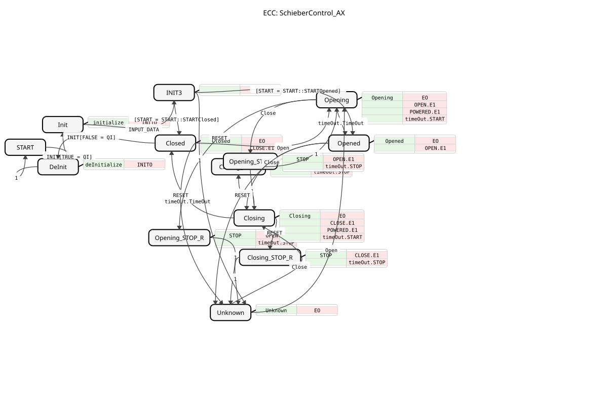

# SlideControl_AX

* * * * * * * * * *
## Introduction
The function block **SlideControl_AX** is used to control a slide valve (valve, flap, or similar actuator) within a 61499-based control system. It implements a state machine that not only manages the logical states (Open, Closed, Opening, Closing) but also handles the timing of the movements and provides corresponding visualization data (buttons, softkeys) for an HMI.

This version of the block ("AX Adapter Version") uses special adapters (`adapter::types::unidirectional::AX`) to control the physical valves.

## Interface Structure

### **Event Inputs**

| Event | Type | Comment |
| :--- | :--- | :--- |
| **INIT** | EInit | Initialization request. Sets all values and parameters. |
| **Open** | Event | Command to open the slider. |
| **Close** | Event | Command to close the slider. |
| **RESET** | Event | Resets the function block to an unknown state ("Unknown"). |
| **INPUT_DATA** | Event | Updates the configuration data for UI elements (button, softkey, aux). |

### **Event Outputs**

| Event | Type | Comment |
| :--- | :--- | :--- |
| **INITO** | EInit | Confirmation of initialization. |
| **EO** | EInit | Event upon state change or update of outputs (button, softkey, status). |
| **EO1** | Event | Internal event (often used after initial startup). |

### **Data Inputs**

| Variable | Data Type | Comment |
| :--- | :--- | :--- |
| **QI** | BOOL | Input Event Qualifier (True = Normal operation, False = De-Init). |
| **BT** | SliderStruct | Configuration structure for button states (depending on slider status). |
| **SK** | SliderStruct | Configuration structure for softkey states. |
| **AUXC** | SliderAuxInStruct | Configuration structure for auxiliary controls (images/colors). |
| **DT_Opening** | TIME | Duration of the opening process. |
| **DT_Closing** | TIME | Duration of the closing process. |
| **START** | UINT | Start configuration (Defines the state in which the function block starts). Default: `STARTUnknown`. |

### **Data Outputs**

| Variable | Data Type | Comment |
| :--- | :--- | :--- |
| **QO** | BOOL | Output Event Qualifier. |
| **Button** | UINT | Current button status (based on the internal state). |
| **Softkey** | UINT | Current softkey status. |
| **Auxiliary** | SliderAuxOutStruct | Current auxiliary data (e.g., image ID, color) for visualization. |
| **STATE** | STRING | Textual representation of the current state (e.g., "Opened", "Closing"). |

### **Adapter**

| Name | Type | Comment |
| :--- | :--- | :--- |
| **POWERED** | AX | Adapter for controlling the "open" valve (pneumatic/main supply). Active during opening and in the open state. |
**OPEN** | AX | Adapter for controlling the "open" signal. |
**CLOSE** | AX | Adapter for controlling the "close" signal. |
**timeOut** | ATimeOut | Adapter for timer functionality (monitors opening/closing times). |

## Functionality

This module operates as an event-controlled logic controller (ECC) that controls transitions based on the events `Open` and `Close`, as well as the timer adapter `timeOut`.

1. **Initialization:**

Upon startup (`INIT`), the initial state of the slider is checked (defined by `START`). Possible states include "Closed," "Opened," or "Unknown."

2. **Movement Sequence:**

* When the command `Open` is executed, the function block switches to the **Opening** state. This activates the adapters `POWERED` and `OPEN`, and starts the timer with `DT_Opening`.
* After the specified time (`timeOut.TimeOut`), the state automatically switches to **Opened**.
* * If the command `Close` is issued, the function block switches to **Closing**. The adapter `CLOSE` is activated (while `POWERED` and `OPEN` are deactivated), and the timer is started with `DT_Closing`.
* After the specified time has elapsed, the state changes to **Closed**.

3. **Interruption:**

If the command `Close` (or vice versa) is issued during the opening process, the process is stopped (`STOP` states), the outputs are reset, and the reverse process is initiated.

4. **Visualization:**

In each state (Closed, Opening, Opened, Closing, Unknown), the outputs `Button`, `Softkey`, and `Auxiliary` are populated with the values from the input structures (`BT`, `SK`, `AUXC`) corresponding to the respective state. This enables dynamic adaptation of the user interface.

## Technical Features
* **AX Adapter Integration:** The direct use of `adapter::types::unidirectional::AX` indicates a standardized interface for hardware abstraction, making the function block reusable for various valve types, provided the adapter is compatible.
* **Structure Mapping:** The function block acts as a "mapper." It accepts complex configuration structures (`SchieberStruct`) and outputs only the individual values relevant to the current state at runtime. This reduces the logic in the HMI.
* **Stop Logic:** Explicit `STOP` states are implemented to ensure that, when changing direction, the outputs are briefly and precisely switched off (`timeOut.STOP`, Valves Off) before the new direction is initiated.

## State Overview

The most important states in the ECC (Execution Control Chart) are:

* **START / Init / DeInit:** Management states for the block's lifecycle.
* **Unknown:** Error or initial state when the position is unknown.
* **Closed:** The valve is fully closed. (`CLOSE`=False, `OPEN`=False).
* **Opening:** The slider is currently opening. (`POWERED`=True, `OPEN`=True, timer running).
* **Opened:** The slider is fully open. (`POWERED`=True, `OPEN`=False).
* **Closing:** The slider is currently closing. (`CLOSE`=True, `POWERED`=False, timer running).
* **..._STOP:** Intermediate states for cleanly stopping movements.

## Application Scenarios
* **Agricultural Machinery:** Control of slurry scrapers, metering flaps, or hydraulic booms.
* **Process Automation:** Simple valve controls that do not have end-position sensors but operate based on time (`DT_Opening`/`DT_Closing`).
* **HMI Integration:** Systems where the symbol or button color on the display must change depending on whether the valve is moving, open, or closed.

## Comparison with Similar Modules

In contrast to a simple `SR`The **SchieberControl_AX** offers the following flip-flop functionality for valve control:

1. **Time Monitoring:** Integrated timers simulate the runtime.

2. **HMI Mapping:** Built-in logic for switching UI information.

3. **Hardware Abstraction:** Uses adapters instead of direct Boolean outputs for the valves.

4. **Intermediate States:** Explicit representation of "Opens" and "Closes," not just "On" and "Off."

## Conclusion

The `SchieberControl_AX` is a specialized, robust function block for time-controlled actuators. It encapsulates the complexity of state transitions, timer handling, and UI status management in a single component, thus significantly simplifying the development of control software for machines with hydraulic or pneumatic valves.
