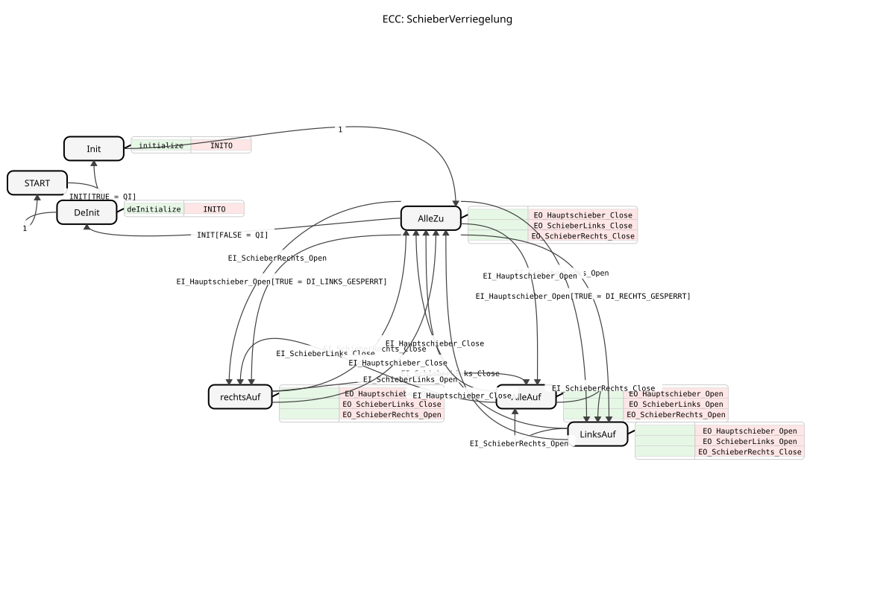
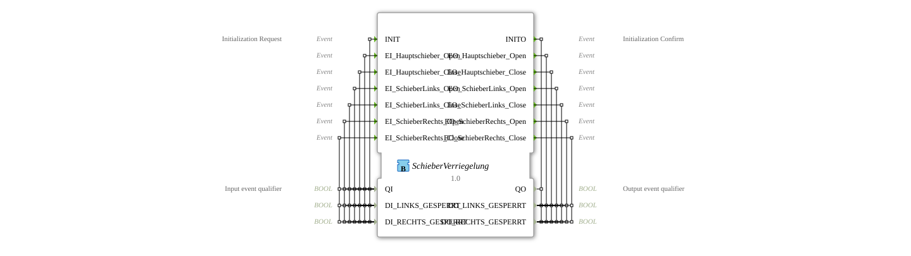

# Slide Lock

* * * * * * * * * *
## Introduction

The function block `SchieberVerriegelung` is used for the coordinated control and locking of three slides: a main slide, a left slide, and a right side slide. Its primary purpose is to ensure valid and collision-free slide combinations based on external requests (events) and locking states. This block is particularly suitable for applications where the movement of one slide must prevent or force the movement of another.

## Interface Structure

### **Event Inputs**

- **`INIT`**: Initialization request. Triggers the transition to the initialized state. Linked to the data `QI`, `DI_LINKS_GESPERRT`, and `DI_RECHTS_GESPERRT`.
- **`EI_Hauptschieber_Open`**: Requests the main slider to open.
- **`EI_Hauptschieber_Close`**: Requests the main slider to close.
- **`EI_SchieberLinks_Open`**: Requests the left side slider to open.
- **`EI_SchieberLinks_Close`**: Requests the left side slider to close.
- **`EI_SchieberRechts_Open`**: Requests the right side slider to open.
- **`EI_SchieberRechts_Close`**: Requests the right side slider to close.

### **Event Outputs**

- **`INITO`**: Initialization confirmation. Triggered after completion of initialization (`INIT`) or deinitialization. Associated with the data `QO`, `DO_LINKS_GESPERRT`, and `DO_RECHTS_GESPERRT`.
- **`EO_Hauptschieber_Open`**: Signals the command to open the main slide.
- **`EO_Hauptschieber_Close`**: Signals the command to close the main slide.
- **`EO_SchieberLinks_Open`**: Signals the command to open the left side slide.
- **`EO_SchieberLinks_Close`**: Signals the command to close the left side slide.
- **`EO_SchieberRechts_Open`**: Signals the command to open the right side slider.
- **`EO_SchieberRechts_Close`**: Signals the command to close the right side slider.

### **Data Inputs**

- **`QI` (BOOL)**: Qualifies the INIT event. `TRUE` starts initialization, `FALSE` starts deinitialization.
- **`DI_LINKS_GESPERRT` (BOOL)**: Signals the locked state of the left side slider (`TRUE` = locked).
- **`DI_RECHTS_GESPERRT` (BOOL)**: Signals the locked state of the right side slider (`TRUE` = locked).

### **Data Outputs**

- **`QO` (BOOL)**: Status output reflecting the success of initialization/deinitialization.
- **`DO_LINKS_GESPERRT` (BOOL)**: Outputs the internally processed or forwarded locked state for the left slider.
- **`DO_RECHTS_GESPERRT` (BOOL)**: Outputs the internally processed or forwarded locked state for the right slider.

### **Adapters**

This function block does not use any adapter interfaces.

## Functionality

The `SchieberVerriegelung` function block is implemented as a Basic Function Block and follows a defined state machine (ECC). After initialization, the block starts in state `AlleZu` (all sliders closed). From here, transitions to other states can occur depending on the incoming event and the current lock states (`DI_LINKS_GESPERRT`, `DI_RECHTS_GESPERRT`).

The `SchieberVerriegelung` function block is implemented as a Basic Function Block and follows a defined state machine (ECC). After initialization, the block starts in state `AlleZu` (all sliders closed). The central logic lies in the interpretation of the `EI_Hauptschieber_Open` event in state `AlleZu`:

1. If **no** side slider is locked (`DI_LINKS_GESPERRT = FALSE` and `DI_RECHTS_GESPERRT = FALSE`), the function block transitions to state `AlleAuf` (all sliders open).
2. If **only the right slider** is locked (`DI_RECHTS_GESPERRT = TRUE`), the function block transitions to state `LinksAuf` (main and left sliders open, right slider remains closed).
3. If **only the left** slider is locked (`DI_LINKS_GESPERRT = TRUE`), the function block (FB) transitions to state `rechtsAuf` (main and right sliders open, left one remains closed).

States `LinksAuf` and `rechtsAuf` represent the locked operating states. From these states, the system can transition to state `AlleAuf` by selectively opening/closing the side sliders, or return to state `AlleZu` by closing the main slider.

The algorithm `normalOperation` copies the blocking states from the inputs (`DI_*_GESPERRT`) to the outputs (`DO_*_GESPERRT`) when operation is enabled (`QI=TRUE`).

## Technical Features

- **State-Controlled Output**: Each operational state (`AlleZu`, `AlleAuf`, `LinksAuf`, `rechtsAuf`) immediately triggers a fixed combination of output events (`EO_*`) that define the desired slider position.
... * **Conditional Transitions**: The transition from `AlleZu` to `LinksAuf`/`rechtsAuf` is linked to the `EI_Hauptschieber_Open` event **and** the corresponding lock state (`DI_*_GESPERRT`). This represents low-level locking logic.

- **Explicit Deinitialization**: A `INIT` event with `QI=FALSE` transitions from any state to the `DeInit` state and sets the output `QO` to `FALSE`.

## State Overview

1. **START**: Inactive initial state before initialization.
2. **Init**: Triggered at `INIT` with `QI=TRUE`. Executes the `initialize` algorithm and confirms with `INITO`.
3. **AllClosed** (Default operating state): All three sliders are closed. Sends `Close` commands for all sliders.
4. **AllOpen**: All three sliders are open. Sends `Open` commands for all sliders.
5. **LeftOpen**: Main slider and left side slider are open; the right side slider is closed (locked). Sends corresponding `Open`/`Close` commands.
6. **RightOpen**: The main slide and right side slide are open, the left one is closed (locked). Sends corresponding `Open`/`Close` commands.
7. **DeInit**: Deinitialization state. Sets `QO` to `FALSE` and then reverts to `START`.

## Application Scenarios

Typical applications can be found in distribution and conveying systems, for example, in agricultural technology or material logistics:

- **Grain or bulk material conveyors**: The main slide conducts the flow. The side gates can be opened as needed, for example, to distribute material into different silos. The interlock prevents both sides from being open simultaneously if this is mechanically or process-related impermissible.
- **Switch control**: Analogous to a mechanical switch, where the position of one switch shoe blocks the other position.

## ⚖️ Comparison with similar components

Compared to simple gate control components (e.g., individual `E_SR` flip-flops per gate), the `SchieberVerriegelung`-FB:

- **Integrated Collision Avoidance**: The interlock logic is hard-coded within the state machine and does not require external wiring.

** **State-Based Coordination**: The output commands are always consistent sets (`Open`/`Close` combinations for all three slides).

- **Explicit Lock Inputs**: The consideration of external lock signals (`DI_*_GESPERRT`) is an integral part of the control logic.

A disadvantage is the reduced flexibility. The logic is specific to exactly three slides with this particular locking relationship. For other numbers or dependencies, a new function block must be created.

## Conclusion

The `SchieberVerriegelung` function block is a specialized control block for the coordinated control of three mechanically or process-coupled slides. Its strength lies in the robust, state-based implementation of the locking logic, which guarantees secure and consistent slide positions. It is ideally suited for clearly defined plant sections with clear dependencies between the actuators and relieves the higher-level control design of the wiring of this safety logic.
