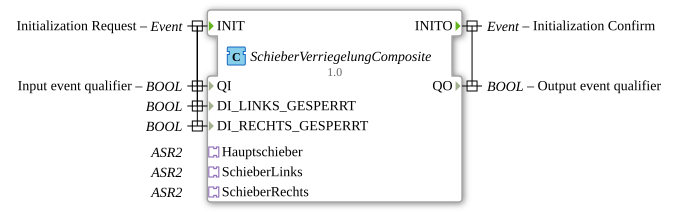

# SlideLockComposite


* * * * * * * * * *
## Introduction
The function block `SchieberVerriegelungComposite` is a composite function block that serves as a wrapper for other function blocks. Its main purpose is to manage and coordinate the locking logic for multiple slides (main slide, left slide, right slide). It encapsulates the internal logic and provides a unified interface for initialization and data exchange with the connected actuators and sensors.



## Interface Structure

### **Event Inputs**

* **`INIT`**: Initialization request. Triggers the initialization process of the internal `SchieberVerriegelung` function block and thus of the entire composite block. Linked to the data `QI`, `DI_LINKS_GESPERRT`, and `DI_RECHTS_GESPERRT`.

### **Event Outputs**

* **`INITO`**: Initialization confirmation. Triggered by the internal `SchieberVerriegelung` function block, it signals successful completion of the initialization. Linked to the data output `QO`.

### **Data Inputs**

* **`QI` (BOOL)**: Qualifier for the INIT event. Controls the initialization.

* **`DI_LINKS_GESPERRT` (BOOL)**: Status input indicating whether the left slider is locked.

* **`DI_RECHTS_GESPERRT` (BOOL)**: Status input indicating whether the right slide is locked.

### **Data Outputs**

* **`QO` (BOOL)**: Qualifier for the INITO event. Returns the initialization status.

### **Adapters**
The composite FB provides three bidirectional adapter interfaces for communicating with the physical or logical slide actuators. Each adapter follows the type `adapter::types::bidirectional::ASR2`, which typically supports SET and RESET commands and corresponding feedback.

1. **`Hauptschieber`**: Adapter for controlling and providing status feedback to the main slide.

2. **`SchieberLinks`**: Adapter for controlling and providing status feedback to the left slide.

3. **`SchieberRechts`**: Adapter for controlling and providing status feedback to the right slide.

## Functionality
The `SchieberVerriegelungComposite` primarily acts as an intermediary. It forwards all external events and data to the internal, encapsulated function block `SchieberVerriegelung`. Likewise, the output events and data of this internal function block are passed through to the composite interfaces.

The central logic for controlling and locking the slides resides entirely within the internal function block `SchieberVerriegelung`. The composite block translates the generic adapter events (`EI_SET`/`EI_RESET`, `EO_SET`/`EO_RESET`) into the specific, named events of the internal function block (e.g., `EI_Hauptschieber_Open`, `EO_SchieberLinks_Close`) and vice versa. This enables a clean separation between application-specific control logic and generic adapter communication.

## Technical Features
* **Encapsulation**: The complex interlock logic is implemented in a separate function block (`SchieberVerriegelung`), which promotes reusability and testability.

* **Adapter-based communication**: Connection to the actuators is exclusively via standardized adapter interfaces (`ASR2`). This abstracts the specific actuators and increases flexibility.

* **Pass-through design**: Except for translating the adapter event names, this composite FB has no logic of its own. It serves to structure the FBNetwork.

## State overview
As a composite FB, `SchieberVerriegelungComposite` does not have an explicit state machine itself. The system state is managed entirely by the internal `SchieberVerriegelung` FB. The composite block can be in one of the following two macro states:

* **Not initialized**: Before the arrival of a valid `INIT` event.

* **Initialized and ready for operation**: After the internal function block acknowledges the initialization via `INITO`. In this state, all adapter events are passed through.

## Application Scenarios

This function block is designed for control applications where multiple mechanically or logically linked slides or closures need to be coordinated, e.g.:

* Interlocking systems in conveyor systems or silos.

* Safety controls for gates or flaps that may only be opened under certain conditions.

* Process controls where the sequence of switching operations must be maintained (e.g., main slides may only open if side closures are closed).

## ⚖️ Comparison with similar function blocks
Unlike a simple, monolithic function block that mixes logic and interfaces, this composite block offers a clear separation of concerns. A direct comparison would be a `SchieberVerriegelung` function block, which would have integrated the adapter interfaces directly. The composite approach is more modular and allows the core logic (`SchieberVerriegelung`) to be reused unchanged in different network environments by simply adapting the enclosing composite block.

## Conclusion
The `SchieberVerriegelungComposite` is a well-structured wrapper block that simplifies the integration of complex slider locking logic into a larger 4diac control system. By using standardized adapters and encapsulating the core functionality, it promotes reusability, maintainability, and clear interface definitions. It is ideal for applications requiring reliable and transparent coordination of multiple actuators.

---

### 🌐 Related topic subpages on ms-muc-docs.de

* [🌐 Eclipse 4diac IDE & Color Reference on ms-muc-docs.de](https://www.ms-muc-docs.de/iec-61499/eclipse-4diac/)


```