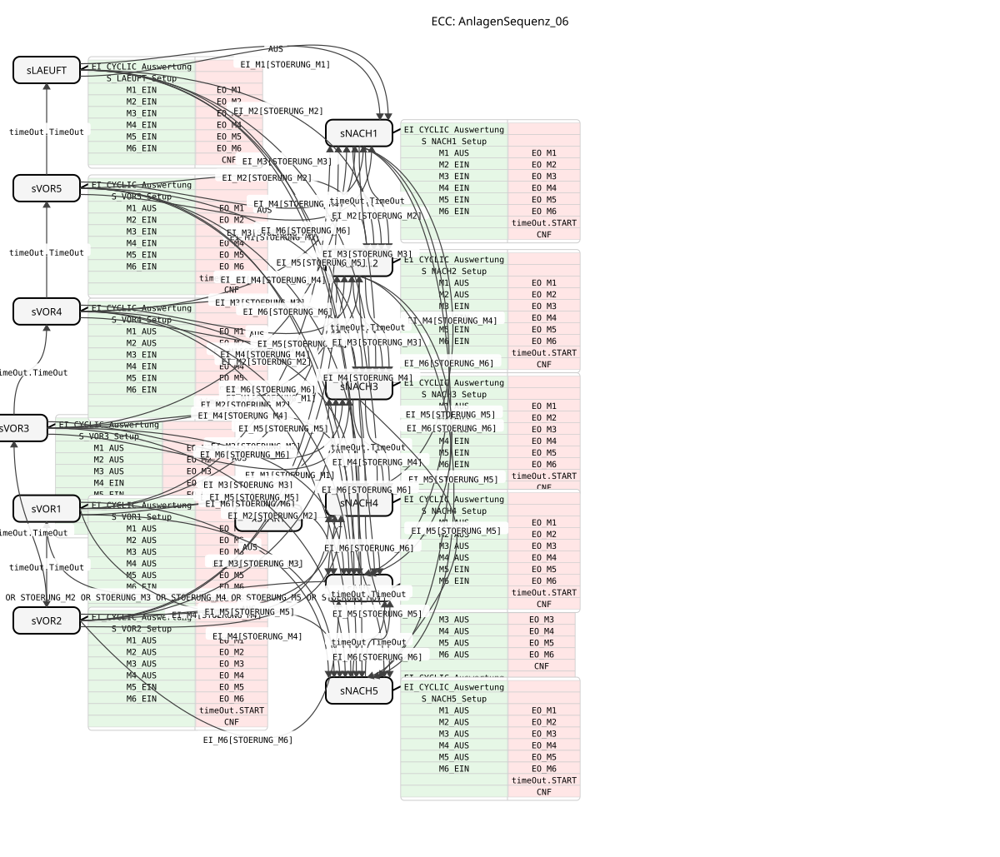

# AnlagenSequenz_06

* * * * * * * * * *

## Introduction

The `AnlagenSequenz_06` function block is a time-controlled ring sequencer for the ordered
start-up and shutdown sequence of six motors (M1..M6), as needed e.g. for a grain-intake
conveyor chain. Unlike the generic [sequence_T_04](sequence_T_04.md)/
[sequence_T_08](sequence_T_08.md) blocks, it is not a general-purpose sequencer but hard-wired to
this one application pattern: start-up (motors switch on one by one, back to front) and shutdown
(motors switch off one by one, front to back) are two separate, purely linear chains, joined into
a closed ring by the two ring poles `sAUS` (bottom, all motors off) and `sLAEUFT` (top, all
motors on). The block additionally implements a complete fault cascade: if any of the six motors
reports a fault during start-up, shutdown, or continuous operation, the FB jumps in a single step
(no re-evaluation over multiple cycles) to the matching shutdown state, taking into account
exactly the upstream motors that are still running at that moment.

## Interface Structure

### **Event Inputs**

-   **`EIN`**: Starts the start-up chain (transition `sAUS` → `sVOR1`). Only effective when
    `EINSCHALTBEREIT = TRUE` (condition `EIN[NOT (STOERUNG_M1 OR ... OR STOERUNG_M6)]`); also
    acknowledges a pending, latched `STATUS_STOERUNG` indication.
-   **`AUS`**: Triggers the shutdown sequence from any start-up step (`sVOR1`..`sVOR5`) or from
    `sLAEUFT`. Jumps to the mirror point of the shutdown chain (`sVOR_k` → `sNACH_(6-k)`), since
    this is an operator request, not a motor fault.
-   **`EI_M1`**: Motor 1 fault status has changed. Leads (`With STOERUNG_M1`) directly to
    `sNACH1` from every state that precedes it.
-   **`EI_M2`**: Motor 2 fault status has changed. Leads (`With STOERUNG_M2`) directly to
    `sNACH2`.
-   **`EI_M3`**: Motor 3 fault status has changed. Leads (`With STOERUNG_M3`) directly to
    `sNACH3`.
-   **`EI_M4`**: Motor 4 fault status has changed. Leads (`With STOERUNG_M4`) directly to
    `sNACH4`.
-   **`EI_M5`**: Motor 5 fault status has changed. Leads (`With STOERUNG_M5`) directly to
    `sNACH5`.
-   **`EI_M6`**: Motor 6 fault status has changed. Leads (`With STOERUNG_M6`) directly to `sAUS`
    (M6 is the last/outermost motor in the chain, so there is no shorter shutdown step).

### **Event Outputs**

-   **`CNF`**: Execution confirmation, triggered on every state change; carries `STATUS_BETRIEB`,
    `STATUS_STOERUNG`, `ZAEHLSTAND`, and `EINSCHALTBEREIT`.
-   **`EO_M1`**: Motor 1 run command updated; carries `DO_M1` (analogous to `EO_Sx` in
    `sequence_T_04`/`_08`).
-   **`EO_M2`**: Motor 2 run command updated; carries `DO_M2`.
-   **`EO_M3`**: Motor 3 run command updated; carries `DO_M3`.
-   **`EO_M4`**: Motor 4 run command updated; carries `DO_M4`.
-   **`EO_M5`**: Motor 5 run command updated; carries `DO_M5`.
-   **`EO_M6`**: Motor 6 run command updated; carries `DO_M6`.

### **Data Inputs**

-   **`ZE1_EIN` .. `ZE5_EIN`** (TIME): Dwell time per start-up step (`sVOR1`→`sVOR2` through
    `sVOR5`→`sLAEUFT`) before the next motor is automatically added. Default: `NO_TIME`.
-   **`ZE1_AUS` .. `ZE5_AUS`** (TIME): Dwell time per shutdown step (`sNACH1`→`sNACH2` through
    `sNACH5`→`sAUS`) before the next motor is automatically switched off. Default: `NO_TIME`.
-   **`STOERUNG_M1` .. `STOERUNG_M6`** (BOOL): Live, continuous fault signal per motor (not a
    pulse). Default: `FALSE`.

### **Data Outputs**

-   **`STATUS_BETRIEB`** (SINT): 0=Off, 1=Starting up, 2=Running, 3=Shutting down.
-   **`STATUS_STOERUNG`** (SINT): 0=none, 4=active — stays latched until the next successful
    `EIN` acknowledgement (see Technical Details).
-   **`EINSCHALTBEREIT`** (BOOL): `TRUE` only when `ZAEHLSTAND = 0` (all motors stopped) AND all
    six `STOERUNG_Mx` are currently `FALSE`.
-   **`ZAEHLSTAND`** (SINT): 0..6, number of motors currently running.
-   **`DO_M1` .. `DO_M6`** (BOOL): Run command per motor.

### **Adapters**

-   **`timeOut`** (Plug, type: `iec61499::events::ATimeOut`): Standardized TimeOut adapter used
    for the start-up and shutdown step timing, the same mechanism used by `sequence_T_04`.

## Functionality

The FB is a Basic Function Block (BFB) with 12 real states plus a start state, arranged as a ring
made of two linear chains:

1.  **Start-up chain** (`sVOR1` → `sVOR2` → `sVOR3` → `sVOR4` → `sVOR5` → `sLAEUFT`): Each step
    adds exactly one more motor, in the order M6, M5, M4, M3, M2, M1 (the highest-numbered
    motors start first). The transition to the next step happens automatically once the
    corresponding `ZEk_EIN` time elapses (`timeOut.TimeOut`).
2.  **Shutdown chain** (`sNACH1` → `sNACH2` → `sNACH3` → `sNACH4` → `sNACH5` → `sAUS`): Mirror
    image of the start-up chain — each step switches off exactly one motor, in the order M1, M2,
    M3, M4, M5, M6.
3.  **Start**: `EIN` (only from `sAUS`, only when `EINSCHALTBEREIT`) acknowledges a pending
    `STATUS_STOERUNG` indication and activates `sVOR1`.
4.  **Planned stop**: `AUS` from any start-up step or from `sLAEUFT` jumps to the mirror point of
    the shutdown chain (`sVOR_k` → `sNACH_(6-k)`, `sLAEUFT` → `sNACH1`) — only the motors that are
    actually running at that moment are shut down in order; motors already stopped are left
    untouched.
5.  **Fault cascade**: Every `EI_Mx` event (`With STOERUNG_Mx`) has a direct, single-step
    transition from every state preceding its target step to the matching `sNACH_x` (or to
    `sAUS` for `x=6`). This makes the FB react to any fault immediately, regardless of whether the
    ring is currently in start-up, shutdown, or continuous operation (`sLAEUFT`) — with no detour
    through a mirror point and no multi-cycle re-evaluation.
6.  **Continuous operation**: `sLAEUFT` is the upper ring pole — all six motors are running, no
    timing is active, and the FB stays here until `AUS` or a fault report.
7.  **End of cycle**: After `sNACH5` (or directly from a fault), the ring reaches `sAUS` again —
    the idle state from which a new `EIN` cycle can begin.

## Technical Details

-   **`EINSCHALTBEREIT` is deliberately NOT coupled to `STATUS_STOERUNG`.** `STATUS_STOERUNG`
    stays latched after a fault until the next successful `EIN` acknowledgement (it exists for
    the Visu indicator). If `EINSCHALTBEREIT` depended on it, the `EIN` button could never be
    released again after the very first fault ever recorded — a genuine deadlock.
    `EINSCHALTBEREIT` instead checks the *live* `STOERUNG_Mx` signals directly
    (`(ZAEHLSTAND = 0) AND NOT (STOERUNG_M1 OR ... OR STOERUNG_M6)`).
-   **The `sAUS → sVOR1` transition also carries the full interlock condition inside the event
    bracket** (`EIN[NOT (STOERUNG_M1 OR ... OR STOERUNG_M6)]`), not just a check against the
    computed status. A plain status flag like `EINSCHALTBEREIT` enforces nothing by itself — only
    an actual `ECTransition Condition` prevents a start while a fault is pending.
-   **Events are polar and are never combined with `AND`/`OR`.** Every condition that combines an
    event with a data condition uses exclusively the bracket syntax
    `EventName[boolean_expression]` (e.g. `EI_M3[STOERUNG_M3]`) — the only valid form for this in
    IEC 61499.
-   **No self-loops left in the ECC.** An earlier revision used a cyclic `EI_CYCLIC` event to
    re-evaluate faults over multiple cycles; that has been removed. `EI_CYCLIC_Auswertung` now
    runs as an entry algorithm in every active state instead, re-evaluating
    `STOERUNG_M1..M6` on every state change.
-   **Direct single-step fault dispatch instead of a mirror-point detour.** Every state preceding
    an `sNACH_x` has its own direct `EI_Mx` transition to it (51 edges in total for the fault
    cascade) — no intermediate step via a mirror point as used for the planned `AUS`.
-   **`MaxBetriebRest`/shutdown remaining-time tracking (demo-server scheme) is not yet
    implemented** — a deliberate, documented simplification of the current revision (see the
    comment in the FB header).

## State Overview

| State | Description | Active motors | Transition condition to the next state |
| :--- | :--- | :--- | :--- |
| **xSTART** | Initial idle state. | — | `1` (immediately to `sAUS`) |
| **sAUS** | Ring base state, bottom. | none | `EIN[NOT (STOERUNG_M1..M6)]` → `sVOR1` |
| **sVOR1** | Start-up step 1. | M6 | `timeOut.TimeOut` → `sVOR2`; `AUS` → `sNACH5`; `EI_Mx` → matching `sNACHx`/`sAUS` |
| **sVOR2** | Start-up step 2. | M5, M6 | `timeOut.TimeOut` → `sVOR3`; `AUS` → `sNACH4`; `EI_Mx` → matching `sNACHx`/`sAUS` |
| **sVOR3** | Start-up step 3. | M4, M5, M6 | `timeOut.TimeOut` → `sVOR4`; `AUS` → `sNACH3`; `EI_Mx` → matching `sNACHx`/`sAUS` |
| **sVOR4** | Start-up step 4. | M3, M4, M5, M6 | `timeOut.TimeOut` → `sVOR5`; `AUS` → `sNACH2`; `EI_Mx` → matching `sNACHx`/`sAUS` |
| **sVOR5** | Start-up step 5. | M2, M3, M4, M5, M6 | `timeOut.TimeOut` → `sLAEUFT`; `AUS` → `sNACH1`; `EI_Mx` → matching `sNACHx`/`sAUS` |
| **sLAEUFT** | Ring pole, top — continuous operation. | M1..M6 (all) | `AUS` → `sNACH1`; `EI_Mx` → matching `sNACHx`/`sAUS` |
| **sNACH1** | Shutdown step 1 (M1 stopped). | M2..M6 | `timeOut.TimeOut` → `sNACH2`; `EI_Mx` → matching `sNACHx`/`sAUS` |
| **sNACH2** | Shutdown step 2 (M1, M2 stopped). | M3..M6 | `timeOut.TimeOut` → `sNACH3`; `EI_Mx` → matching `sNACHx`/`sAUS` |
| **sNACH3** | Shutdown step 3 (M1..M3 stopped). | M4, M5, M6 | `timeOut.TimeOut` → `sNACH4`; `EI_Mx` → matching `sNACHx`/`sAUS` |
| **sNACH4** | Shutdown step 4 (M1..M4 stopped). | M5, M6 | `timeOut.TimeOut` → `sNACH5`; `EI_Mx` → matching `sNACHx`/`sAUS` |
| **sNACH5** | Shutdown step 5 (M1..M5 stopped). | M6 | `timeOut.TimeOut` → `sAUS`; `EI_M6` → `sAUS` |

**Global fault cascade**: from every state preceding an `sNACH_x`, `EI_Mx[STOERUNG_Mx]` leads
directly, with no detour, straight into that state (or to `sAUS` for `x=6`) — 51 such direct
edges in total, see the network diagram.

## Application Scenarios

-   **Grain-intake conveyor chain**: Six conveyor elements in series (e.g. bucket elevator, cross
    conveyor, trough or screw conveyor) that must only be switched on and off in a fixed order so
    that no element ever conveys against a stopped downstream element.
-   **Multi-stage conveying systems in general**: Any system with a fixed cascade of motors where
    a fault at one stage requires a controlled but immediate retreat of the upstream stages.
-   **Safety-critical sequence chains**: Processes where a plain timed sequencer is not enough
    because a latched fault indication and a restart interlock (`EINSCHALTBEREIT`) are also
    required.

## ⚖️ Comparison with Similar Blocks

-   **[sequence_T_04](sequence_T_04.md) / [sequence_T_08](sequence_T_08.md)**: Generic, linear
    timed sequencers with 4 or 8 steps and a single reset path. `AnlagenSequenz_06` reuses the
    same `ATimeOut` adapter mechanism, but is not a generic block — the ring topology (two
    coupled linear chains), the fixed six-motor pattern per step, and the direct single-step fault
    cascade are all hard-coded, not configurable.
-   **Plain timer chains (TON chaining)**: Would need to reimplement state logic, the per-step
    motor pattern, and fault handling by hand. `AnlagenSequenz_06` encapsulates all of that,
    including the interlock logic.
-   **Counter-/event-based sequencers**: Advance on external triggers rather than time.
    `AnlagenSequenz_06` is specifically designed for the case where the dwell time per step is
    fixed (motor start-up time), with faults as the only asynchronous interruption path.

## Conclusion

`AnlagenSequenz_06` bundles a complete, safety-relevant start/stop logic for six motors operating
in series into a single block: an ordered start-up and shutdown sequence via two coupled linear
chains, a latched fault status with an explicit restart interlock, and a direct, delay-free fault
cascade from every operating state. The clear separation of ring topology (ECC), motor switching
logic (algorithms), and timing (`timeOut` adapter) keeps the block maintainable despite its
complexity and significantly reduces the programming effort in the parent application network.
