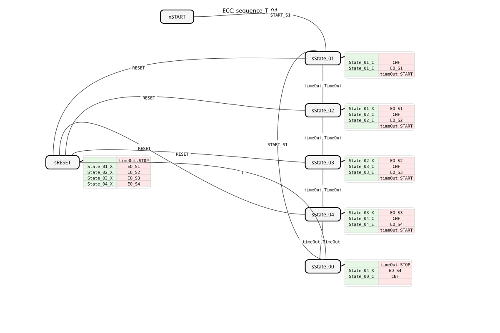

# sequence_T_04

* * * * * * * * * *
## Introduction
The function block `sequence_T_04` is a time-controlled sequencer with four defined states (State_01 to State_04) and a start state (START). It enables the cyclical or one-time execution of a fixed sequence, with the dwell time in each state controlled by configurable time values. The transition between states occurs automatically after the set time has elapsed. This function block is ideally suited for time-controlled sequences, such as those found in conveyor systems, packaging machines, or washing processes.

## Interface Structure

### **Event Inputs**
* **`START_S1`**: Starts the sequence. An event at this input causes the transition from the START state or sState_00 to the first active state, State_01. The time data `DT_S1_S2`, `DT_S2_S3`, `DT_S3_S4`, and `DT_S4_START` are read.
* **`RESET`**: Immediately resets the sequence from any state to the idle state (sState_00). All outputs (`DO_S1` to `DO_S4`) are deactivated.

### **Event Outputs**
* **`CNF`**: Execution Confirmation event. Triggered on every state change and returns the current state number `STATE_NR`.
* **`EO_S1`**: Triggered upon entering state State_01 and returns the corresponding data output `DO_S1`.
* **`EO_S2`**: Triggered upon entering state State_02 and returns the corresponding data output `DO_S2`.
* **`EO_S3`**: Triggered upon entering state State_03 and returns the corresponding data output `DO_S3`.
* **`EO_S4`**: Triggered upon entering state_04 and outputs the corresponding data output `DO_S4`.

### **Data Inputs**
* **`DT_S1_S2`** (TIME): Time spent in state_01 before the automatic transition to state_02. Initial value: `NO_TIME`.
* **`DT_S2_S3`** (TIME): Time spent in state_02 before the automatic transition to state_03. Initial value: `NO_TIME`.
* **`DT_S3_S4`** (TIME): Time spent in state_03 before the automatic transition to state_04. Initial value: `NO_TIME`.
* **`DT_S4_START`** (TIME): Duration in state State_04 before the automatic transition to idle state sState_00 occurs. Initial value: `NO_TIME`.

### **Data Outputs**
* **`STATE_NR`** (SINT): Outputs the number of the currently active state. START = 0, State_01 = 1, State_02 = 2, State_03 = 3, State_04 = 4.
* **`DO_S1`** (BOOL): Logical output that is TRUE as long as the function block is in state State_01.
* **`DO_S2`** (BOOL): Logical output that is TRUE while the FB is in state State_02.
* **`DO_S3`** (BOOL): Logical output that is TRUE while the FB is in state State_03.
* **`DO_S4`** (BOOL): Logical output that is TRUE while the FB is in state State_04.

### **Adapter**
* **`timeOut`** (Plug, Type: `iec61499::events::ATimeOut`): A standardized TimeOut adapter used for timed state transitions. The function block (FB) starts the timer (`timeOut.START`) upon entering an active state and reacts to its `TimeOut` event.

## Functionality
The FB operates as a Basic Function Block (BFB) with a defined Execution Control Chart (ECC). The sequence iterates through the states in the fixed order: START -> State_01 -> State_02 -> State_03 -> State_04 -> sState_00.

1. **Start**: A `START_S1` event (from states `xSTART` or `sState_00`) activates State_01.

2. **State Activation**: Upon entering a state (State_01-04), the following actions are performed:

* The corresponding data output (`DO_Sx`) is set to TRUE (Entry Algorithm `State_x_E`).
* The associated event (`EO_Sx`) is triggered.
* The state number (`STATE_NR`) is updated (Confirmation Algorithm `State_x_C`).
* The time configured for the next transition (`DT_...`) is passed to the `timeOut` adapter, and the timer is started.
* The general confirmation event (`CNF`) is triggered.

3. **Time-Controlled Transition**: After the time set in the timer has elapsed, the adapter triggers the `TimeOut` event. This is the condition for transitioning to the next state in the sequence.

4. **State Exit**: When exiting a state, the corresponding data output (`DO_Sx`) is reset to FALSE by the exit algorithm (`State_x_X`).

5. **Cycle End and Reset**: After State_04, the function block switches to the state `sState_00` (idle state). From here, the sequence can be restarted by another `START_S1` event. A `RESET` event from any state immediately leads to state `sRESET`, disables all outputs, and then transitions to `sState_00`.

## Technical Features
* **Initial Values**: The time data inputs are pre-assigned the constant `NO_TIME` by default. A value of `NO_TIME` causes the function block to wait indefinitely after entering the state until a `RESET` event occurs.
* **State sState_00**: This state is the stable idle state after the completion of a cycle. Unlike the initial `xSTART`, it is part of the ECC and can execute algorithms (set the state number to 0 here).
* **Adapter Usage**: The timing control is completely outsourced to the standardized `ATimeOut` adapter, increasing reusability and clarity.

## State Overview

| State Name | Description | Active Outputs | Transition Condition to Next State |

| :--- | :--- | :--- | :--- |

| **xSTART** | Initial Idle State. | None | `START_S1` |

| **sState_01** | First Active Step. | `DO_S1=1`, `STATE_NR=1` | `timeOut.TimeOut` (after DT_S1_S2) |

| **sState_02** | Second Active Step. | `DO_S2=1`, `STATE_NR=2` | `timeOut.TimeOut` (after DT_S2_S3) |

**sState_03** | Third active step. | `DO_S3=1`, `STATE_NR=3` | `timeOut.TimeOut` (after DT_S3_S4) |

**sState_04** | Fourth active step. | `DO_S4=1`, `STATE_NR=4` | `timeOut.TimeOut` (after DT_S4_START) |

**sState_00** | Idle state after sequence completion. | `STATE_NR=0` | `START_S1` (for new cycle) |

| **sRESET** | Intermediate state for reset operation. | None | Always (`Condition=1`) |

**Global transition condition**: From states sState_01 to sState_04, a `RESET`-Event always returns to the sRESET state.

## Application Scenarios
* **Control of Cycle Machines**: Automatic sequencing of machining steps such as drilling, milling, and deburring with adjustable processing times.
* **Packaging Systems**: Control of the timing sequence: product feeding -> packaging closure -> label application -> palletizing.

``* **Cleaning Processes**: Control of a spray booth: Pre-rinse (State_01) -> Main cleaning (State_02) -> Rinse (State_03) -> Dry (State_04).

* **Test Stands**: Automated test sequence where each test step has a fixed duration.

## ⚖️ Comparison with similar modules
* **Simple Timers (TON)**: Individual timer modules would have to be chained together for a sequence, and the logic for the state transitions and outputs would have to be programmed separately. `sequence_T_04` encapsulates this complete logic.
* **Counter-based Sequencers**: Sequencers that advance based on events (not time) offer a different type of control. `sequence_T_04` is specifically designed for time-critical processes without external triggers.
* **PLC-specific Sequence Flow Languages (S7-GRAFCET)**: This function block implements a similar principle to a Grafcet step chain, but within the portable IEC 61499 standard.

## Conclusion
The `sequence_T_04` is a robust and easy-to-configure tool for time-controlled sequence functions with up to four steps. The clear separation of state logic (ECC) and time control (adapter), as well as the complete encapsulation of its behavior, makes it easy to maintain and significantly reduces programming effort in the higher-level application network. The ability to instantly reset from any state also ensures high operational reliability.
