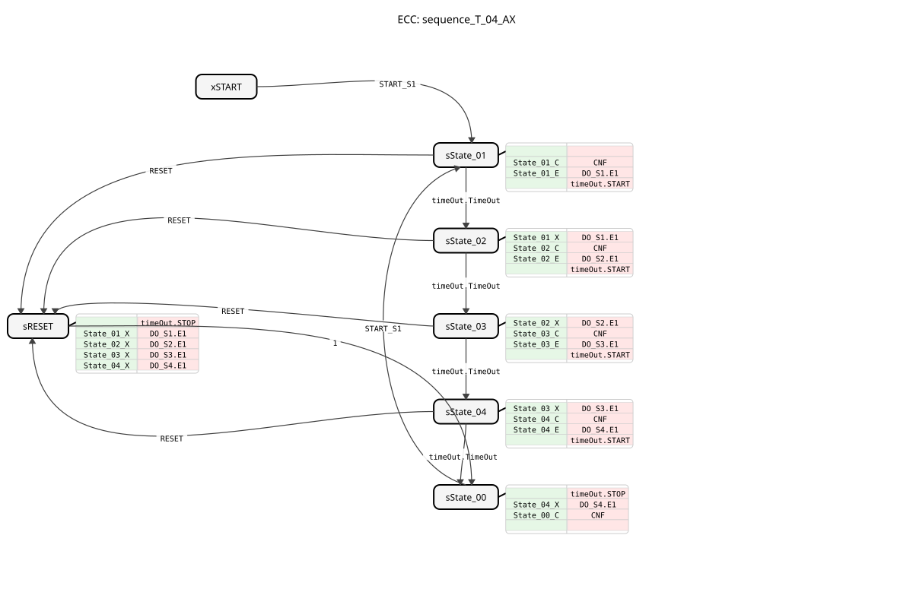
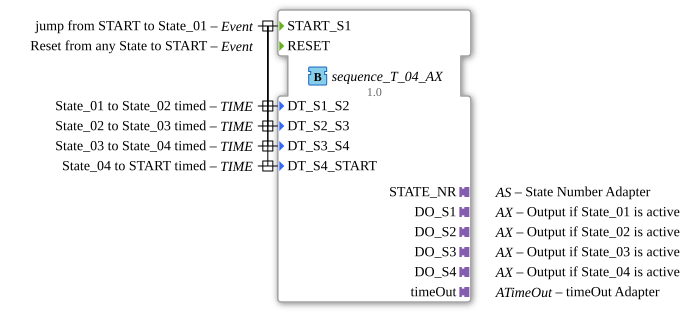

# sequence_T_04_AX

* * * * * * * * * *
## Introduction
`sequence_T_04_AX` is a variant of `sequence_T_04` that additionally uses adapters (`AX`) for the outputs. It controls a purely time-based sequence with 4 output states.

## Interface Structure

### **Event Inputs**

* **START_S1**: Starts the sequence at State_01.

* **RESET**: Resets the sequence.

### **Event Outputs**

* **CNF**: Confirms execution.

### **Data Inputs**
* **DT_S1_S2**: Transition time from State_01 to State_02.

* **DT_S2_S3**: Transition time from State_02 to State_03.

* **DT_S3_S4**: Transition time from State_03 to State_04.

* **DT_S4_START**: Transition time from State_04 to START.

### **Data Outputs**
* **STATE_NR** (SINT): Current state number.

### **Adapters**
* **DO_S1** (adapter::types::unidirectional::AX): Output adapter for State_01.

* **DO_S2** (adapter::types::unidirectional::AX): Output adapter for State_02.

* **DO_S3** (adapter::types::unidirectional::AX): Output adapter for State_03.

* **DO_S4** (adapter::types::unidirectional::AX): Output adapter for State_04.

* **timeOut** (iec61499::events::ATimeOut): Timer adapter.

## Functionality
Corresponds to `sequence_T_04`, but uses adapters for the outputs.

## Technical Features
* Uses `adapter::types::unidirectional::AX`.

## State Overview
See `sequence_T_04`.

## Application Scenarios
For time-controlled 4-step sequences with adapter connection.

## ⚖️ Comparison with Similar Function Blocks
* **sequence_T_04**: Standard version without adapter.

## Conclusion
Adapter version of the 4-step time sequencer.