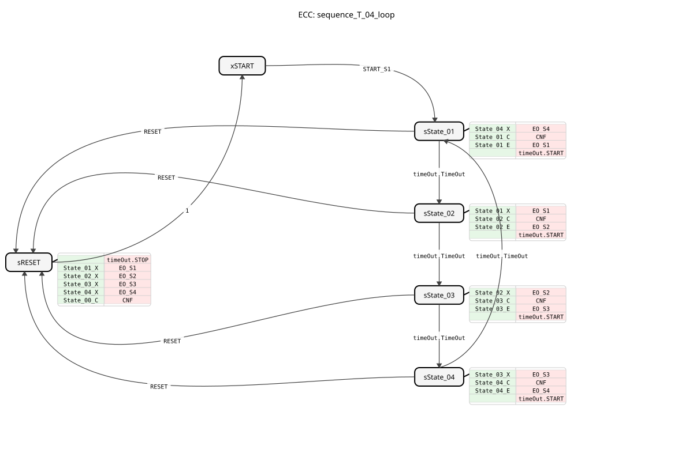

# sequence_T_04_loop

* * * * * * * * * *
## Introduction

The function block `sequence_T_04_loop` is a time-controlled sequencer with four outputs that operates in a loop. It cycles through four states (State_01 to State_04) sequentially. The transition from one state to the next occurs automatically after an adjustable time delay. The block can be reset from any state and then restarts the sequence.

## Interface Structure

### **Event Inputs**

* **`START_S1`**: Starts the sequence. The transition occurs from the initial state `START` to `State_01`. This event is linked to the four time data inputs.
* **`RESET`**: Resets the sequence from any active state back to the initial state `START`.

### **Event Outputs**

* **`CNF`**: Confirmation. Triggered on every state change, it returns the current state number.
* **`EO_S1`**: Triggered upon entering `State_01` and returns the corresponding data output `DO_S1`.
* **`EO_S2`**: Triggered upon entry into `State_02` and returns the corresponding data output `DO_S2`.
* **`EO_S3`**: Triggered upon entry into `State_03` and returns the corresponding data output `DO_S3`.
* **`EO_S4`**: Triggered upon entry into `State_04` and returns the corresponding data output `DO_S4`.

### **Data Inputs**

* **`DT_S1_S2`** (`TIME`): Time delay for the transition from `State_01` to `State_02`. Initial value: `NO_TIME`.
* **`DT_S2_S3`** (`TIME`): Time delay for the transition from `State_02` to `State_03`. Initial value: qzmsdocs000031 ... * **`DT_S3_S4`** (`TIME`): Time delay for the transition from `State_03` to `State_04`. Initial value: `NO_TIME`.
* **`DT_S4_S1`** (`TIME`): Time delay for the transition from `State_04` back to `State_01` (loop). Initial value: `NO_TIME`.

### **Data Outputs**

* **`STATE_NR`** (`SINT`): Current status number. `0` = START, `1` = State_01, `2` = State_02, `3` = State_03, `4` = State_04.
* **`DO_S1`** (`BOOL`): Is `TRUE` when `State_01` is active.
* **`DO_S2`** (`BOOL`): Is `TRUE` when `State_02` is active.
* **`DO_S3`** (`BOOL`): Is `TRUE` when `State_03` is active.
* **`DO_S4`** (`BOOL`): Is `TRUE` when `State_04` is active.

### **Adapter**

* **`timeOut`** (Plug, Type: `iec61499::events::ATimeOut`): A timer adapter used for timed state transitions. The function block starts the timer when a state is entered and reacts to its `TimeOut` event.

## Functionality

The function block (FB) is implemented as a BasicFB with an Execution Control Chart (ECC). The sequence begins in the initial state `xSTART`. An event `START_S1` leads to the first active state `sState_01`.

**In each active state (`sState_01` to `sState_04`), the following actions are executed sequentially:**

1. **Exit step of the previous state**: The corresponding data output (`DO_Sx`) is set to `FALSE` (except on the first entry of `xSTART`).
2. **Confirmation Step**: The state number `STATE_NR` is updated, and the delay time for the *next* transition is passed to the `timeOut` adapter (`timeOut.DT`).
3. **Entry Step of the New State**: The corresponding data output (`DO_Sx`) is set to `TRUE`, and the corresponding event (`EO_Sx`) is triggered.
4. **Timer Start**: The `timeOut` adapter is started (`timeOut.START`).

The transition to the next state occurs exclusively via the `TimeOut` event of the adapter. After `State_04`, the sequence jumps back to `State_01` according to the loop logic.

An event `RESET` from any state leads to state `sRESET`. There, all outputs (`DO_S1` to `DO_S4`) are deactivated, the timer is stopped, the state number is set to `0` (START), and an acknowledgment (`CNF`) is issued. The function block then automatically returns to state `xSTART`.

## Technical Features

* **Time Control**: The transitions are purely time-controlled. There are no event-driven transitions between the main states. * **Initial Values**: The time data inputs are pre-assigned to `NO_TIME` by default. This must be adjusted for proper operation.
* **Constants**: The function block uses constants from the library `logiBUS::utils::sequence::const::sequence` (e.g., for state numbers) and `logiBUS::utils::sequence::const::sequence::NO_TIME`.

## State Overview

1. **`xSTART`**: Initial, inactive state. Waiting for `START_S1`.
2. **`sState_01`**: First active state. `DO_S1 = TRUE`. Timer for transition to `State_02` is running.
3. **`sState_02`**: Second active state. `DO_S2 = TRUE`. Timer for transition to `State_03` is running.
4. **`sState_03`**: Third active state. `DO_S3 = TRUE`. Timer for transition to `State_04` is running.
5. **`sState_04`**: Fourth active state. `DO_S4 = TRUE`. Timer for transition (back) to `State_01` is running.
6. **`sRESET`**: Reset state. Disables all outputs, stops the timer, and confirms the reset.

## Application Scenarios

* Control of cyclic processes with fixed time steps, e.g., in packaging machines, washing systems, or automated assembly lines.
* Control of actuators in a fixed, time-based sequence.
* As a central clock for higher-level control processes.

## ⚖️ Comparison with Similar Components

* **Simple Timers (TON)**: Individual timers do not offer integrated sequence logic. `sequence_T_04_loop` encapsulates the complete state machine with four steps.
* **Event-Driven Sequencers**: In contrast to event-driven sequencers (e.g., `sequence_E_04_loop`), transitions here occur exclusively based on time, not through external events.
* **PLC Cycle**: Time-controlled sequence monitoring is more precise and independent of the PLC cycle because it is based on the `ATimeOut` adapter.

## 🛠️ Related Exercises

* [Exercise_035a](../../../../../../Uebungen/test_B/Uebungen_doc/Uebung_035a.md)

## Conclusion

The `sequence_T_04_loop`This is a robust and easy-to-configure function block for time-controlled, four-step sequences. Its clear separation of state logic and time parameters, along with its integrated reset functionality, makes it well-suited for standardized cyclic processes in automation technology. The use of a standard timing adapter ensures portability and reliability.
