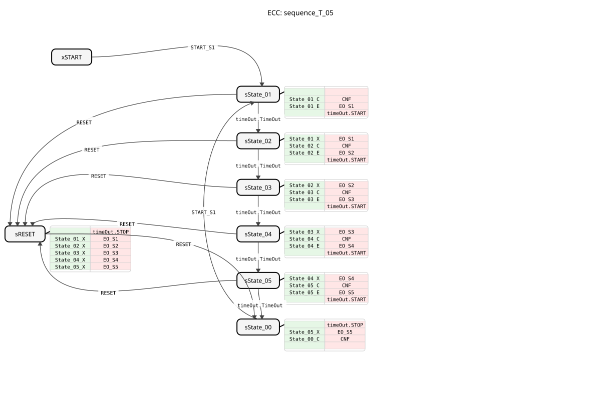
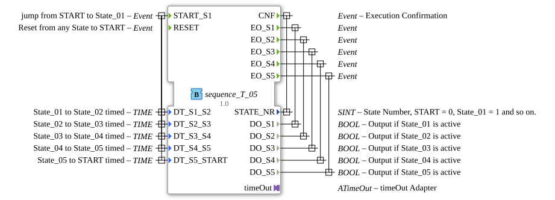

# sequence_T_05

* * * * * * * * * *
## Introduction

The function block `sequence_T_05` is a time-controlled sequencer with five output states. It cycles through a fixed sequence of states (State_01 to State_05), with the transition between each state controlled by adjustable time delays. The block is designed for applications where process steps or actions need to be activated sequentially for a defined duration.

## Interface Structure

### **Event Inputs**

- **`START_S1`**: Starts the sequence. The block transitions from the start state (`START` or `State_00`) to the first active state, `State_01`. This event is linked to the five time data inputs.
- **`RESET`**: Resets the sequence from any state back to the inactive start state (`State_00`). All outputs are disabled.

### **Event Outputs**

- **`CNF`**: Confirmation. Triggered on every state transition, it returns the new state number (`STATE_NR`).
- **`EO_S1`**: Triggered upon entering state `State_01` and outputs the corresponding data output `DO_S1`.
- **`EO_S2`**: Triggered upon entering state `State_02` and outputs the corresponding data output `DO_S2`.
- **`EO_S3`**: Triggered upon entering state `State_03` and outputs the corresponding data output `DO_S3`.
- **`EO_S4`**: Triggered upon entering state `State_04`, this output provides the corresponding data output `DO_S4`.
- **`EO_S5`**: Triggered upon entering state `State_05`, this output provides the corresponding data output `DO_S5`.

### **Data Inputs**

All time data inputs are of type `TIME` and have the initial value `NO_TIME`. They define the dwell time in the respective state before the automatic transition to the next state occurs.

** ... * **`DT_S1_S2`**: Retention time in `State_01` before the transition to `State_02`.

- **`DT_S2_S3`**: Retention time in `State_02` before the transition to `State_03`.
- **`DT_S3_S4`**: Retention time in `State_03` before the transition to `State_04`.
- **`DT_S4_S5`**: Retention time in `State_04` before the transition to `State_05`.
- **`DT_S5_START`**: Dwell time in `State_05` before transitioning back to the start state `State_00`.

### **Data Outputs**

- **`STATE_NR`** (SINT): Outputs the current state number. `0` = `START`/`State_00`, `1` = `State_01`, ..., `5` = `State_05`.
- **`DO_S1`** (BOOL): Is `TRUE` when state `State_01` is active.
- **`DO_S2`** (BOOL): Is `TRUE` when state `State_02` is active.
- **`DO_S3`** (BOOL): Is `TRUE` when state `State_03` is active.
- **`DO_S4`** (BOOL): Is `TRUE` when state `State_04` is active.
- **`DO_S5`** (BOOL): Is `TRUE` when state `State_05` is active.

### **Adapter**

- **`timeOut`** (Plug, Type: `iec61499::events::ATimeOut`): A timeout adapter used for timed state transitions. The block starts (`START`) the timer when entering an active state and stops (`STOP`) it when leaving.

## Functionality

The block operates as a Basic Function Block with a defined Execution Control Chart (ECC). The sequence is initiated by the event `START_S1`. The block then cycles through the states `State_01` to `State_05`. In each active state, the corresponding data output (`DO_Sx`) is set to `TRUE`, and a timer with the duration configured for that state (`DT_Sx_Sy`) is started. Once the timer expires (`timeOut.TimeOut`), the block automatically transitions to the next state. During the state change, the previous output is deactivated, and the new one is activated. After `State_05`, the block returns to the inactive state `State_00`. An event in `RESET` immediately interrupts the sequence, disables all outputs, and brings the block to state `State_00`.

## Technical Features

- **State Handling**: Each active state (`State_01` to `State_05`) has separate algorithms for entry (`_E`), acknowledgment (`_C`), and exit (`_X`). This allows for a clear separation of logic.
- **Timer Integration**: The timing control is completely outsourced to the adapter `ATimeOut`, which increases reusability and maintainability.
- **Constants**: The block imports constants from `logiBUS::utils::sequence::const::sequence` (for state numbers) and `::NO_TIME` for the initial duration values.
- **Initial State**: The actual inactive sleep state after a reset or sequence completion is `sState_00`. `xSTART` is the initial ECC state during the first boot.

## State Overview

1. **`xSTART`**: Initial ECC state at system startup.
2. **`sState_00`**: Inactive sleep state. All outputs are `FALSE`. The sequence can be started from here with `START_S1`. 3. **`sState_01` to `sState_05`**: Active sequence states. The respective output `DO_Sx` is `TRUE`. The transition to the next state is time-controlled.
4. **`sRESET`**: Intermediate state that is accessed from any active state upon a `RESET` event. It deactivates all outputs and then switches to `sState_00`.

## Application Scenarios

- **Batch Process Control**: Sequentially activated steps such as filling, heating, stirring, cooling, and emptying with adjustable step times.
- **Sequence Controls in Machines**: Time-controlled sequence of cylinder movements or tool changes in an automated system.
- **Test Sequences**: Automated test sequences in which various signals are applied sequentially for a specific duration, and the results are evaluated.
- **Lighting Control**: Time-controlled choreographies for advertising or decorative lighting.

## ⚖️ Comparison with Similar Function Blocks

Compared to a simple `E_DELAY` or `E_SR` function block, `sequence_T_05` offersA predefined, multi-stage sequence logic in a single, configurable block. Compared to a custom-programmed sequence with multiple interconnected blocks, it significantly simplifies the application and reduces the potential for errors. Other sequencer blocks might react to events (instead of time) for transitions or allow a variable number of steps.

## Conclusion

The `sequence_T_05` is a robust and easy-to-configure tool for time-controlled sequences with a fixed number of steps. Due to the clear separation of state logic and timing, as well as the comprehensive confirmation and reset mechanisms, it is ideally suited for reliable automation tasks in industrial environments. Parameterization of step times at runtime enables a high degree of flexibility.
