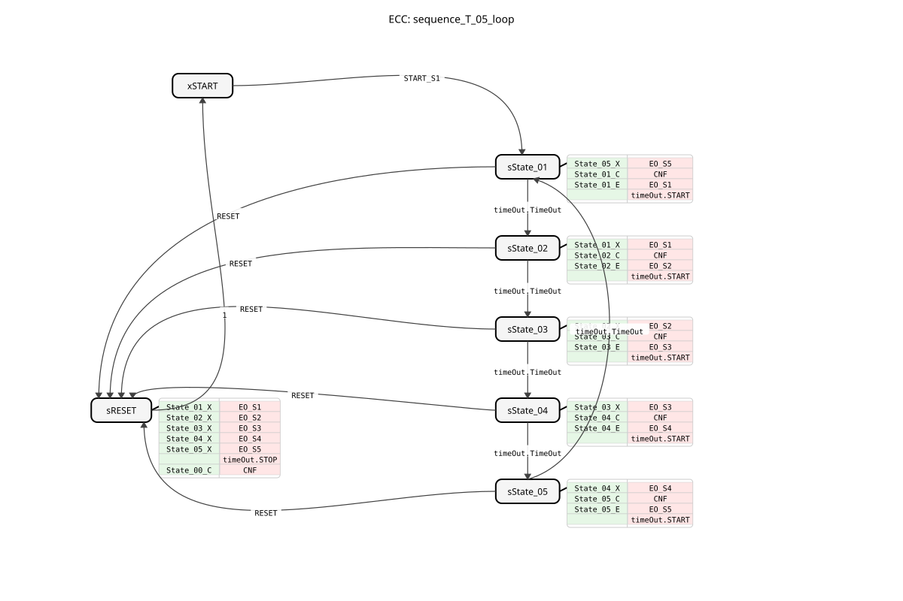

# sequence_T_05_loop

* * * * * * * * * *
## Introduction

The function block `sequence_T_05_loop` is a time-controlled sequencer that implements a cyclical sequence of five states (State_01 to State_05). The transition from one state to the next occurs after an adjustable time delay. This function block is designed for applications where actions or process steps need to be activated sequentially for a defined duration, for example, in automated handling or manufacturing processes.

## Interface Structure

### **Event Inputs**

* **`START_S1`**: Starts the sequence and performs a transition from the initial state (`START`) to the first active state (`State_01`). The event is linked to the five time data inputs.
* **`RESET`**: Aborts the current sequence and enters the reset state (`sRESET`), from where it automatically returns to the initial state (`xSTART`). Resets all outputs.

### **Event Outputs**

* **`CNF`**: Confirmation event. Triggered on every state change, this output returns the current state number (`STATE_NR`).
* **`EO_S1`** to **`EO_S5`**: State events. Triggered upon entering the respective state (State_01 to State_05), these outputs return the corresponding Boolean data output (`DO_S1` to `DO_S5`).

### **Data Inputs**

* **`DT_S1_S2`** (Type: `TIME`, Initial value: `NO_TIME`): Duration of the transition from State_01 to State_02.
* **`DT_S2_S3`** (Type: `TIME`, Initial value: `NO_TIME`): Time for the transition from State_02 to State_03.
* **`DT_S3_S4`** (Type: `TIME`, Initial value: `NO_TIME`): Time for the transition from State_03 to State_04.
* **`DT_S4_S5`** (Type: `TIME`, Initial value: `NO_TIME`): Time for the transition from State_04 to State_05.
* **`DT_S5_S1`** (Type: `TIME`, Initial value: `NO_TIME`): Time for the transition from State_05 back to State_01, which closes the loop.

### **Data Outputs**

* **`STATE_NR`** (Type: `SINT`): Outputs the number of the currently active state. `0` = START, `1` = State_01, ..., `5` = State_05.

* **`DO_S1`** to **`DO_S5`** (Type: `BOOL`): Logical outputs that are `TRUE` while the FB is in the corresponding state (State_01 to State_05).

### **Adapter**

* **`timeOut`** (Type: `iec61499::events::ATimeOut`, Plug): A timer adapter used for timed state transitions. The FB starts the timer upon entering a state and transitions to the next state upon receiving the `TimeOut` event.

## Functionality

The FB is implemented as a Basic Function Block (BFB) with an Execution Control Chart (ECC). After starting (`START_S1`), it cycles through states `State_01` to `State_05` in a fixed sequence. In each active state, the following actions are performed:

1. **Exit action of the previous state**: Sets the corresponding Boolean output (`DO_Sx`) to `FALSE`.
2. **Confirmation action**: Sets the current state `STATE_NR` and configures the dwell time for the *current* state in the `timeOut` adapter (e.g., the value from `DT_S1_S2` is loaded in `State_01`).
3. **Entry Action of the New State**: Sets the corresponding Boolean output (`DO_Sx`) to `TRUE`.
4. **Timer Start**: Starts the `timeOut` adapter with the time loaded in step 2.

The transition to the next state occurs only if the `timeOut` adapter returns the `TimeOut` event. After `State_05`, the function block jumps back to `State_01` according to `DT_S5_S1`, creating an infinite loop. A `RESET` event from any state disables all outputs, stops the timer, and returns the function block to its initial state, `xSTART`.

## Technical Features

* **Initial Values**: The time data inputs are initialized with the constant `NO_TIME` by default. A value of `NO_TIME` or `T#0s` results in an immediate state transition.
* **State Confirmation**: The `CNF` event is triggered in every state (including reset), enabling reliable external monitoring of the function block's activity.
* **Adapter Usage**: The time control is completely outsourced to the standardized `ATimeOut` adapter, which promotes reusability and clear interfaces.
* **Constants**: The function block imports constants from `logiBUS::utils::sequence::const::sequence`, e.g., for the state numbers (`State_00`, `State_01`, ...).

## State Overview

The ECC comprises seven states:

* **`xSTART`**: Inactive initial state. Waiting for `START_S1`.
* **`sState_01`** to **`sState_05`**: Active operating states. Each one activates its specific output (`DO_Sx`) and starts the timer for its own duration.
* **`sRESET`**: Reset state. Deactivates all outputs, stops the timer, and sends an acknowledgment (`CNF`) with `STATE_NR=0`. Automatically reverts to condition `1` (always true) and then back to `xSTART`.

## Application Scenarios

* **Cycle Control**: Automated sequences in packaging machines where various actuators (grippers, punches, conveyors) must be activated sequentially for specific durations.
* **Process Control**: Step-by-step execution of chemical or thermal processes where each step has a defined dwell time.
* **Display or Flashing Sequences**: Control of visual or audible signals in a defined, timed sequence.

## ⚖️ Comparison with Similar Function Blocks

Unlike a simple TON timer (delay-on delay), this function block implements a complete state machine with multiple steps. Compared to generic sequencer function blocks, which often use step detection (e.g., via slope edges), this block is purely time-controlled. It resembles a chain of TON blocks but is encapsulated in a single, state-based function block, simplifying its arrangement and parameterization.

## 🛠️ Related exercises

* [Uebung_035a2](../../../../../../Uebungen/test_B/Uebungen_doc/Uebung_035a2.md)
* [Uebung_035a3](../../../../../../Uebungen/test_B/Uebungen_doc/Uebung_035a3.md)

## Conclusion

The `sequence_T_05_loop`This is a specialized, robust, and easy-to-configure sequencer for cyclic, time-controlled, five-step processes. Its clear structure, use of standardized adapters, and comprehensive confirmation of all state changes make it a reliable component for time-critical automation tasks. The loop function and central reset are particularly well-suited for continuous operation applications.
