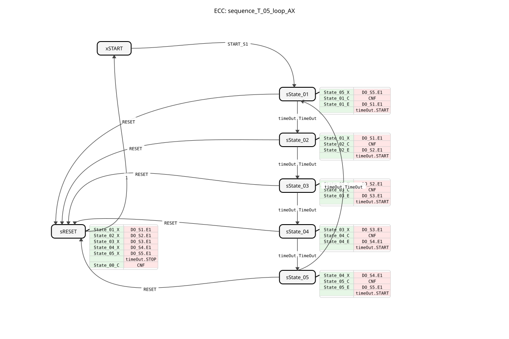
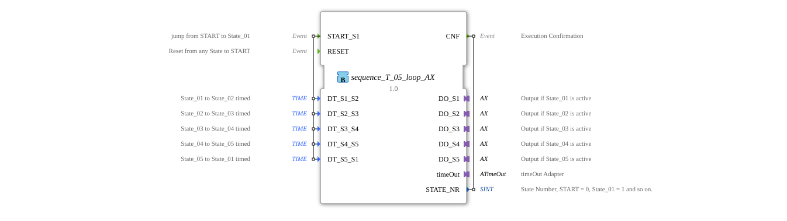

# sequence_T_05_loop_AX

* * * * * * * * * *
## Introduction

sequence_T_05_loop_AX` is a variant of `sequence_T_05_loop` that additionally uses adapters (`AX`) for the outputs. It controls a purely time-controlled, cyclic sequence with 5 output states.

## Interface Structure

### **Event Inputs**

* **START_S1**: Starts the sequence at State_01.
* **RESET**: Resets the sequence.

### **Event Outputs**

* **CNF**: Confirmation of execution.

### **Data Inputs**

* **DT_S1_S2**: Transition time for State_01 -> State_02.
* **DT_S2_S3**: Transition time for State_02 -> State_03.
* **DT_S3_S4**: Transition time for State_03 -> State_04.
* **DT_S4_S5**: Transition time for State_04 -> State_05.
* **DT_S5_S1**: Transition time for State_05 -> State_01.

### **Data Outputs**

* **STATE_NR** (SINT): Current state number.

### **Adapters**

* **DO_S1** (adapter::types::unidirectional::AX): Output adapter for State_01.
* **DO_S2** (adapter::types::unidirectional::AX): Output adapter for State_02.
* **DO_S3** (adapter::types::unidirectional::AX): Output adapter for State_03.
* **DO_S4** (adapter::types::unidirectional::AX): Output adapter for State_04.
* **DO_S5** (adapter::types::unidirectional::AX): Output adapter for State_05.
* **timeOut** (iec61499::events::ATimeOut): Timer adapter.

## Functionality

Corresponds to `sequence_T_05_loop`, but uses adapters for the outputs.

## Technical Features

* Uses `adapter::types::unidirectional::AX`.

## State Overview

See `sequence_T_05_loop`.

## Application Scenarios

For time-controlled, cyclical 5-step sequences with adapter connectivity.

## ⚖️ Comparison with similar building blocks

* **sequence_T_05_loop**: Standard version without adapter.

## 🛠️ Related exercises

* [Exercise_035a2_AX](../../../../../../Uebungen/test_AX/Uebungen_doc/Uebung_035a2_AX.md)]
* [Exercise_035a3_AX](../../../../../../Uebungen/test_AX/Uebungen_doc/Uebung_035a3_AX.md)]

## Conclusion

Adapter version of the 5-step loop time sequencer.
