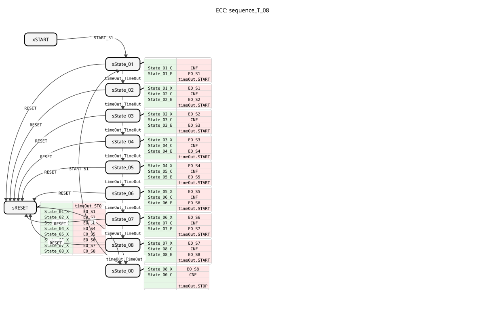
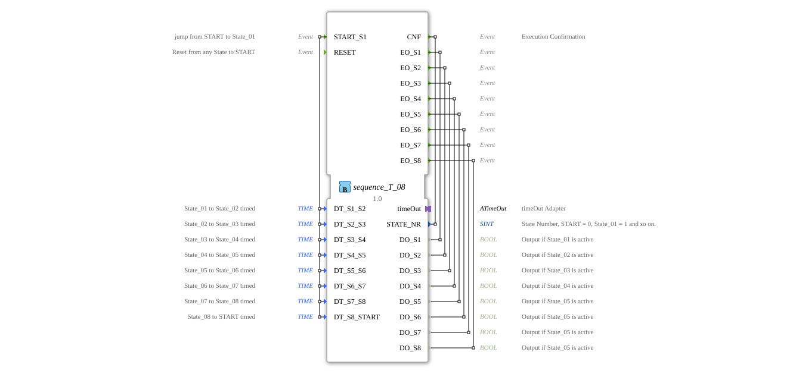

# sequence_T_08

* * * * * * * * * *
## Introduction
The function block `sequence_T_08` is a time-controlled sequencer with eight outputs. It implements a fixed sequence of states, with the transition between individual states controlled by adjustable time delays. This block is designed for applications where process steps or machine states need to be activated sequentially for a defined duration, such as in packaging machines, conveyor systems, or washing systems.

## Interface Structure
### **Event Inputs**
* `START_S1`: Starts the sequence. An event at this input causes the transition from state `START` to the first active state, `State_01`. All eight time data inputs are read.
* `RESET`: Immediately resets the sequence. An event at this input leads from any state to state `START` and disables all outputs.

### **Event Outputs**
* `CNF`: Execution Confirmation event. Triggered on every state change, it returns the new state number, `STATE_NR`.
* `EO_S1` to `EO_S8`: State events. Each of these events is triggered upon entering the corresponding state (`State_01` to `State_08`) and returns the associated Boolean data output value (`DO_S1` to `DO_S8`).

### **Data Inputs**
* `DT_S1_S2` to `DT_S8_START` (Type `TIME`): Define the dwell time for each state. This value determines how long the function block remains in the respective state before the automatic transition to the next state occurs. The default value, `NO_TIME`, disables the timed transition, so the function block remains in the state until `RESET` occurs.
* `DT_S1_S2` to `DT_S8_START` (Type `TIME`): Define the dwell time for each state.
### **Data Outputs**
* `STATE_NR` (Type `SINT`): Outputs the current state number. `0` corresponds to state `START`, `1` to `8` correspond to the active states `State_01` to `State_08`.
* `DO_S1` to `DO_S8` (Type `BOOL`): The physical output signals of the sequence. Each output is set to `TRUE` when the corresponding state is active; otherwise, it is `FALSE`.

### **Adapter**
* `timeOut` (Type `iec61499::events::ATimeOut`): A plug-in adapter that provides the timer. The function block (FB) uses the interface to start a timer (`timeOut.START`) and wait for its expiration (`timeOut.TimeOut`). The respective time duration is transmitted via `timeOut.DT`.

## Functionality
The FB operates as a Basic Function Block (BFB) with a defined Execution Control Chart (ECC). The sequence cycles through states `State_01` to `State_08` in a fixed order. Each active state performs three essential actions:

1. **Exit action of the previous state**: Disables the corresponding output (algorithm `State_XX_X`).

2. **Confirmation action**: Sets the state number `STATE_NR` and passes the time duration configured for this state to the timer adapter (algorithm `State_XX_C`). Triggers the `CNF` event.

3. **Entry action**: Enables the corresponding output (algorithm `State_XX_E`). Triggers the corresponding `EO_Sx` event. Starts the timer.

The transition to the next state occurs only when the timer has expired (`timeOut.TimeOut`). After `State_08`, the function block jumps to the inactive `State_00` (also represented as `START`), where the timer is stopped. From here, the sequence can only be restarted by a new `START_S1` event. A `RESET` event from any state leads back to `State_00` via a dedicated reset state (`sRESET`), deactivating all active outputs.

## Technical Features
* **Flexible Time Control**: Each state transition can be individually configured at runtime via the `DT_` inputs. The value `NO_TIME` allows the sequence to be paused at a specific point.
* **Immediate Reset**: The `RESET` input always has priority and immediately interrupts the running time control.
* **State Feedback**: The current position in the sequence is always traceable via the `STATE_NR` output.
* **Event-Driven Outputs**: In addition to the continuous data outputs (`DO_Sx`), the function block provides a separate event (`EO_Sx`) for each state, which simplifies the control of downstream, event-driven function blocks.

## State Overview
The ECC comprises the following states:

* **xSTART / sState_00**: Inactive start and end state. `STATE_NR = 0`, all outputs are `FALSE`.
* **sState_01 to sState_08**: The eight active sequence states. `STATE_NR = 1` to `8`. The corresponding output `DO_Sx` is `TRUE`.
* **sRESET**: Internal reset state. Deactivates all outputs and returns to `sState_00`.

## Application Scenarios
* **Cycle Control**: In machines where various actuators (valves, motors, heaters) need to be switched on and off sequentially for a specific period of time.
* **Batch Processes**: For the sequential control of process steps in the food or chemical industries, e.g., filling, heating, stirring, cooling.
* **Test Stands**: Automated sequence of testing and measurement steps on a component.
* **Safety Sequences**: Orderly start-up and shutdown of a system, where steps may only be triggered after a waiting period.

## ⚖️ Comparison with Similar Components
Unlike a simple TON (Timer On-Delay) or TOF (Timer Off-Delay), which only control a single time-delayed switching operation, `sequence_T_08` orchestrates a complete chain of time-controlled actions. Compared to a Control Unit Transducer (CTU), it offers predefined, state-based logic with dedicated outputs and is therefore easier to configure and secure. It is a specialized form of Sequential Function Chart (SFC) with a fixed number of steps and pure timing control.

## Conclusion
The `sequence_T_08`is a robust and easy-to-configure function block for all applications requiring a fixed, time-controlled sequence of steps. Its clear separation of state logic, time parameters, and output signals, along with its immediate reset functionality, makes it particularly suitable for well-organized and easily maintainable control programs. The integration of a standard timer adapter also makes it portable and reusable in various 4diac projects.

---

### 🌐 Related topic subpages on ms-muc-docs.de
* [🌐 Eclipse 4diac IDE & Color Reference on ms-muc-docs.de](https://www.ms-muc-docs.de/iec-61499/eclipse-4diac/)

]
