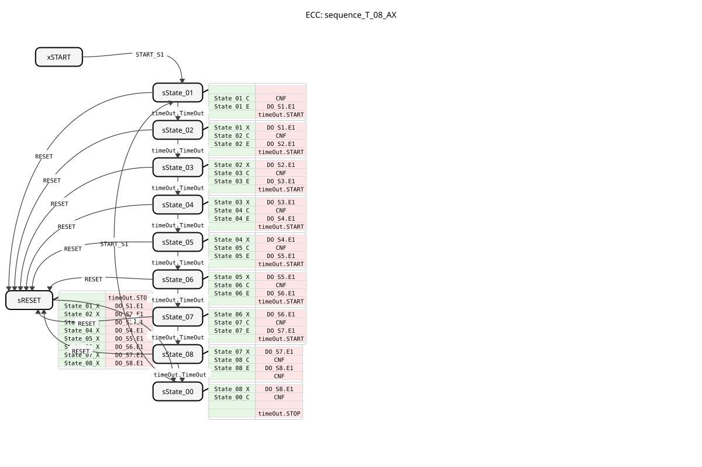
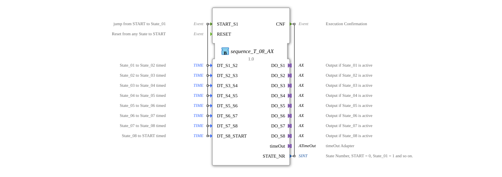

# sequence_T_08_AX

* * * * * * * * * *
## Introduction
`sequence_T_08_AX` is a variant of `sequence_T_08` that additionally uses adapters (`AX`) for the outputs. It controls a purely time-based sequence with 8 output states.

## Interface Structure

### **Event Inputs**
* **START_S1**: Starts the sequence at State_01.
* **RESET**: Resets the sequence.

### **Event Outputs**
* **CNF**: Confirms execution.

### **Data Inputs**
* **DT_S1_S2**: Transition time State_01 -> State_02.
* **DT_S2_S3**: Transition time State_02 -> State_03.
* **DT_S3_S4**: Transition time State_03 -> State_04.
* **DT_S4_S5**: Transition time State_04 -> State_05.
* **DT_S5_S6**: Transition time State_05 -> State_06.
* **DT_S6_S7**: Transition time State_06 -> State_07.
* **DT_S7_S8**: Transition time State_07 -> State_08.
* **DT_S8_START**: Transition time State_08 -> START.

### **Data Outputs**
* **STATE_NR** (SINT): Current state number.

### **Adapters**
* **DO_S1** ... **DO_S8** (adapter::types::unidirectional::AX): Output adapter for State_01 to State_08.
* **timeOut** (iec61499::events::ATimeOut): Timer adapter.

## Functionality
Corresponds to `sequence_T_08`, but uses adapters for the outputs.

## Technical Features
* Uses `adapter::types::unidirectional::AX`.

## State Overview
See `sequence_T_08`.

## Application Scenarios
For time-controlled 8-step sequences with adapter connection.

## ⚖️ Comparison with Similar Function Blocks
* **sequence_T_08**: Standard variant without adapters.

## Conclusion
Adapter variant of the 8-step time sequencer.