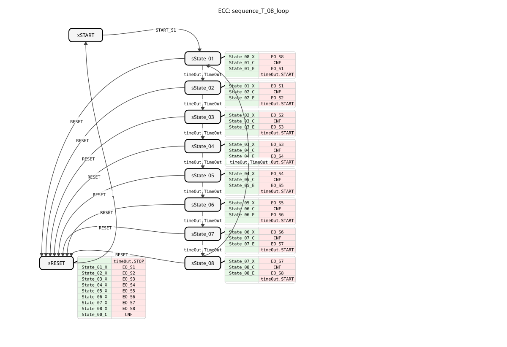
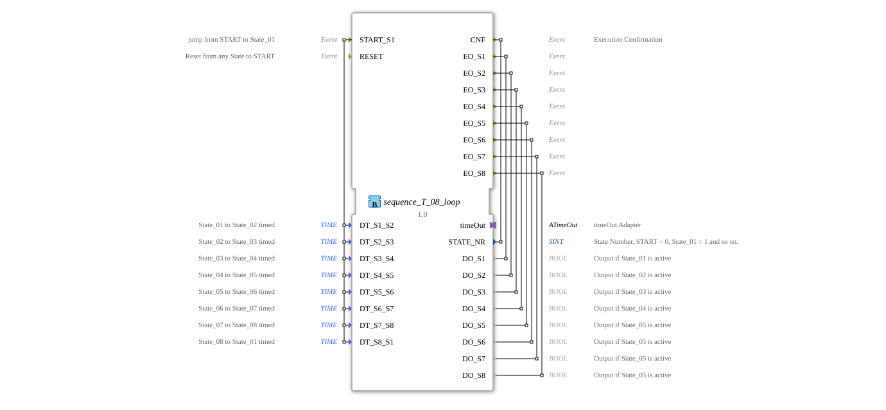

# sequence_T_08_loop

* * * * * * * * * *
## Introduction

The function block `sequence_T_08_loop` is a time-controlled sequencer with eight output states. It implements a cyclic sequence of states, with the transition between individual states controlled by adjustable time delays. This block is designed for applications where process steps or machine states need to be activated sequentially for a defined duration, for example, in conveyor systems, packaging machines, or automated assembly processes.

## Interface Structure

### **Event Inputs**

- **`START_S1`**: Starts the sequence by jumping from the initial state `START` to the first active state `State_01`. Triggers the execution of the associated algorithms.
- **`RESET`**: Immediately resets the sequence to the initial state `START`, regardless of the current state. All active outputs are deactivated.

### **Event Outputs**

- **`CNF`** (Execution Confirmation): Triggered on every state change and confirms execution. Transmits the current state number `STATE_NR`.
- **`EO_S1` to `EO_S8`**: Event outputs triggered upon entering the respective state `State_01` to `State_08`. They transmit the corresponding Boolean data value (`DO_S1` to `DO_S8`), which is set to `TRUE`.

### **Data Inputs**

Eight time-based data inputs of type `TIME`, defining the duration in each state. The default value is `NO_TIME` (no time, immediate transition).

### * `DT_S1_S2`: Retention time in `State_01` before transition to `State_02`.

- `DT_S2_S3`: Retention time in `State_02` before transition to `State_03`.
- `DT_S3_S4`: Retention time in `State_03` before transition to `State_04`.
- `DT_S4_S5`: Retention time in `State_04` before transition to `State_05`.
- `DT_S5_S6`: Retention time in `State_05` before transition to `State_06`.
- `DT_S6_S7`: Retention time in `State_06` before transition to `State_07`.
- `DT_S7_S8`: Retention time in `State_07` before transition to `State_08`.
- `DT_S8_S1`: Retention time in `State_08` before the cyclical transition back to `State_01`.

### **Data Outputs**

- **`STATE_NR`** (SINT): Outputs the number of the currently active state. `START` = 0, `State_01` = 1, ..., `State_08` = 8.
- **`DO_S1` to `DO_S8`** (BOOL): The physical output signals of the sequence. Each output is set to `TRUE` when the corresponding state is active; otherwise, it is `FALSE`.

### **Adapter**

- **`timeOut`** (Plug, Type: `iec61499::events::ATimeOut`): A timer adapter used to implement timed state transitions. The function block starts the timer upon entering a state and transitions to the next state upon receiving the `TimeOut` event.

## Functionality

The function block operates as a Basic Function Block with an internal Execution Control Chart (ECC). The sequence begins in the initial state `xSTART`. A `START_S1` event leads to the state `sState_01`. Upon entering a state (e.g., `sState_01`), three actions are performed:

1. The exit algorithm of the previous state (e.g., `State_08_X`) disables its output.
2. The confirmation algorithm (e.g., `State_01_C`) sets the `STATE_NR` and loads the time configured for this state (`DT_S1_S2`) into the `timeOut` adapter.
3. The entry algorithm (e.g., `State_01_E`) sets the corresponding data output (`DO_S1`) to `TRUE` and triggers the corresponding event (`EO_S1`).
4. The timer adapter is started with `timeOut.START`.

After the set time has elapsed, the adapter triggers the `timeOut.TimeOut` event, which causes the transition to the next state in the ECC (e.g., from `sState_01` to `sState_02`). After the last state (`sState_08`), the system transitions back to the first state (`sState_01`), creating an infinite loop.

A `RESET` event from any state leads to state `sRESET`. Here, all outputs are deactivated, the timer is stopped, and an acknowledgment is sent with `STATE_NR=0` before the system automatically returns to state `xSTART`.

## Technical Features

- **Non-Stop Cycle**: After starting, the sequence runs indefinitely in a loop until a `RESET` signal is received. There is no built-in stop command.
- **Immediate State Transitions**: By setting the time values to `NO_TIME` (default), the function block can be configured to immediately transition to the next state as soon as the entry algorithm of the current state has been executed.
- **Deterministic Execution**: The algorithms for Exit, Confirmation, and Entry are executed atomically in exactly this order upon state entry.
- **Constants for State Numbers**: The state number `STATE_NR` is set via constants from the imported state `sequence` (e.g., `sequence::State_01`), which improves maintainability and readability.

## State Overview

The ECC consists of 10 states:

- **`xSTART`**: Initial, inactive state. Waiting for `START_S1`.
- **`sState_01` to `sState_08`**: The eight active sequence states. Each manages its own output and the time until the next state.
- **`sRESET`**: Reset state. Upon the `RESET` event, it jumps from any state, disables all outputs, and then returns to `xSTART`.

The transition conditions are:

- `START_S1`: From `xSTART` to `sState_01`.
- `timeOut.TimeOut`: From each state `sState_XX` to the next `sState_YY` (cyclically from `sState_08` to `sState_01`).
- `RESET`: From each active state (`sState_01` to `sState_08`) to `sRESET`.
- `1` (always true): From `sRESET` back to `xSTART`.

## Application Scenarios

- **Control of Rotary Transfer Machines**: Activation of various tools or stations in a rotating machine for a precisely defined duration.
- **Batch Processes in Chemical Engineering**: Step-by-step control of valves, pumps, and heaters in a chemical process with fixed cycle times.
- **Automated Test Sequences**: Sequential execution of various measurements or tests on a component.
- **Light or Signaling Systems**: Generation of fixed flashing or running light patterns.

## ⚖️ Comparison with Similar Components

In contrast to aIn contrast to the `E_CYCLE` or `E_DELAY` function blocks, which generate simple periodic or delayed events, the `sequence_T_08_loop` function block offers a structured state machine with multiple independent outputs. Compared to a freely programmable `E_CTU` (counter) in combination with `SEL` blocks, this function block is preconfigured and therefore easier and faster to use for standard sequences with up to eight steps. For more complex or state-dependent sequences, a Service Sequence Function Block (SFC) or custom Basic Function Block programming would be required.

This function block is preconfigured and therefore easier and faster to use for standard sequences with up to eight steps.## 🛠️ Related Exercises

- [Exercise_038](../../../../../../Uebungen/test_B/Uebungen_doc/Uebung_038.md)

## Conclusion

The `sequence_T_08_loop` is a robust and easy-to-configure function block for time-controlled sequences with a fixed number of steps. Its clear structure of states, configurable dwell times, and dedicated outputs makes it particularly suitable for standardized control tasks in automation technology where reliability and ease of parameterization are paramount. The integration of a timer adapter decouples the timing from the function block logic and promotes reusability.

---

### 🌐 Related Topic Subpages on ms-muc-docs.de

- [🌐 E_CTU Event Counter Block on ms-muc-docs.de](https://www.ms-muc-docs.de/iec-61499/event-function-blocks/e_ctu/)
