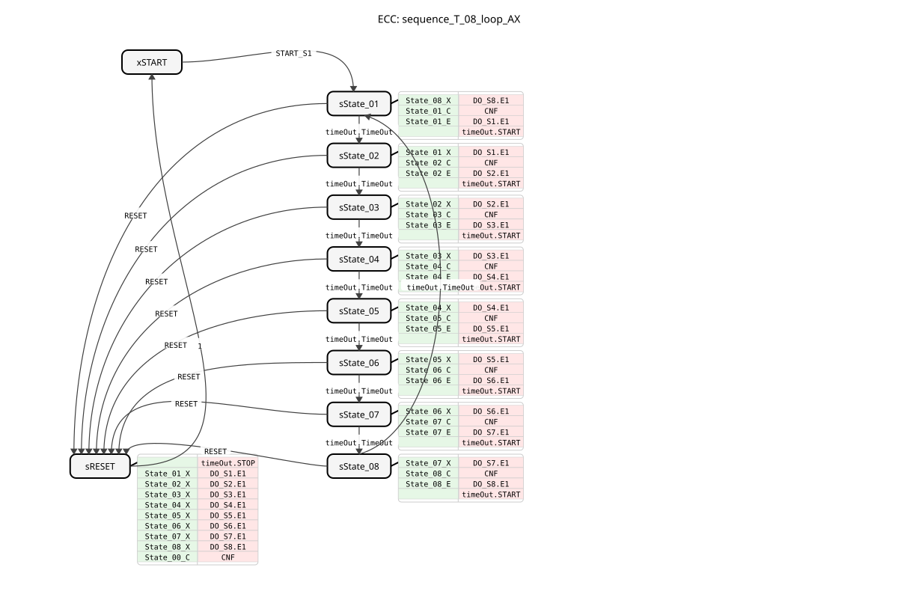
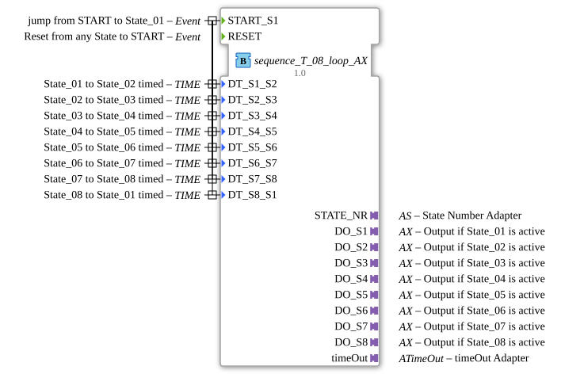

# sequence_T_08_loop_AX

* * * * * * * * * *
## Introduction
`sequence_T_08_loop_AX` is a variant of `sequence_T_08_loop` that additionally uses adapters (`AX`) for the outputs. It controls a purely time-controlled, cyclic sequence with 8 output states.

## Interface Structure

### **Event Inputs**
* **START_S1**: Starts the sequence at State_01.
* **RESET**: Resets the sequence.

### **Event Outputs**
* **CNF**: Confirmation of execution.

### **Data Inputs**
* **DT_S1_S2** ... **DT_S8_S1**: Times for automatic transitions between states.

### **Data Outputs**
* **STATE_NR** (SINT): Current state number.

### **Adapters**
* **DO_S1** ... **DO_S8** (adapter::types::unidirectional::AX): Output adapter for State_01 to State_08.
* **timeOut** (iec61499::events::ATimeOut): Timer adapter.

## Functionality
Corresponds to `sequence_T_08_loop`, but uses adapters for the outputs.

## Technical Features
* Uses `adapter::types::unidirectional::AX`.

## State Overview
See `sequence_T_08_loop`.

## Application Scenarios
For time-controlled, cyclic 8-step sequences with adapter connectivity.

## ⚖️ Comparison with similar modules
* **sequence_T_08_loop**: Standard version without adapter.

## 🛠️ Related Exercises
* [Exercise_038_AX](../../../../../../Uebungen/test_AX/Uebungen_doc/Uebung_038_AX.md)]

## Conclusion
Adapter version of the 8-step loop time sequencer.