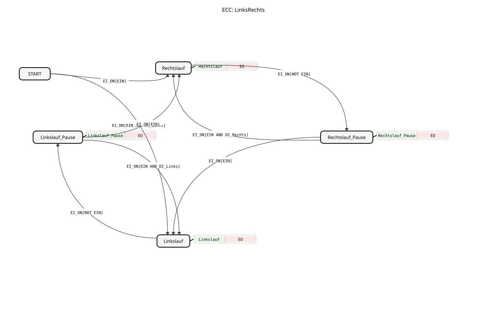

# Left/Right

* * * * * * * * * *
## Introduction
The function block `LinksRechts` is a fundamental building block for controlling bidirectional motion, such as a drive that can operate in both clockwise and counterclockwise directions. It implements a simple prioritization logic where clockwise rotation takes precedence over counterclockwise rotation unless a specific counterclockwise command is active. The block also allows pausing the motion.

## Interface Structure

### **Event Inputs**
* **`EI_ON`**: The central control event. Upon arrival, it triggers an evaluation of the current input data and a potential state transition.

### **Event Outputs**
* **`EO`**: This event is triggered on every state change. It provides the updated output data `Rechts`, `Links`, and `STATE`.

### **Data Inputs**
* **`EIN`** (BOOL): General enable/enable command. `TRUE` allows operation, while `FALSE` puts the block into a pause state.
* **`DI_Rechts`** (BOOL): Command for "Right-Hand Rotation Only". Enforces right-hand rotation if `EIN` is active.
* **`DI_Links`** (BOOL): Command for "Left Rotation Only". Enforces left rotation if `EIN` is active and no `DI_Rechts` command is present.

### **Data Outputs**
* **`Rechts`** (BOOL): Control signal for right rotation. Is `TRUE` when the block is in state `Rechtslauf`.
* **`Links`** (BOOL): Control signal for left rotation. Is `TRUE` when the block is in state `Linkslauf`.
* **`STATE`** (STRING): Displays the current internal state of the function block as readable text (e.g., "Right Rotation", "Left Rotation_Pause").

### **Adapters**
This function block does not use any adapters.

## Functionality
The `LinksRechts` block is implemented as a Basic Function Block with Event Control (ECC). The arrival of the event `EI_ON` triggers an evaluation of the accompanying data `EIN`, `DI_Rechts`, and `DI_Links`. Based on the current combination of these values and the current state, a transition to a new state occurs.

In each state, a specific algorithm is executed that sets the output signals `Rechts` and `Links` and writes the state name to `STATE`. The output event `EO` is then generated to inform downstream blocks of the change.

The priority logic is defined as follows: If `EIN` is active (`TRUE`), `DI_Rechts` is checked first. If this is `TRUE`, forward rotation is activated. If `DI_Rechts` or `FALSE`, `DI_Links` is checked. If `TRUE` is present, forward scrolling is activated. If `EIN` or `FALSE` is present, the block enters a pause state, regardless of the scrolling commands.

## Technical Features
* **Priority**: The specification emphasizes that "Forward scrolling only" (`DI_Rechts`) takes precedence over "Left scrolling only" (`DI_Links`). This is implemented in the ECC transition from `START` to `Rechtslauf`, which only requires `EIN`, while the transition to `Linkslauf` additionally requires `DI_Links`.
* **Status Output**: The output `STATE` is of type `STRING` and is fed from an imported enumeration `STATES`, which facilitates diagnosis and visualization.
* **Pause States**: There are two separate pause states (`Rechtslauf_Pause` and `Linkslauf_Pause`). These remember the last active direction. Upon reactivation (`EIN=TRUE`), the last active direction is resumed, unless a specific run command (`DI_Rechts`/`DI_Links`) is pending.

**Pause States**: Two separate pause states exist (`Rechtslauf_Pause` and `Linkslauf_Pause`). These remember the last active direction.
## State Overview
The ECC (Execution Control Chart) of the function block comprises five states:

1. **`START`**: Initial state. This state is exited with the first `EI_ON` event.

2. **`Rechtslauf`**: Active state, in which the output signal `Rechts` is set to `TRUE`.

3. **`Linkslauf`**: Active state, in which the output signal `Links` is set to `TRUE`.

4. **`Rechtslauf_Pause`**: Pause state reached from `Rechtslauf` when `EIN` becomes `FALSE`. Both outputs are `FALSE`.

5. **`Linkslauf_Pause`**: Pause state reached from `Linkslauf` when `EIN` becomes `FALSE`. Both outputs are `FALSE`.

The transitions between states are triggered exclusively by the event `EI_ON` in combination with the data conditions.

## Application Scenarios
Typical applications include:

* Controlling a dual-direction AC motor.
* Controlling a horizontally moving unit (e.g., a carriage, a gate).
* Any application where forward/reverse movement needs to be controlled with a general enable and individual direction commands.

## ⚖️ Comparison with Similar Function Blocks
Compared to a simple `SR` or `RS` flip-flop, `LinksRechts` offers a higher level of abstraction because it already encapsulates the prioritization logic and pause functionality. In contrast to a simple `E_SWITCH` block, which only switches between two outputs, `LinksRechts` additionally manages internal states (pause) and offers defined input prioritization.

## 🛠️ Related Exercises
* [Exercise_006a4](../../../../../../Uebungen/test_B/Uebungen_doc/Uebung_006a4.md)

## Conclusion
The `LinksRechts` function block is a useful and robust basic building block for controlling bidirectional movements. Its integrated prioritization logic (clockwise before counterclockwise) and state-based pause function simplify application programming and improve the clarity of control programs. Its clear interface and output status support commissioning and troubleshooting.
