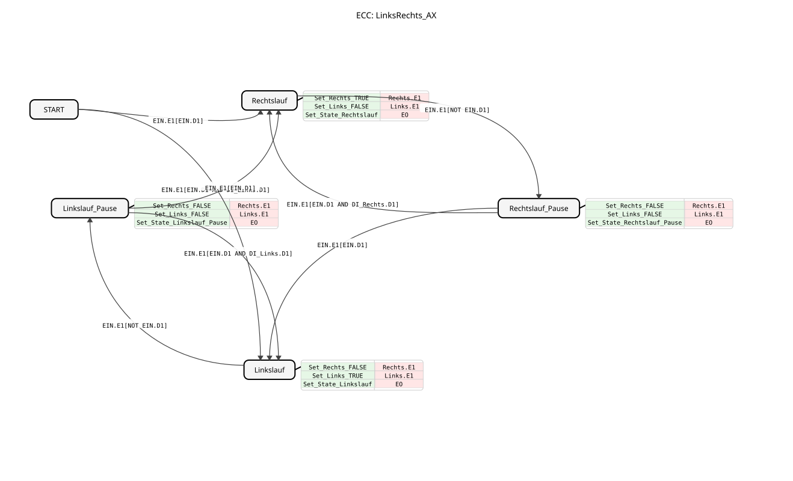

# LeftRight_AX

*Note: An image of the function block is not available here.*

* * * * * * * * * *

## Introduction

The function block **LeftRight_AX** (from the package `logiBUS::utils::sequence::verteiler`) controls an alternating process with two directions (clockwise and counterclockwise rotation). It is designed to switch back and forth between two outputs, taking pause states into account.

Of particular note is the ability to prevent automatic switching via digital inputs (`DI_Rechts`, `DI_Links`) to force operation in only one direction. The block uses the `AX` adapter interface for this purpose.

## Interface Structure

This function block primarily uses adapters for communication but also provides a status string as a direct output.

### **Event Inputs**
*There are no direct event inputs. Control is achieved via the events of the adapter sockets.*

### **Event Outputs**

| Name | Type | Description |

| :--- | :--- | :--- |

| **EO** | Event | Event triggered when the internal state (`STATE`) changes. |

### **Data Inputs**
*There are no direct data inputs. Data is read via the adapter sockets.*

### **Data Outputs**

| Name | Type | Description |

| :--- | :--- | :--- |

| **STATE** | STRING | Current state of the function block (e.g., "Right Rotation", "Left Rotation_Pause"). |

### **Adapter**

**Sockets (Input Interfaces):**

| Name | Type | Comment |

| :--- | :--- | :--- |

| **ON** | adapter::types::unidirectional::AX | **Turn On**: The main signal to start and stop the movement. |

| **DI_Right** | adapter::types::unidirectional::AX | **Right Rotation Only**: When active, a change to left rotation is prevented, and right rotation is enforced. |

| **DI_Left** | adapter::types::unidirectional::AX | **Left Rotation Only**: When active, a change to right rotation is prevented, and left rotation is enforced. |

**Plugs (Output Interfaces):**

| Name | Type | Comment |

| :--- | :--- | :--- |

**Right** | adapter::types::unidirectional::AX | **Right Rotation**: Output signal for rightward movement. |

**Left** | adapter::types::unidirectional::AX | **Left Rotation**: Output signal for leftward movement. |

## Functionality

The **LeftRight_AX** function block implements a state machine that alternates between rightward and leftward movement, separated by pause phases.

1. **Start:** Starting from the `START` state, the function block decides, based on the inputs `EIN` and `DI_Links`, whether to switch to leftward or rightward rotation first.

2. **Activation (Run):** As long as the signal `EIN.D1` (data) is present together with an event `EIN.E1` as `TRUE`, the function block enters an active state (`Rechtslauf` or `Linkslauf`). The corresponding output adapter (`Rechts` or `Links`) is then set to `TRUE`.

3. **Deactivation (Pause):** When `EIN.D1` changes to `FALSE` (switch off), the function block switches to the corresponding pause state (`Rechtslauf_Pause` or `Linkslauf_Pause`). The outputs are deactivated (`FALSE`).

4. **Alternating Logic:**

* If the function block is in `Rechtslauf_Pause` and is switched on again (`EIN` = TRUE), it switches to **counterclockwise** by default.

* If the function block is in `Linkslauf_Pause` and is switched on again, it switches to **clockwise** by default.

* If the function block is in `Linkslauf_Pause` and is switched on again, it switches to **clockwise** by default. 5. **Override Logic (Forcing):**

* If input `DI_Rechts` is active in state `Rechtslauf_Pause`, the switch to counterclockwise rotation is prevented, and counterclockwise rotation is restarted.

* If input `DI_Links` is active in state `Linkslauf_Pause`, the switch to clockwise rotation is prevented, and counterclockwise rotation is restarted.

## Technical Features

* **AX Adapter:** This function block uses the generic `unidirectional::AX` type. This typically combines a Boolean data signal (`D1`) with an event (`E1`).

* * **Prioritization:** According to the internal description, "clockwise rotation only takes precedence over counterclockwise rotation only," which is reflected in the start conditions. However, the sequence logic is primarily determined by the previous state (history).

* **Status Reporting:** Each state change updates the `STATE` variable and fires the `EO` event. The state names are obtained via an external enumeration (`STATES::...`).

## State Overview

The ECC (Execution Control Chart) defines the following states:

| State Name | Action | Description |

| :--- | :--- | :--- |

| **START** | - | Initial state. Waiting for the `EIN` signal. |

| **clockwise rotation** | `Set_Rechts_TRUE`, `Set_Links_FALSE`, Status update | Enables adapter `Rechts`, disables `Links`. |

**Right Rotation_Pause** | `Set_Rechts_FALSE`, `Set_Links_FALSE`, Status update | Both outputs off. The system remembers that it was last in right rotation. |

**Left Rotation** | `Set_Rechts_FALSE`, `Set_Links_TRUE`, Status update | Enables adapter `Links`, disables `Rechts`. |

**Left Rotation_Pause** | `Set_Rechts_FALSE`, `Set_Links_FALSE`, Status update | Both outputs off. The system remembers that it was last on the left. |

## Application Scenarios

* **Pendulum Operation:** Automatic control of mechanisms that need to move back and forth (e.g., a windshield wiper mode or a cleaning head), controlled by a single button (`EIN`).

* **Irrigation Systems:** Sequential control of two sectors (Sector Right -> Pause -> Sector Left -> Pause), whereby a sector can be activated multiple times in succession if required (using `DI_Rechts`/`DI_Links`).

* **Reversing Motor:** Control of a motor that should change its direction of rotation every time it restarts, unless otherwise specified.

## ⚖️ Comparison with Similar Function Blocks

* **Simple Toggle (Flip-Flop):** A standard toggle switch simply turns one output on/off. `LinksRechts_AX` toggles between *two* outputs.

* **RS Gate:** An RS gate stores only one state based on set/reset. This function block incorporates sequence logic (history memory) because it remembers which state was active *before* the pause.

* **E_SELECT:** Similar to a selector, but `LinksRechts_AX` includes the timing component of the "pause" and automatic switching at the next start signal.

## Conclusion

The **LeftRight_AX** function block is a specialized component for sequence control systems that require alternating operation between two outputs. Through the integration of the adapter technology (`AX`) and the ability to control the sequence through digital inputs (To influence `DI`), it offers a flexible solution for sequential control tasks with direction prioritization.