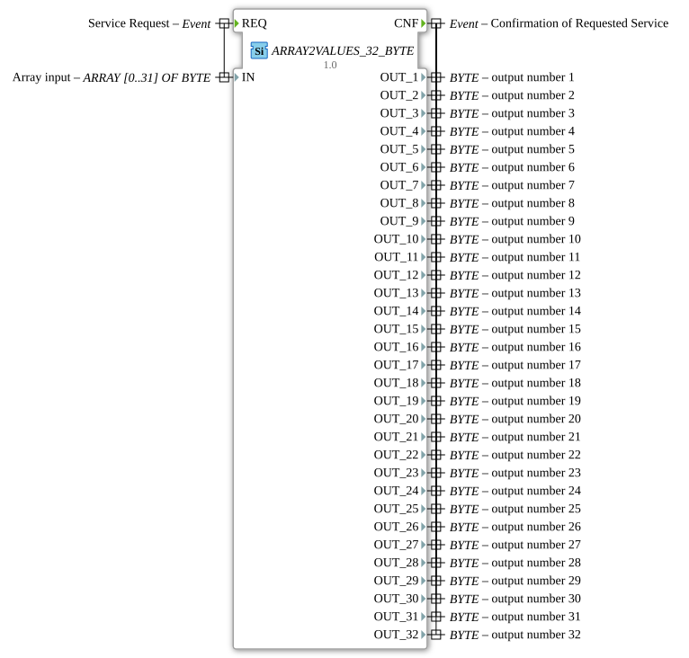

# ARRAY2VALUES_32_BYTE

* * * * * * * * * *

## Introduction

`ARRAY2VALUES_32_BYTE` splits a `BYTE` array of size 32 into 32 individual scalar variables `OUT_1`…`OUT_32`. It belongs to the generic `GEN_ARRAY2ARRAY` family (cf. [ARRAY2VALUES_2_LREAL](ARRAY2VALUES_2_LREAL.md)) and converts array data into discrete individual values.

## Interface Structure

### **Event Inputs**

- **REQ**: Triggers the split, carries `IN`.

### **Event Outputs**

- **CNF**: Confirms completion, carries `OUT_1`, `OUT_2`, `OUT_3`, `OUT_4`, `OUT_5`, `OUT_6`, `OUT_7`, `OUT_8`, `OUT_9`, `OUT_10`, `OUT_11`, `OUT_12`, `OUT_13`, `OUT_14`, `OUT_15`, `OUT_16`, `OUT_17`, `OUT_18`, `OUT_19`, `OUT_20`, `OUT_21`, `OUT_22`, `OUT_23`, `OUT_24`, `OUT_25`, `OUT_26`, `OUT_27`, `OUT_28`, `OUT_29`, `OUT_30`, `OUT_31`, `OUT_32`.

### **Data Inputs**

- **IN** (`BYTE`, array size 32): The array to split (8-bit bit pattern).

### **Data Outputs**

- `OUT_1`, `OUT_2`, `OUT_3`, `OUT_4`, `OUT_5`, `OUT_6`, `OUT_7`, `OUT_8`, `OUT_9`, `OUT_10`, `OUT_11`, `OUT_12`, `OUT_13`, `OUT_14`, `OUT_15`, `OUT_16`, `OUT_17`, `OUT_18`, `OUT_19`, `OUT_20`, `OUT_21`, `OUT_22`, `OUT_23`, `OUT_24`, `OUT_25`, `OUT_26`, `OUT_27`, `OUT_28`, `OUT_29`, `OUT_30`, `OUT_31`, `OUT_32` (`BYTE`): `OUT_i` corresponds to `IN[i-1]`, i.e. the i-th element of the array.

## Functionality

On `REQ`, every element of `IN` is copied to the corresponding scalar output `OUT_i` (`IN[0]` → `OUT_1`, …, `IN[31]` → `OUT_32`), then `CNF` is triggered.

## Technical Features

- **Generic implementation**: `eclipse4diac::core::GenericClassName = 'GEN_ARRAY2ARRAY'`, the same C++ base as [ARRAY2VALUES_2_LREAL](ARRAY2VALUES_2_LREAL.md) and the other `ARRAY2VALUES_*` variants.
- **Fixed size 32**: For other array sizes of the same type see `ARRAY2VALUES_2_BYTE`, `ARRAY2VALUES_4_BYTE`, `ARRAY2VALUES_8_BYTE`, `ARRAY2VALUES_16_BYTE`.

## State Overview

Stateless: every `REQ` immediately results in a full split and `CNF`.

## Application Scenarios

- **Data preparation**: An upstream block delivers a `BYTE` array, but a downstream block needs discrete individual variables.
- **Interface adaptation** between array-based and variable-based block interfaces.

## Comparison with similar function blocks

- **[ARRAY2VALUES_2_LREAL](ARRAY2VALUES_2_LREAL.md)**: the same generic implementation for data type `LREAL`.
- **`VALUES2ARRAY_32_BYTE`**: the reverse direction — combines 32 individual values into an array.
- **`ARRAY2ARRAY_2_BYTE`**: copies the array unchanged instead of splitting it.

## Conclusion

`ARRAY2VALUES_32_BYTE` provides a simple, generically implemented split of a `BYTE` array of size 32 into 32 discrete individual variables and is suitable for adapting array-based to variable-based interfaces.
