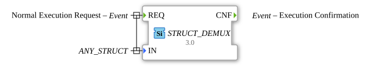

# STRUCT_DEMUX

* * * * * * * * * *
## Introduction
The function block (FB) `STRUCT_DEMUX` is a generic demultiplexer for structured data types. Its main task is to split an input data structure into its individual components (members). These individual members are then made available via separate data outputs, which are generated dynamically.

## Interface Structure
The interface of the `STRUCT_DEMUX` function block is defined generically. The actual data outputs are only determined during the instantiation of the block.

### **Event Inputs**

- **REQ**: Triggers the execution of the function block and causes the input structure to be read.

- **With Data Variable**: `IN`

### **Event Outputs**

- **CNF**: Confirms the completion of the operation after the structure's values have been passed to the outputs.

- **With Data Variables**: All dynamically generated data outputs.

### **Data Inputs**

- **IN** (Type: `ANY_STRUCT`): The input data structure to be split.

### **Data Outputs**
The data outputs of this function block are not predefined. Instead, they are created **dynamically** based on the data type associated with the `IN` input. For each member of the input structure, a corresponding data output with the same name and data type is created in the function block.

### **Example:**

If a structure of type `MyStruct` with members `a` (type `INT`) and `b` (type `BOOL`) is connected to the `IN` input, the `STRUCT_DEMUX` block automatically generates two data outputs:

- `a` (type `INT`)
- `b` (type `BOOL`)

The image above illustrates this exact case.

- `a` (type `INT`)

- `b` (type `BOOL`)

The image above illustrates this exact case.

... ## Functionality

As soon as a `REQ` event is received at the input of the `STRUCT_DEMUX` function block, the block reads the data structure present at the `IN` input. It extracts the values of each individual member of the structure and forwards them to the corresponding, dynamically generated data outputs. After all output values have been updated, the `CNF` event is triggered to signal the completion of the process.

## Technical Features

- **Generic Block**: Thanks to the attribute `GEN_STRUCT_DEMUX`, the block is able to adapt to any structured data type (`ANY_STRUCT`).

- **Dynamic Interface**: The ability to generate its outputs based on the input data type makes it extremely flexible and reusable.

- **Service Interface Function Block Type**: The function block is designed as a standardized interface for this service.

## State Overview
The `STRUCT_DEMUX` is a stateless function block that operates according to a simple request-acknowledgment cycle:

1. **Ready**: Waits for a `REQ` event.

2. **Executing**: Reads the input structure, extracts the member values, and sets the corresponding outputs.

3. **Completed**: Triggers the `CNF` event and returns to the ready state.

## Application Scenarios

- **Complex Data Splitting**: Decomposing complex data structures (e.g., sensor data, status information) into individual signals for further processing.

- **Improved Readability**: Instead of accessing structure members via `GET_STRUCT_VALUE`, the members can be used directly as separate data lines in the logic.

- **Interface Adaptation**: Adapting data arriving as a single structure from a function block to multiple function blocks that expect individual inputs.

## ⚖️ Comparison with Similar Function Blocks

- **`GET_STRUCT_VALUE`**: While `GET_STRUCT_VALUE` dynamically extracts a single member via a `STRING` name, `STRUCT_DEMUX` statically exposes all members as separate outputs. ``STRUCT_DEMUX`` is often easier to use when all members are needed, while ``GET_STRUCT_VALUE`` is more flexible when only specific members need to be addressed at runtime.

- **`STRUCT_MUX`**: The complementary component that combines individual data inputs into a single data structure.

## Metadata

| Attribute | Value |

| :--- | :--- |

| Copyright | (c) 2020 Johannes Kepler University Linz |

| License | EPL-2.0 |

| Version | 3.0 (2025-04-14, Patrick Aigner) |

| 4diac Package | eclipse4diac::convert |

## 🛠️ Related exercises

* [Uebung_051](../../../Uebungen/test_B/Uebungen_doc/Uebung_051.md)
* [Uebung_120](../../../Uebungen/test_B/Uebungen_doc/Uebung_120.md)
* [Uebung_121](../../../Uebungen/test_B/Uebungen_doc/Uebung_121.md)
* [Uebung_122](../../../Uebungen/test_B/Uebungen_doc/Uebung_122.md)
* [Uebung_122b](../../../Uebungen/test_B/Uebungen_doc/Uebung_122b.md)
* [Uebung_123](../../../Uebungen/test_B/Uebungen_doc/Uebung_123.md)
* [Uebung_124](../../../Uebungen/test_B/Uebungen_doc/Uebung_124.md)
* [Uebung_125](../../../Uebungen/test_B/Uebungen_doc/Uebung_125.md)
* [Uebung_126](../../../Uebungen/test_B/Uebungen_doc/Uebung_126.md)
* [Uebung_127](../../../Uebungen/test_B/Uebungen_doc/Uebung_127.md)
* [Uebung_128](../../../Uebungen/test_B/Uebungen_doc/Uebung_128.md)
* [Uebung_128b](../../../Uebungen/test_B/Uebungen_doc/Uebung_128b.md)
* [Uebung_130](../../../Uebungen/test_B/Uebungen_doc/Uebung_130.md)
* [Uebung_131](../../../Uebungen/test_B/Uebungen_doc/Uebung_131.md)
* [Uebung_132](../../../Uebungen/test_B/Uebungen_doc/Uebung_132.md)
* [Uebung_133](../../../Uebungen/test_B/Uebungen_doc/Uebung_133.md)
* [Uebung_134](../../../Uebungen/test_B/Uebungen_doc/Uebung_134.md)

## Conclusion

`STRUCT_DEMUX` is a fundamental and extremely useful building block for working with data structures in 4diac. Its ability to automatically decompose any structure into its constituent parts significantly simplifies application logic and promotes clear, readable wiring. It is the standard tool for accessing the contents of structures.

---

### 🌐 Related topic subpages on ms-muc-docs.de

* [🌐 Eclipse 4diac IDE & Color Reference on ms-muc-docs.de](https://www.ms-muc-docs.de/iec-61499/eclipse-4diac/)

]