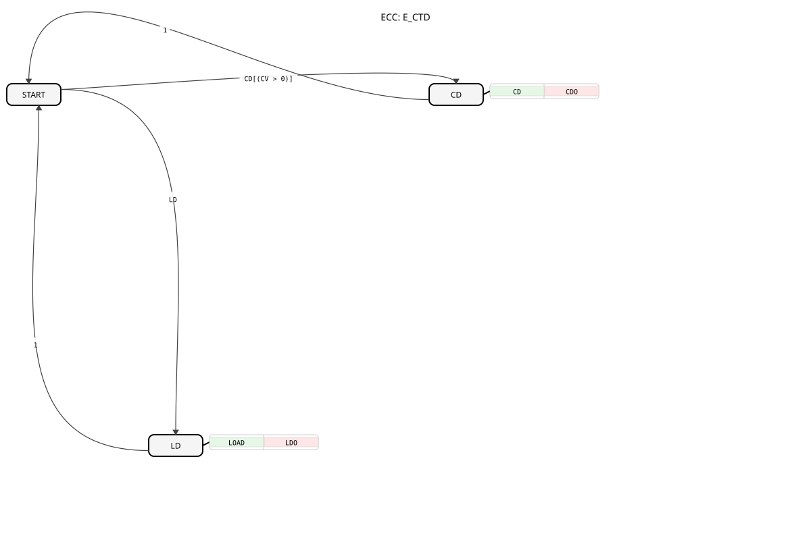

# E_CTD

## 🎧 Podcast

* [E_CTD: Event-Driven Down Counter according to IEC 61499](https://podcasters.spotify.com/pod/show/iec-61499-grundkurs-de/episodes/E_CTD-Ereignisgesteuerter-Abwrtszhler-nach-IEC-61499-e368lli)
## Introduction

The **E_CTD** (Event-Driven Down Counter) is an event-driven down counter according to the IEC 61499 standard. This function block is used in industrial control systems to implement counting operations that are triggered by events.

## Structure of the E_CTD Function Block

### Interface

**Event Inputs:**

- **CD (Count Down):** Triggers a counting step that decrements the counter value.
- **LD (Load):** Loads the initial value `PV` into the counter.

**Event Outputs:**

- **CDO (Count Down Output):** Confirms a counting step. Triggered after each `CD` event, as long as the counter value was greater than 0.
- **Related Data:** `Q`, `CV`
- **LDO (Load Output):** Confirms the successful loading of a new counter value.
- **Related Data**: `Q`, `CV`

**Input Variables:**

- **PV (Preset Value):** The initial value loaded during a load event (Data Type: `UINT`).

**Output Variables:**

- **Q (Status):** Output flag set when the counter reaches 0 (Data Type: `TRUE`).
- **CV (Counter Value):** The current counter value (Data Type: `UINT`).

## Behavior of the E_CTD Block

1. **Initialization/Loading:**
- When an **LD** event occurs, the counter value `CV` is set to the value of **PV**.
- The output flag `Q` is updated based on the condition `CV = 0`.
- The **LDO** event is triggered and outputs the new counter value `CV` and the flag `Q`.
2. **Countdown:**
- With each **CD** event, the counter value **CV** is decremented by 1 if it is greater than 0.
- The output flag `Q` is then updated based on the new condition `CV = 0`.
- The **CDO** event is triggered and outputs the current counter value `CV` and the flag `Q`.
3. **Counter Reload:**
- A subsequent **LD** event resets **CV** back to **PV** at any time and triggers **LDO**.

## Technical Features

- **Event-driven:** The function block operates exclusively based on events and does not require cyclic calls.
- **Flexible Initialization:** The initial value **PV** can be changed at any time by an **LD** event.

## Application Examples

- **Production Lines:** Counting units produced.
- **Packaging Machines:** Control of filling processes.
- **Energy Management:** Monitoring of consumption cycles.

## ⚖️ Comparison with similar modules

| Feature | E_CTD | E_CTU (Up Counter) | E_CTUD (Up/Down Counter) |
|------------------|-------------------|--------------------|--------------------------|
| Counting Direction | Down | Up | Both |
| Event-Driven | Yes | Yes | Yes |
| Reset Function | LD (Reload) | R (Reset) | R (Reset) |

## 🛠️ Related Exercises

* [Exercise_081](../../../Uebungen/test_B/Uebungen_doc/Uebung_081.md)

## Conclusion

The **E_CTD** block is an essential element in IEC 61499, providing a reliable and flexible counting function for industrial controllers. Its event-driven nature makes it particularly suitable for distributed systems where cyclic polling is impractical. Its clear interface and intuitive behavior make it easy to integrate into existing control concepts.

---

### 🌐 Related Topic Subpages on ms-muc-docs.de

* [🌐 E_CTU Event Counter Block on ms-muc-docs.de](https://www.ms-muc-docs.de/iec-61499/event-function-blocks/e_ctu/)
