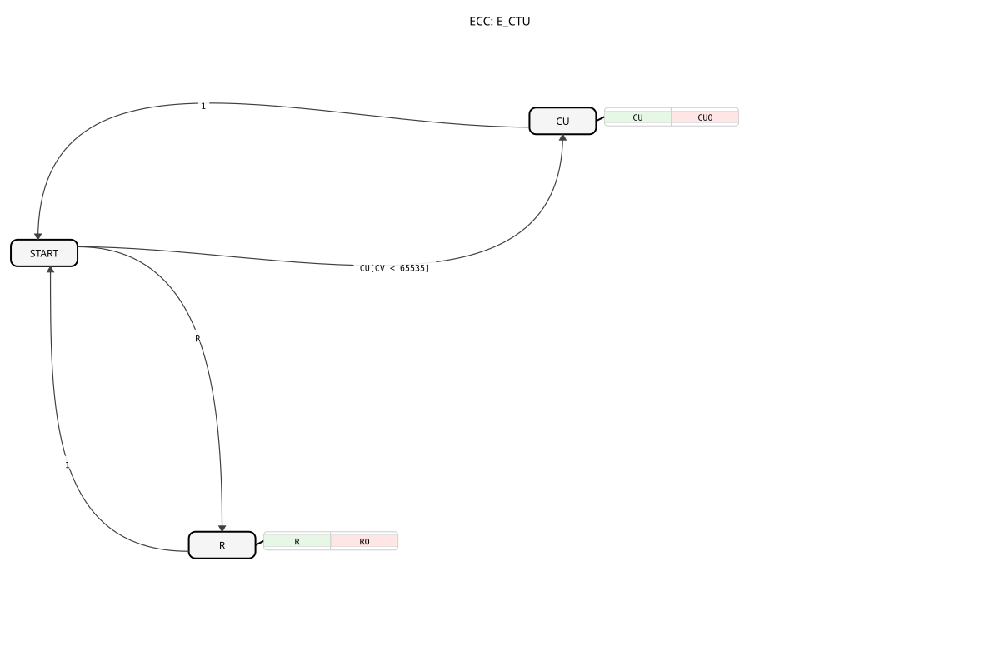

# E_CTU

## 📺 Video



* [The E_CTU upcounter](https://www.youtube.com/watch?v=2v4Ib2wZLGM)

## 🎧 Podcast

* [The E_CTU in IEC 61499: Event-driven counting and why the minimalist solution is convincing in mechanical engineering](https://podcasters.spotify.com/pod/show/iec-61499-grundkurs-de/episodes/Der-E_CTU-in-der-IEC-61499-Ereignisgesteuertes-Zhlen-und-warum-der-Minimalist-im-Maschinenbau-berzeugt-e3a9qnq)

* [The E_CTU component: Event-driven incrementing in industry according to IEC 61499](https://podcasters.spotify.com/pod/show/iec-61499-grundkurs-de/episodes/Der-E_CTU-Baustein-Ereignisgesteuertes-Hochzhlen-in-der-Industrie-nach-IEC-61499-e36846t)

* [E_CTUD: Bidirectional counter in IEC 61499 systems](https://podcasters.spotify.com/pod/show/iec-61499-grundkurs-de/episodes/E_CTUD-Bidirektionaler-Zhler-in-IEC-61499-Systemen-e368lmb)

* [Master knowledge 61499: The event-driven upcounter (E_CTU) – Robust counting in Agricultural Machinery Controls ](https://podcasters.spotify.com/pod/show/iec-61499-grundkurs-de/episodes/Meisterwissen-61499-Der-Ereignisgesteuerte-Aufwrtszhler-E_CTU--Robustes-Zhlen-in-Landmaschinen-Steuerungen-e3a9q5n)

----


* * * * * * * * * *
## Introduction
The `E_CTU` (Event-Driven Up Counter) is an event-driven up counter according to the IEC 61499 standard. Its function is to increment an internal counter value with each incoming counting event and compare this value to a predefined limit. The block can be reset at any time.


## Interface Structure

### **Event Inputs**

- **CU (Count Up)**: Triggers a counting step that increments the counter value `CV` by 1.

- **Related Data**: `PV`

- **R (Reset)**: Resets the counter value `CV` to 0.

### **Event Outputs**

- **CUO (Count Up Output)**: Confirms a count increment. Triggered after each `CU` event.

- **Related Data**: `Q`, `CV`

- **RO (Reset Output)**: Confirms the counter reset.

- **Related Data**: `Q`, `CV`

### **Data Inputs**

- **PV (Preset Value)**: The threshold value (data type: `UINT`). This value is compared to the counter reading on every `CU` event.

### **Data Outputs**

- **Q (Status)**: Output flag that is set when the counter reading reaches or exceeds the threshold value (data type: `PV`) (data type: `BOOL`).

- **CV (Counter Value)**: The current counter value (data type: `UINT`).

## Functionality
The `E_CTU` block has two main functions: counting and resetting.

1. **Counting (CU)**: When a `CU` event occurs and the internal counter value `CV` has not yet reached the maximum value for `UINT` (65535), `CV` is incremented by 1. Then, `CV` is compared to the limit value at the `PV` input. If `CV >= PV` is the current value, the output `Q` is set to `TRUE`; otherwise, it is set to `FALSE`. After the counting process, the event `CUO` is triggered, which outputs the current counter value `CV` and the status flag `Q`.


If `CV >= PV` is the current value, the output `Q` is set to `TRUE`; otherwise, it is set to `FALSE`. 2. **Reset (R)**: When a `R` event occurs, the counter value `CV` is immediately reset to 0 and the status flag `Q` is set to `FALSE`. Subsequently, the `RO` event is triggered, which outputs the reset values `CV` and `Q`.

## Technical Features
- **Event-driven**: This function block operates exclusively based on events (`CU`, `R`).


## Technical Features

- **Event-driven**: This function block operates exclusively based on events (`CU`, `R`).


- **Overflow Protection**: The counter stops when the maximum value for `UINT` (65535) is reached to prevent an overflow.

- **PV at Each Count Step**: The limit value `PV` is linked to the `CU` event, meaning it can potentially be changed at each count step.

## Application Examples

- **Piece Counter**: Counting produced parts on a conveyor belt. When a target quantity (`PV`) is reached, `Q` becomes `TRUE`.

- **Event Counting**: Recording the frequency of events, such as the activation of a switch.

- **Cycle Counter**: Counts cycles in a machine to signal maintenance intervals.

## ⚖️ Comparison with similar function blocks

| Feature | E_CTU (Up Counter) | E_CTD (Down Counter) | E_CTUD (Up/Down Counter) |

|------------------|--------------------|----------------------|--------------------------|

| Counting Direction | Up | Down | Both |

| Event-Driven | Yes | Yes | Yes |

| Reset Function | R (Reset to 0) | LD (Set to PV) | R (Reset to 0) |

## 🛠️ Related exercises

* [Uebung_040](../../../Uebungen/test_B/Uebungen_doc/Uebung_040.md)
* [Uebung_040_2](../../../Uebungen/test_B/Uebungen_doc/Uebung_040_2.md)
* [Uebung_040_AX](../../../Uebungen/test_AX/Uebungen_doc/Uebung_040_AX.md)
* [Uebung_041](../../../Uebungen/test_B/Uebungen_doc/Uebung_041.md)
* [Uebung_080](../../../Uebungen/test_B/Uebungen_doc/Uebung_080.md)
* [Uebung_080b](../../../Uebungen/test_B/Uebungen_doc/Uebung_080b.md)
* [Uebung_080c](../../../Uebungen/test_B/Uebungen_doc/Uebung_080c.md)
* [Uebung_084](../../../Uebungen/test_B/Uebungen_doc/Uebung_084.md)
* [Uebung_12x_sub](../../../Uebungen/test_B/Uebungen_doc/Uebung_12x_sub.md)

## Conclusion
The `E_CTU` is a basic and versatile counter module for event-driven systems according to IEC 61499. Its simple interface and predictable behavior make it a robust tool for a wide range of counting and monitoring tasks in industrial automation.

---

### 🌐 Related topic subpages on ms-muc-docs.de

* [🌐 E_CTU Event Counter Module on ms-muc-docs.de ](https://www.ms-muc-docs.de/iec-61499/event-function-blocks/e_ctu/)


```