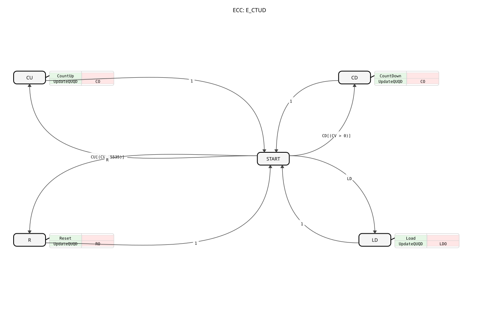

# E_CTUD

## 🎧 Podcast

* [E_CTUD: Bidirectional Counter in IEC 61499 Systems ](https://podcasters.spotify.com/pod/show/iec-61499-grundkurs-de/episodes/E_CTUD-Bidirektionaler-Zhler-in-IEC-61499-Systemen-e368lmb)
----

* * * * * * * * *
The `E_CTUD` (Event-Driven Up-Down Counter) is an event-driven up- and down-counter compliant with the IEC 61499 standard. It can increment, decrement, reset, or load a counter value based on separate events. This makes it a flexible and powerful component for a wide variety of counting applications.

- **CU (Count Up)**: Triggers an up count.
- **Linked Data**: `PV`
- **CD (Count Down)**: Triggers a down count.
- **R (Reset)**: Resets the counter to 0.
- **LD (Load)**: Loads a new value into the counter.
- **Linked Data**: `PV`
- **CO (Count Output)**: Acknowledges a counting operation (`CU` or `CD`).
- **Linked Data**: `QU`, `CV`, `QD`
- **RO (Reset Output)**: Confirms that the counter has been reset.
- **Linked Data**: `QU`, `CV`, `QD`
- **LDO (Load Output)**: Confirms that a new counter value has been loaded.
- **Linked Data**: `QU`, `CV`, `QD`
- **PV (Preset Value)**: The threshold value for `QU` or the value to be loaded for `LD` (Data type: `UINT`).
- **QU (Status Up)**: Output flag that is set when `TRUE` (Data type: `CV >= PV`) is reached.
- **CV (Counter Value)**: The current counter value (data type: `UINT`).

### Data Outputs

### Data Inputs

### Event Outputs

### Event Inputs

## Interface Structure

## Introduction

## Functionality

The `E_CTUD` counter responds to four different events:

1. **Count Up (CU)**: When a `CU` event occurs and `CV` is less than the maximum value (65535), `CV` is incremented by 1. The `CO` event is then triggered.
2. **Count Down (CD)**: If a `CD` event occurs and `CV` is greater than 0, `CV` is decremented by 1. The `CO` event is then triggered.
3. **Reset (R)**: If a `R` event occurs, `CV` is set to 0. The `RO` event is then triggered.
4. **Load (LD)**: When a `LD` event occurs, `CV` is set to the value of `PV`. Then, the `LDO` event is triggered.

After each of these actions, the status flags `QU` and `QD` are updated based on the new value of `CV` (`QU = (CV >= PV)` and `QD = (CV == 0)`). The respective output events (`CO`, `RO`, `LDO`) then output the current counter value (`CV`) and the two status flags.

- **Bidirectional Counting**: The function block supports both up and down counting in a single block.
- **Comprehensive Control**: In addition to counting, it also offers functions for explicit loading and resetting.
- **Two Status Outputs**: `QU` signals when the upper limit is reached, and `QD` signals when the lower limit (0) is reached.
- **Overflow and Underflow Protection**: Counting operations are only performed within the valid limits (0 to 65535).
- **Position Detection**: Counting incremental encoder steps in both directions.
- **Fill Level Control**: Detecting inflows and outflows in a tank.
- **Storage Location Management**: Counting incoming and outgoing pallets.

| Feature | E_CTUD (Up/Down) | E_CTU (Up) | E_CTD (Down) |
--------------|------------------|-----------------|------------------|
| Counting Direction | Up & Down | Up Only | Down Only |
| Reset (to 0)| Yes (`R`) | Yes (`R`) | No |
| Load (to PV)| Yes (`LD`) | No | Yes (`LD`) |
| Top Status | `QU` (`CV >= PV`) | `Q` (`CV >= PV`) | No |
| Bottom Status | `QD` (`CV = 0`) | No | `Q` (`CV = 0`) |

* [Exercise_082](../../../Uebungen/test_B/Uebungen_doc/Uebung_082.md)

The `E_CTUD` is a universal counter module that combines and extends the functionality of a simple up and down counter. With its four control events (`CU`, `CD`, `R`, `LD`) and two status outputs (`QU`, `QD`), it offers maximum flexibility for complex counting and monitoring tasks in industrial automation.

* [🌐 E_CTU Event Counter module on ms-muc-docs.de](https://www.ms-muc-docs.de/iec-61499/event-function-blocks/e_ctu/)

## Technical Features

## Application Scenarios

## ⚖️ Vergleich mit ähnlichen Bausteinen

## 🛠️ Zugehörige Übungen

## Conclusion

### 🌐 Passende Themen-Unterseiten auf ms-muc-docs.de