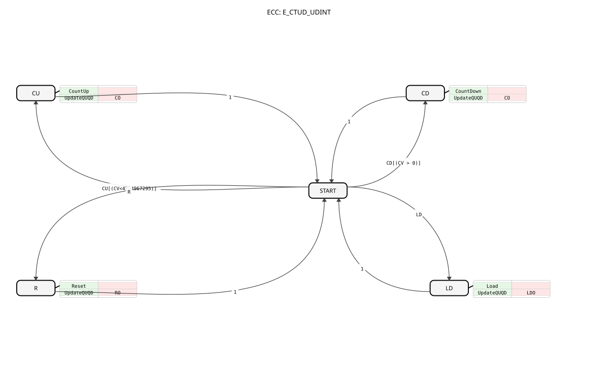

# E_CTUD_UDINT

----

* * * * * * * * * *
The `E_CTUD_UDINT` is a variant of the `E_CTUD` counter that uses the `UDINT` data type (Unsigned Double Integer, 32-bit). This event-driven up and down counter can cover a very large counter range. It can increment, decrement, reset, or load a counter value with a predefined value based on separate events.

- **CU (Count Up)**: Triggers an up count.
- **Related Data**: `PV`
- **CD (Count Down)**: Triggers a countdown.
- **R (Reset)**: Resets the counter to 0.
- **LD (Load)**: Loads a new value into the counter.
- **Related Data**: `PV`
- **CO (Count Output)**: Acknowledges a counting operation (`CU` or `CD`).
- **Linked Data**: `QU`, `CV`, `QD`
- **RO (Reset Output)**: Confirms that the counter has been reset.
- **Linked Data**: `QU`, `CV`, `QD`
- **LDO (Load Output)**: Confirms that a new counter value has been loaded.
- **Linked Data**: `QU`, `CV`, `QD`
- **PV (Preset Value)**: The threshold value for `QU` or the value to be loaded for `LD` (Data type: `UDINT`).
- **QU (Status Up)**: Output flag that is set when `TRUE` (Data type: `CV >= PV`) (Data type: `BOOL`) is reached.
- **CV (Counter Value)**: The current counter value (data type: `UDINT`).

### Data Outputs

### Data Inputs

### Event Outputs

### Event Inputs

## Interface Structure

## Introduction

## Functionality

The `E_CTUD_UDINT` responds to four different events:

1. **Count Up (CU)**: When a `CU` event occurs and `CV` is less than the maximum value (4,294,967,295), `CV` is incremented by 1. The `CO` event is then triggered.
2. **Count Down (CD)**: If a `CD` event occurs and `CV` is greater than 0, `CV` is decremented by 1. The `CO` event is then triggered.
3. **Reset (R)**: If a `R` event occurs, `CV` is set to 0. The `RO` event is then triggered.
4. **Load (LD)**: When a `LD` event occurs, `CV` is set to the value of `PV`. Then, the `LDO` event is triggered.

After each of these actions, the status flags `QU` and `QD` are updated based on the new value of `CV` (`QU = (CV >= PV)` and `QD = (CV == 0)`). The respective output events (`CO`, `RO`, `LDO`) then output the current counter value (`CV`) and the two status flags.

- **Large Counting Range**: By using `UDINT`, the counter can take values from 0 to 4,294,967,295.
- **Bidirectional Counting**: The function block supports both up and down counting in a single block.
- **Comprehensive Control**: In addition to counting, it also offers functions for explicit loading and resetting.
- **Overflow and Underflow Protection**: Counting operations are only performed within the valid `UDINT` limits (0 to 4,294,967,295).
- **Total Counter**: Recording total production quantities or operating hours over the entire lifespan of a machine, where a 16-bit counter is insufficient.
- **Energy Measurement**: Counting pulses from an energy meter (e.g., Wh or kWh) over extended periods.
- **High-Resolution Position Detection**: Counting a very large number of increments from a high-resolution encoder.
- [Exercise_009](../../../Uebungen/test_B/Uebungen_doc/Uebung_009.md)
- [Exercise_034b](../../../Uebungen/test_B/Uebungen_doc/Uebung_034b.md)
- [Exercise_083](../../../Uebungen/test_B/Uebungen_doc/Uebung_083.md)

The `E_CTUD_UDINT` is the `UDINT` variant of the universal `E_CTUD` counter. It offers the same functionality, but with a significantly larger counting range (32 bits). This makes it the ideal choice for applications where the counter value can exceed the limit of a 16-bit `UINT` counter. Its robust, event-driven nature and comprehensive control and status functions are retained.

- [🌐 E_CTU Event Counter module on ms-muc-docs.de](https://www.ms-muc-docs.de/iec-61499/event-function-blocks/e_ctu/)

## Technical Features

## Application Scenarios

## 🛠️ Zugehörige Übungen

## Conclusion

### 🌐 Passende Themen-Unterseiten auf ms-muc-docs.de
