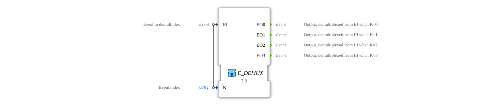
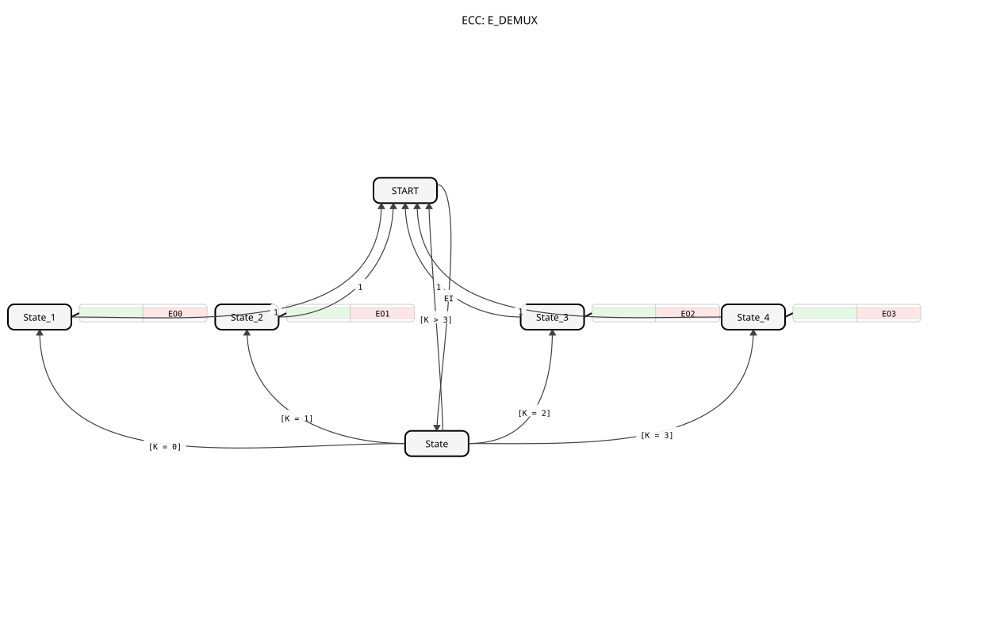

# E_DEMUX
## Introduction
The `E_DEMUX` (Event Demultiplexer) is a function block according to IEC 61499 that forwards a single input event (`EI`) to one of several outputs. The selection of the specific output is determined by the value of an input variable (`K`). This version of the block is a 1-to-4 demultiplexer.

## Interface Structure

### **Event Inputs**
- **EI (Event Input)**: The input event to be distributed.
- **Related Data**: `K`

### **Event Outputs**
- **EO0**: Triggered when `EI` and `K = 0` arrive.
- **EO1**: Triggered when `EI` and `K = 1` arrive.
- **EO2**: Triggered when `EI` and `K = 2` arrive.
- **EO3**: Triggered when `EI` and `K = 3` arrive.

### **Data Inputs**
- **K**: The selection index that determines which output is triggered (data type: `UINT`).

## Functionality

1. **Event Reception**: The function block waits for an event at input `EI`.

2. **Selection**: When the `EI` event arrives, the value of the data variable `K` is evaluated.

3. **Forwarding**:

- If `K` = 0, the event is forwarded to `EO0`.
- If `K` = 1, the event is forwarded to `EO1`.
- If `K` = 2, the event is forwarded to `EO2`.
- If `K` = 3, the event is forwarded to `EO3`.

4. **Invalid Index**: If the value of `K` is outside the valid range [0, 3], no output event is triggered, and the `EI` event is discarded.

The input event is therefore always forwarded exclusively to exactly one output, provided the index `K` is valid.

## Technical Features
- **1-to-4 Distribution**: This function block distributes an event to four possible outputs.
- **Index-driven**: The logic is based on a numerical index.
- **Deterministic behavior**: The routing is clearly and unambiguously defined, ensuring reliable control.

## Application scenarios
- **State machines**: Selection of the next state transition based on a calculated index.
- **Mode switching**: Activation of different plant components depending on the selected operating mode (`K` = mode number).
- **Sequencers/Step chains**: Activation of the next step in a chain.
- **Error routing**: Routing of a general error event to a specific handler based on an error code (`K` = error code).

## ⚖️ Comparison with similar function blocks

| Feature | E_DEMUX (this) | E_MUX | E_SWITCH |

----------------|------------------|----------------|------------------|

Operating principle | 1:4 distribution | n:1 merging | 1:2 distribution |

| Control | Index `K` [0-3] | Index `K` | `BOOL` condition `G` |

| Event flow | Splitting | Merging | Conditional switch |

*Note: Other variants exist, such as `E_DEMUX_2` and `E_DEMUX_8` for 2 and 8 outputs, respectively.*

## 🛠️ Related Exercises
* [Exercise_040](../../../Uebungen/test_B/Uebungen_doc/Uebung_040.md)]
* [Exercise_040_AX](../../../Uebungen/test_AX/Uebungen_doc/Uebung_040_AX.md)]
* [Exercise_087](../../../Uebungen/test_B/Uebungen_doc/Uebung_087.md)]

## Conclusion
The `E_DEMUX` is a fundamental building block for controlling event flow in IEC 61499 applications. It enables a clear, index-based division of event streams and is therefore a key tool for implementing state logic, mode switching, and sequence control.
