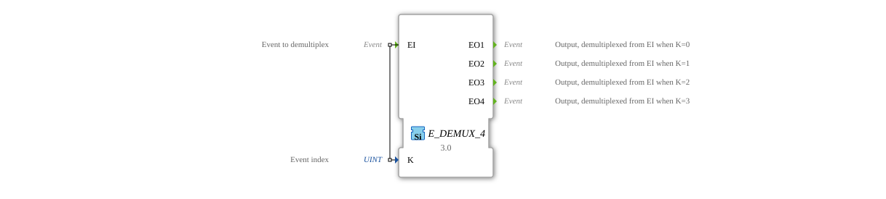

# E_DEMUX_4

<!-- Hier wäre Platz für ein Bild des Funktionsblocks, falls vorhanden. -->
* * * * * * * * * *
## Introduction

The `E_DEMUX_4` (Event Demultiplexer) is a function block according to IEC 61499 that forwards a single input event (`EI`) to one of four outputs. The output selection is determined by the value of the input variable `K`.

## Interface Structure

### **Event Inputs**

- **EI (Event Input)**: The input event to be distributed.
- **Related Data**: `K`

### **Event Outputs**

- **EO1**: Triggered when `EI` arrives and the selection index is `K = 0`.
- **EO2**: Triggered when `EI` arrives and the selection index is `K = 1`.
- **EO3**: Triggered when `EI` arrives and the selection index is `K = 2`.
- **EO4**: Triggered when `EI` arrives and the selection index is `K = 3`.

### **Data Inputs**

- **K**: The zero-based selection index that determines which output is triggered (data type: `UINT`).

## Functionality

1. **Event Reception**: The function block waits for an event at input `EI`.
2. **Selection**: When the `EI` event arrives, the value of the data variable `K` is evaluated.
3. **Forwarding**:
- If `K` = 0, the event is forwarded to `EO1`.
- If `K` = 1, the event is forwarded to `EO2`.
- If `K` = 2, the event is forwarded to `EO3`.
- If `K` = 3, the event is forwarded to `EO4`.
4. **Invalid Index**: If the value of `K` is outside the valid range [0, 3], no output event is triggered.

## Technical Features

- **1-to-4 Distribution**: This function block distributes an event across four possible outputs.
- **Index-Driven**: The logic is based on a numeric index (`K`).
- **Confusing Naming Convention**: Note that the outputs are named 1-based (`EO1` to `EO4`), but the selection index `K` is 0-based (`K=0` for `EO1`, `K=1` for `EO2`, etc.).
- **Generic Building Block**: The functionality is provided by the generic class `GEN_E_DEMUX`.

## Application Scenarios

- **State Machines**: Selection of the next state transition based on a calculated index.
- **Mode Switching**: Activation of different system components depending on the selected operating mode (`K` = mode number).
- **Sequencer/Step Chains**: Activation of one of four possible next steps.

## 🛠️ Related Exercises

* [Exercise_040_2](../../../Uebungen/test_B/Uebungen_doc/Uebung_040_2.md)]
* [Exercise_087a1](../../../Uebungen/test_B/Uebungen_doc/Uebung_087a1.md)]
* [Exercise_087a2](../../../Uebungen/test_B/Uebungen_doc/Uebung_087a2.md)]

## Conclusion

The `E_DEMUX_4` is a standard implementation of the demultiplexer principle for four outputs. It is useful for splitting an event flow into up to four paths. The inconsistent naming of the outputs in relation to the index value requires special attention during implementation.
